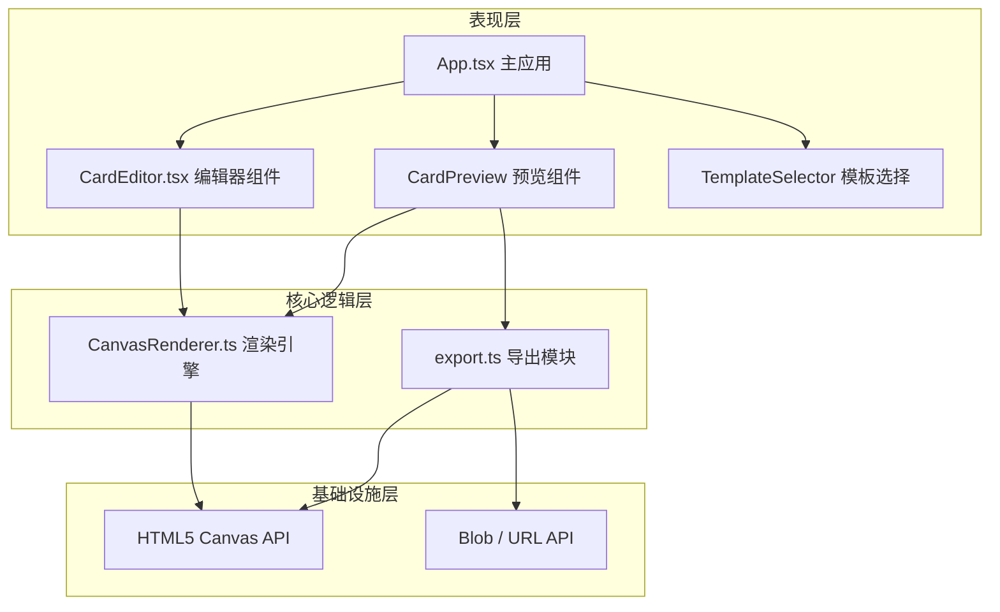

## 1. 架构设计

纯前端单页应用，采用React组件化架构，Canvas负责高性能图形渲染，状态管理使用React Hooks，模块之间通过清晰的接口进行交互。



## 2. 技术描述

- **前端框架**：React@18.2.0 + React-DOM@18.2.0，函数式组件 + Hooks
- **语言**：TypeScript@5.3.3，严格模式，target ES2020
- **构建工具**：Vite@5.0.8 + @vitejs/plugin-react@4.2.0
- **状态管理**：React useState / useRef 管理组件状态，useCallback 优化渲染性能
- **渲染技术**：HTML5 Canvas 2D API，requestAnimationFrame 实现流畅动画
- **样式方案**：纯CSS + CSS变量实现毛玻璃效果和渐变，不引入Tailwind（按用户需求定制）
- **性能优化**：useRef 存储Canvas和渲染数据避免重渲染，requestAnimationFrame 批量绘制

## 3. 路由定义

应用使用React状态切换模拟页面路由，无需引入react-router-dom。

| 逻辑路由 | 对应组件 | 用途 |
|----------|----------|------|
| / (首页) | TemplateSelector (App内渲染) | 展示并选择贺卡模板 |
| /editor | CardEditor | 贺卡编辑页面 |
| /preview | CardPreview | 动态预览与分享页面 |

页面切换通过 App.tsx 中的 `currentPage` state 控制。

## 4. 数据模型定义

### 4.1 类型定义

```typescript
// 贺卡模板类型
interface CardTemplate {
  id: string;
  name: string;
  category: 'birthday' | 'holiday' | 'thanks' | 'wedding' | 'encouragement';
  background: string; // CSS渐变或纯色
  primaryColor: string;
  secondaryColor: string;
  defaultTexts: TextElement[];
  defaultDecorations: DecorationElement[];
  previewGradient: string; // 圆形卡片预览渐变
}

// 文字元素
interface TextElement {
  id: string;
  type: 'text';
  content: string;
  x: number;
  y: number;
  fontSize: number; // 12-72
  fontFamily: string;
  color: string;
  strokeWidth: number; // 1-4, 0表示无描边
  strokeColor: string;
  shadowBlur: number; // 3-8, 0表示无阴影
  shadowColor: string;
}

// 装饰元素类型
type DecorationType = 'flower' | 'star' | 'heart' | 'balloon' | 'confetti';

// 装饰元素
interface DecorationElement {
  id: string;
  type: 'decoration';
  shape: DecorationType;
  x: number;
  y: number;
  scale: number; // 0.5-2
  rotation: number; // 0-360度，步进15
  color: string;
}

// 背景类型
type BackgroundType = 'solid' | 'gradient' | 'image';

interface BackgroundConfig {
  type: BackgroundType;
  value: string; // 颜色值、渐变字符串或图片URL
}

// 编辑器状态
interface EditorState {
  template: CardTemplate | null;
  texts: TextElement[];
  decorations: DecorationElement[];
  background: BackgroundConfig;
  selectedElementId: string | null;
}

// 粒子（预览动画用）
interface Particle {
  x: number;
  y: number;
  vx: number;
  vy: number;
  size: number;
  opacity: number;
  color: string;
}
```

### 4.2 核心模块接口

```typescript
// CanvasRenderer 接口
class CanvasRenderer {
  constructor(canvas: HTMLCanvasElement);
  setBackground(bg: BackgroundConfig): void;
  addText(text: TextElement): void;
  updateText(id: string, updates: Partial<TextElement>): void;
  removeElement(id: string): void;
  addDecoration(deco: DecorationElement): void;
  updateDecoration(id: string, updates: Partial<DecorationElement>): void;
  render(): void; // 强制重绘
  getCanvasDataURL(type?: string): string; // 导出图片数据
  hitTest(x: number, y: number): string | null; // 检测点击元素
  setSelected(id: string | null): void;
}

// export 模块函数签名
function exportAsPNG(canvas: HTMLCanvasElement): Promise<Blob>;
function generateShareLink(): Promise<string>; // 模拟短链接API
```

## 5. 项目文件结构

```
auto64/
├── package.json
├── index.html
├── tsconfig.json
├── vite.config.js
└── src/
    ├── main.tsx              # React入口挂载
    ├── App.tsx               # 主应用：路由状态、页面切换
    ├── types/
    │   └── index.ts          # 全局类型定义
    ├── data/
    │   └── templates.ts      # 5种预设模板数据
    ├── core/
    │   └── CanvasRenderer.ts # Canvas渲染核心引擎
    ├── utils/
    │   └── export.ts         # 导出与分享模块
    ├── components/
    │   ├── CardEditor.tsx    # 贺卡编辑器（左侧面板+Canvas）
    │   ├── CardPreview.tsx   # 动态预览与分享页
    │   └── TemplateSelector.tsx # 首页模板选择
    └── styles/
        └── global.css        # 全局样式：毛玻璃、渐变、响应式
```

## 6. 性能保障策略

- **Canvas渲染性能**：
  - 使用 requestAnimationFrame 循环，目标帧率30fps
  - 仅在状态变更时标记重绘，避免无效渲染
  - 拖拽操作使用 useRef 直接操作像素，不触发React重渲染
  - 元素选中框通过离屏Canvas缓存

- **拖拽响应优化（<16ms）**：
  - 鼠标事件使用原生 addEventListener 绑定，避免React合成事件延迟
  - 坐标变换使用局部变量计算，减少对象分配
  - hitTest 使用空间缓存，避免O(n)遍历

- **导出性能（≤500ms）**：
  - 使用 canvas.toBlob() 异步导出，不阻塞主线程
  - PNG导出前先暂停渲染循环，释放CPU
  - 短链接生成使用本地随机算法，模拟网络延迟
