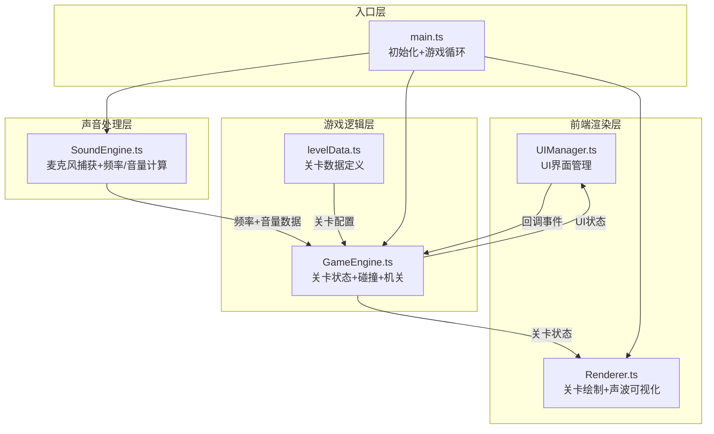

## 1. 架构设计



**数据流向**：麦克风 → SoundEngine（频率/音量） → GameEngine（更新机关状态） → Renderer（绘制帧）

## 2. 技术说明

- **前端**：TypeScript + HTML Canvas + Web Audio API + Vite
- **构建工具**：Vite 5.0.8
- **语言**：TypeScript 5.3.3，严格模式，target ES2020
- **无后端**：纯前端游戏，所有逻辑在浏览器端运行
- **模块通信**：事件总线（EventBus）模式，模块间松耦合

## 3. 文件结构与调用关系

```
project/
├── package.json              # 依赖：typescript@5.3.3, vite@5.0.8
├── index.html                # 入口页面，全屏深色渐变背景
├── tsconfig.json             # 严格模式，target ES2020
├── vite.config.js            # Vite默认配置
└── src/
    ├── main.ts               # 游戏入口 → 初始化Canvas、SoundEngine、GameEngine、Renderer
    ├── sound/
    │   └── SoundEngine.ts    # 声音处理 → 输出频率(Hz)和音量(0-1)给GameEngine
    ├── game/
    │   ├── GameEngine.ts     # 游戏逻辑 → 接收声音数据，更新状态，驱动Renderer
    │   └── levelData.ts      # 关卡数据 → 被GameEngine引用
    ├── render/
    │   └── Renderer.ts       # 渲染模块 → 从GameEngine获取状态并绘制
    └── ui/
        └── UIManager.ts      # UI管理 → 通过回调与GameEngine交互
```

## 4. 核心模块接口定义

### 4.1 SoundEngine 接口

```typescript
interface SoundData {
  frequency: number;
  volume: number;
  waveform: Float32Array;
}

class SoundEngine {
  init(): Promise<void>;
  getSoundData(): SoundData;
  startCalibration(): void;
  getCalibrationResult(): { baseFrequency: number; frequencyRange: number };
  destroy(): void;
}
```

### 4.2 GameEngine 接口

```typescript
interface GameState {
  player: PlayerState;
  platforms: PlatformState[];
  doors: DoorState[];
  blocks: BlockState[];
  walls: WallState[];
  goal: GoalState;
  levelComplete: boolean;
}

class GameEngine {
  loadLevel(levelIndex: number): void;
  update(dt: number, soundData: SoundData, input: InputState): void;
  getState(): GameState;
  resetLevel(): void;
}
```

### 4.3 Renderer 接口

```typescript
class Renderer {
  init(canvas: HTMLCanvasElement): void;
  render(state: GameState, soundData: SoundData, uiState: UIState): void;
  resize(width: number, height: number): void;
}
```

### 4.4 UIManager 接口

```typescript
type GameScreen = 'calibration' | 'levelSelect' | 'playing' | 'levelComplete';

class UIManager {
  init(canvas: HTMLCanvasElement): void;
  setScreen(screen: GameScreen): void;
  onUpdate(callback: (dt: number) => void): void;
  onLevelSelect(callback: (levelIndex: number) => void): void;
  onNextLevel(callback: () => void): void;
  render(ctx: CanvasRenderingContext2D): void;
}
```

## 5. 事件总线设计

```typescript
type EventMap = {
  'sound:data': SoundData;
  'game:state': GameState;
  'game:levelComplete': number;
  'game:reset': void;
  'ui:screenChange': GameScreen;
  'ui:levelSelect': number;
  'ui:nextLevel': void;
  'ui:startCalibration': void;
  'calibration:complete': { baseFrequency: number; frequencyRange: number };
};
```

## 6. 关卡数据结构

```typescript
interface LevelConfig {
  width: number;
  height: number;
  playerStart: { x: number; y: number };
  platforms: PlatformConfig[];
  doors: DoorConfig[];
  blocks: BlockConfig[];
  walls: WallConfig[];
  goal: { x: number; y: number };
}

interface PlatformConfig {
  x: number; y: number; width: number; height: number;
  frequencyMin: number; frequencyMax: number;
  moveAxis: 'y'; moveRange: number;
}

interface DoorConfig {
  x: number; y: number; width: number; height: number;
  frequencyMin: number; frequencyMax: number;
  volumeThreshold: number;
}

interface BlockConfig {
  x: number; y: number; size: number;
}
```

## 7. 性能约束

- 游戏主循环以60FPS运行（requestAnimationFrame + deltaTime计算）
- 声音分析每帧执行一次（Web Audio API AnalyserNode，fftSize=2048）
- Canvas绘制优化：按层绘制（背景→平台→机关→玩家→声波→UI）
- 输入延迟不超过100ms：键盘事件直接更新输入状态，声音数据实时获取
