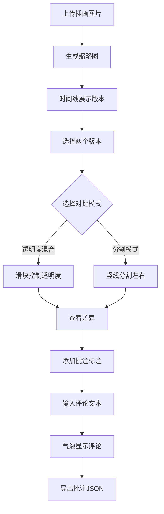

## 1. 产品概述

面向独立插画师的在线插画版本比对与评审工具，解决多版本草稿交付时比对困难、修改意见标注低效的痛点。支持版本上传管理、双图叠加对比、画布批注评论及版本历史时间线浏览，帮助插画师与客户高效协作。

- 目标用户：独立插画师、设计团队、与客户协作的创意工作者
- 核心价值：将版本对比从「切换窗口」升级为「叠加比对」，将修改意见从「文字描述」升级为「精准画布批注」

## 2. 核心功能

### 2.1 用户角色

| 角色 | 注册方式 | 核心权限 |
|------|----------|----------|
| 插画师 | 无需注册（本地工具） | 上传版本、对比、批注、导出 |

### 2.2 功能模块

1. **主工作区页面**：版本上传与缩略图管理、双图对比视图、批注标注层、版本历史时间线

### 2.3 页面详情

| 页面名称 | 模块名称 | 功能描述 |
|----------|----------|----------|
| 主工作区 | 版本上传 | 支持多张图片上传（最多10张，jpg/png，≤5MB），自动生成180×120缩略图 |
| 主工作区 | 版本时间线 | 底部水平时间线，圆形缩略图（直径64px），虚线连接，点击切换版本 |
| 主工作区 | 双图对比 | 透明度混合模式与分割模式，滑块/竖线交互控制 |
| 主工作区 | 批注标注 | 拖拽绘制矩形/圆形批注框，文本输入，气泡评论展示 |
| 主工作区 | 缩放平移 | 鼠标滚轮缩放（0.5x-3x），空格+拖拽平移 |
| 主工作区 | 批注导出 | JSON格式导出所有批注数据 |
| 主工作区 | 控制面板 | 左侧可折叠面板，显示当前版本属性 |

## 3. 核心流程

用户上传插画版本 → 系统生成缩略图并排列在时间线 → 用户从时间线选择两个版本 → 主区域展示双图对比（透明度/分割模式）→ 用户在画布上添加批注框并输入评论 → 批注以气泡形式显示 → 用户可导出批注数据为JSON文件

## 4. 用户界面设计

### 4.1 设计风格

- 主色：靛蓝 #6C63FF，辅色：浅灰 #F5F5F5
- 文字色：深灰 #333，标题色：#1A1A1A，警示色：#EF4444
- 按钮风格：圆角8px，hover抬升+阴影加深
- 字体：Inter，标题14-18px，正文12-14px
- 布局：顶部工具栏48px + 左侧面板200px + 中央画布 + 底部时间线120px
- 图标：FontAwesome风格线性图标

### 4.2 页面设计概览

| 页面名称 | 模块名称 | UI元素 |
|----------|----------|--------|
| 主工作区 | 顶部工具栏 | 白色背景48px，添加批注按钮（主色圆角），导出批注按钮，对比模式切换（圆形36px），缩放比例显示 |
| 主工作区 | 左侧面板 | 浅灰背景200px，版本属性列表（文件名、尺寸、时间），可折叠 |
| 主工作区 | 中央画布 | Canvas双图叠加，批注框覆盖层，缩放平移控制 |
| 主工作区 | 底部时间线 | 白色背景120px，圆形缩略图64px，虚线连接，版本号+日期 |

### 4.3 响应式适配

- 桌面端优先设计（≥768px）：标准布局
- 移动端适配（<768px）：控制面板折叠为悬浮图标，时间线变为纵向滚动，对比视图上下堆叠
- 触屏支持：时间线左右滑动，画布双指缩放

### 4.4 3D场景指引

不适用
