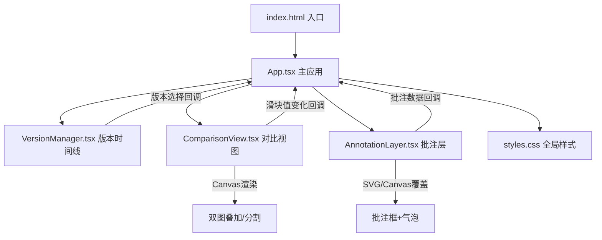
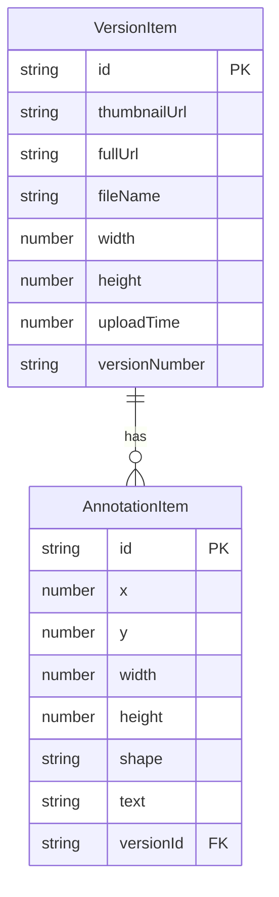

## 1. 架构设计



## 2. 技术说明

- 前端：React@18.2.0 + TypeScript@5.3.3 + Vite@5.0.8
- 构建工具：Vite + @vitejs/plugin-react@4.2.0
- 样式：纯CSS（styles.css），CSS变量管理主题色
- 后端：无（纯前端应用，图片通过FileReader本地处理）
- 数据库：无（状态管理通过React useState/useReducer）

### 数据流向

```
用户操作 → App.tsx（全局状态中心）
  ├─ 上传图片 → 生成版本列表 → VersionManager（展示时间线）
  ├─ 选择版本 → 更新当前对比版本对 → ComparisonView（渲染对比）
  ├─ 添加批注 → 更新批注数据 → AnnotationLayer（渲染批注框）
  └─ 导出批注 → JSON下载
```

### 组件通信

- **App → VersionManager**：`versionList`（版本数据数组）、`onSelectVersion`（版本选择回调）
- **App → ComparisonView**：`imageA`/`imageB`（图片URL）、`mode`（对比模式）、`opacity`/`sliderPos`（控制值）、`onModeChange`/`onOpacityChange`/`onSliderChange`（回调）
- **App → AnnotationLayer**：`annotations`（批注数据）、`canvasRect`（画布尺寸）、`scale`（缩放比例）、`onAddAnnotation`/`onUpdateAnnotation`/`onDeleteAnnotation`（回调）

## 3. 路由定义

| 路由 | 用途 |
|------|------|
| / | 单页应用主工作区 |

## 4. API定义

无后端API，所有数据在前端本地处理。

### 核心数据类型

```typescript
interface VersionItem {
  id: string;
  file: File;
  thumbnailUrl: string;
  fullUrl: string;
  fileName: string;
  width: number;
  height: number;
  uploadTime: number;
  versionNumber: string;
}

interface AnnotationItem {
  id: string;
  x: number;
  y: number;
  width: number;
  height: number;
  shape: 'rect' | 'circle';
  text: string;
  versionId: string;
}

type CompareMode = 'opacity' | 'split';
```

## 5. 服务端架构

不适用（纯前端应用）

## 6. 数据模型

### 6.1 数据模型定义



### 6.2 数据定义

无数据库DDL，数据存储在React组件状态中。
