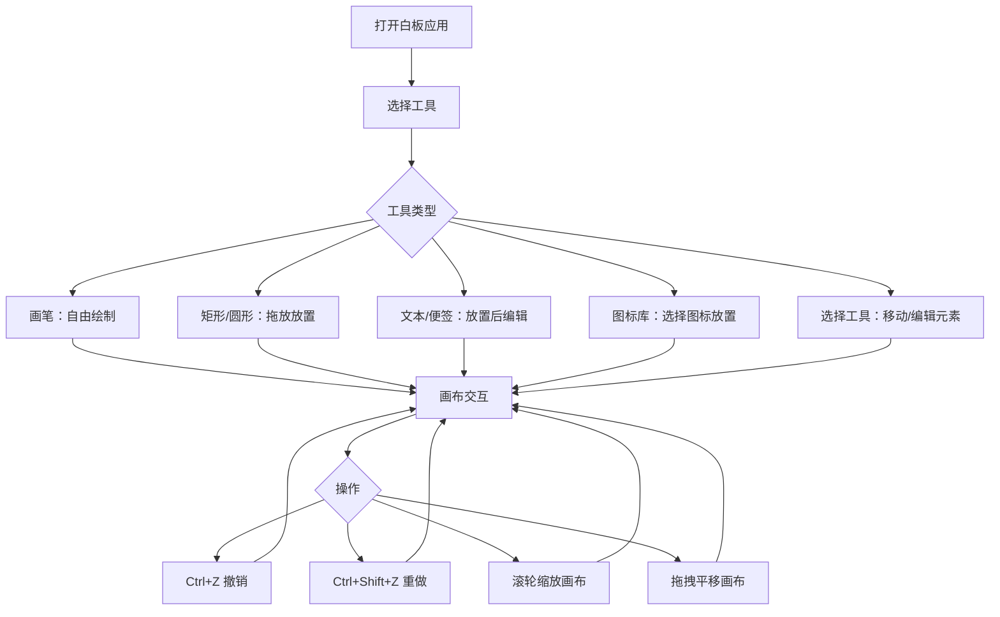

## 1. 产品概述

在线协作白板是一款面向团队协作的实时绘图工具，支持在无限画布上绘制流程图、贴便签、插入图标，提供撤销/重做和流畅的画布交互体验。
- 解决团队成员远程协作时缺乏直观视觉沟通工具的问题，目标用户为产品经理、设计师、开发工程师等需要可视化讨论的团队
- 核心价值：极简毛玻璃美学 + 手绘风格渲染 + 无限画布自由创作

## 2. 核心功能

### 2.1 用户角色
| 角色 | 注册方式 | 核心权限 |
|------|----------|----------|
| 普通用户 | 无需注册 | 浏览、绘制、编辑画布元素 |

### 2.2 功能模块
1. **白板主页面**: 无限画布、工具条、元素渲染、缩放拖拽、网格辅助线、撤销重做

### 2.3 页面详情
| 页面名称 | 模块名称 | 功能描述 |
|----------|----------|----------|
| 白板主页面 | 无限画布 | 鼠标拖拽平移、滚轮缩放（0.5x-3x，光标位置缩放，0.15秒平滑过渡）、浅灰色背景(#F0F2F5)配极淡网格(50px间距,0.5px线宽,#D0D4D8) |
| 白板主页面 | 左侧工具条 | 固定宽60px竖直工具条，白色背景圆角右边缘8px带轻微阴影，7个工具按钮（画笔、矩形、圆形、文本、便签、图标库、选择），40px圆角正方形按钮，hover浅蓝背景(#EBF4FF)+1.05倍放大，选中蓝色图标(#2563EB)+2px蓝色下沿线 |
| 白板主页面 | 元素放置 | 拖动工具按钮到画布放置图形，放置动画0.2秒spring效果，矩形/圆形网格吸附(阈值10px)，双击编辑内容（文本工具→文字编辑，便签→浅黄色#FEF3C7 textarea浮层） |
| 白板主页面 | 撤销重做 | Ctrl+Z撤销、Ctrl+Shift+Z重做，撤销栈50步限制，右下角历史指示器(3/50格式，6px圆角半透明黑色背景) |
| 白板主页面 | 顶部导航栏 | 浅紫到浅蓝渐变(#667EEA→#764BA2)，毛玻璃风格 |

## 3. 核心流程

用户打开白板 → 选择工具（画笔/矩形/圆形/文本/便签/图标/选择） → 在画布上放置或绘制元素 → 拖拽移动元素 → 双击编辑元素内容 → 撤销/重做操作 → 自由缩放拖拽画布浏览

## 4. 用户界面设计

### 4.1 设计风格
- 主色：浅紫(#667EEA)到浅蓝(#764BA2)线性渐变
- 辅色：浅蓝(#EBF4FF)、浅黄(#FEF3C7)
- 强调色：蓝色(#2563EB)
- 按钮风格：40px圆角正方形，毛玻璃质感(背景模糊10px)
- 字体：系统默认无衬线字体
- 布局风格：左侧固定工具条 + 中间无限画布 + 顶部导航栏
- 图标风格：线性简约图标(lucide-react)

### 4.2 页面设计概览
| 页面名称 | 模块名称 | UI元素 |
|----------|----------|--------|
| 白板主页面 | 顶部导航栏 | 渐变背景(#667EEA→#764BA2)，毛玻璃效果，高度48px，显示应用标题 |
| 白板主页面 | 左侧工具条 | 白色毛玻璃背景，宽60px，7个垂直排列按钮，hover/选中微动效 |
| 白板主页面 | 画布区域 | 浅灰色背景(#F0F2F5)，50px间距网格线，roughjs手绘风格元素渲染 |
| 白板主页面 | 历史指示器 | 右下角浮动，6px圆角半透明黑色背景，显示步数/总步数 |

### 4.3 响应式
- 桌面优先设计，画布占满可用空间
- 工具条始终固定在左侧
- 缩放和平移操作适配鼠标滚轮和拖拽

### 4.4 3D场景指引
- 不适用
