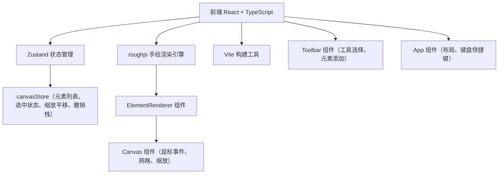
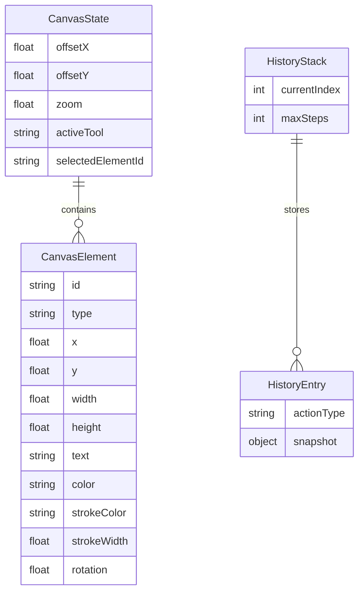

## 1. 架构设计



## 2. 技术说明
- 前端：React@18.2.0 + TypeScript@5.3.3 + Zustand@4.5.0 + roughjs@4.6.6
- 构建工具：Vite@5.0.8 + @vitejs/plugin-react@4.2.0
- 状态管理：Zustand（画布状态、元素列表、撤销/重做栈）
- 渲染引擎：roughjs（手绘风格图形渲染，Canvas 2D API）
- 无后端：纯前端应用，所有状态存储在内存中

## 3. 路由定义
| 路由 | 用途 |
|------|------|
| / | 白板主页面，包含无限画布和工具条 |

## 4. API定义
- 无后端API，所有数据在客户端内存中管理

## 5. 服务器架构图
- 不适用（纯前端应用）

## 6. 数据模型

### 6.1 数据模型定义



### 6.2 数据定义

```typescript
type ToolType = 'select' | 'pen' | 'rectangle' | 'circle' | 'text' | 'sticky' | 'icon'

interface CanvasElement {
  id: string
  type: 'rectangle' | 'circle' | 'text' | 'sticky' | 'icon' | 'pen'
  x: number
  y: number
  width: number
  height: number
  text?: string
  color?: string
  strokeColor?: string
  strokeWidth?: number
  rotation?: number
  iconType?: string
  points?: { x: number; y: number }[]
}

interface CanvasState {
  elements: CanvasElement[]
  activeTool: ToolType
  selectedElementId: string | null
  offsetX: number
  offsetY: number
  zoom: number
  history: CanvasElement[][]
  historyIndex: number
  maxHistory: number
}
```
