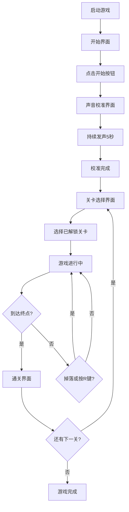

## 1. 产品概述

本产品是一款基于声音操作解谜的2D平台跳跃游戏，玩家通过麦克风发出不同频率和时长的声音来控制平台升降、移动障碍物或触发机关，最终到达终点。

- **目标用户**：独立游戏爱好者、解谜游戏玩家、对创新交互方式感兴趣的用户
- **核心价值**：创新的声音交互玩法，将声音频率、音量等音频特征转化为游戏控制机制，提供独特的解谜体验
- **市场定位**：独立小游戏，主打创新交互和赛博朋克视觉风格

## 2. 核心功能

### 2.1 用户角色
| 角色 | 注册方式 | 核心权限 |
|------|----------|----------|
| 玩家 | 无需注册 | 体验游戏全部关卡、使用声音控制、查看通关进度 |

### 2.2 功能模块
1. **声音校准模块**：麦克风输入检测、频率范围校准、音量阈值设置
2. **关卡系统**：3个不同难度关卡、进度解锁机制、关卡选择界面
3. **机关系统**：音控平台、音控门、可推动音控方块
4. **玩家控制**：键盘移动跳跃、声音控制机关、碰撞检测
5. **可视化模块**：声波波形可视化、圆环校准动画、游戏画面渲染
6. **UI界面**：开始界面、关卡选择、通关提示、重试机制

### 2.3 页面详情
| 页面名称 | 模块名称 | 功能描述 |
|----------|----------|----------|
| 开始界面 | 入口模块 | 游戏标题、开始按钮、赛博朋克风格背景动画 |
| 校准界面 | 声音校准模块 | 实时音量条、声波圆环动画、5秒校准倒计时、校准完成提示 |
| 关卡选择界面 | 关卡系统 | 三张关卡卡片、解锁状态显示、点击进入关卡 |
| 游戏界面 | 核心玩法 | 游戏画布、声波可视化区域、玩家角色、机关元素、星星终点 |
| 通关界面 | 结果反馈 | 恭喜通关文字、下一关/返回按钮、通关动画 |

## 3. 核心流程

玩家启动游戏 → 进入开始界面 → 点击开始 → 进入声音校准 → 持续发声5秒完成校准 → 进入关卡选择 → 选择已解锁关卡 → 游戏进行中（声音控制机关 + 键盘控制移动） → 到达星星终点 → 通关界面 → 下一关或返回选择 → 全部通关或中途重试

## 4. 用户界面设计

### 4.1 设计风格
- **主色调**：深蓝（#0B0C10）、蓝紫（#1F2833）、青色（#45A29E、#66FCF1）
- **辅助色**：橙色（#F3A183）、亮黄（#FFD700）、暗红（#C5C6C7）
- **按钮风格**：圆角8px，背景渐变（#45A29E → #66FCF1），hover时缩放1.05倍加光晕，过渡0.2秒
- **字体**：现代无衬线字体，标题使用青色（#66FCF1），正文白色（#FFFFFF）
- **整体风格**：赛博朋克风格，深蓝+青色+紫色配色，带有星星粒子背景动画
- **特殊效果**：界面切换淡入淡出动画（0.2秒）、星星粒子缓慢闪烁、终点星星闪烁动画（0.5秒周期）

### 4.2 页面设计概述
| 页面名称 | 模块名称 | UI元素 |
|----------|----------|--------|
| 开始界面 | 背景 | 全屏径向渐变（中心#1F2833 → 边缘#0B0C10）、星星粒子、游戏标题发光效果 |
| 开始界面 | 按钮 | 居中"开始游戏"按钮，渐变色，hover动效 |
| 校准界面 | 背景 | 深蓝到蓝紫径向渐变（#0B0C10 → #1F2833） |
| 校准界面 | 可视化 | 中心声波圆环（半径50-120px动态缩放，蓝到红渐变，过渡0.2秒）、上方实时音量条（200px宽，半透明背景）、倒计时文字 |
| 校准界面 | 提示 | "请持续发出'啊——'声5秒"提示文字 |
| 关卡选择 | 卡片 | 3张200x250px卡片，圆角12px，已解锁为亮色渐变，未解锁为半透明灰色，内阴影 |
| 游戏界面 | 画布 | 自适应窗口，16:9比例，居中显示 |
| 游戏界面 | 声波可视化 | 右下角200x80px区域，圆角8px，半透明深色背景，Canvas波形绘制（左右各20采样点） |
| 游戏界面 | 玩家 | 直径20px黄色圆形，带25px光晕（透明度0.3） |
| 游戏界面 | 平台 | 200x20px长方形，青色到蓝色渐变 |
| 游戏界面 | 门 | 25x100px矩形，暗红色，水平滑动动画0.3秒 |
| 游戏界面 | 方块 | 40x40px正方形，橙色 |
| 游戏界面 | 终点 | 直径40px金色星形，0.5秒闪烁周期 |
| 通关界面 | 文字 | 居中"恭喜通关"48px，青色，带阴影 |
| 通关界面 | 按钮 | "下一关"按钮，渐变色 |

### 4.3 响应式
- **桌面优先**：画布自适应窗口大小，保持16:9比例，居中显示
- **缩放策略**：监听窗口resize事件，动态调整Canvas尺寸，游戏逻辑坐标系统独立于渲染尺寸
- **触摸优化**：主要面向桌面端，键盘操作，麦克风输入

### 4.4 性能要求
- **帧率**：游戏主循环60FPS
- **输入延迟**：不超过100ms
- **渲染优化**：Canvas分层绘制，脏矩形区域更新
