## 1. 架构设计

```mermaid
graph TD
    subgraph "表现层 (Presentation)"
        UI["UIManager.ts<br/>界面管理"]
        Renderer["Renderer.ts<br/>Canvas渲染"]
    end
    
    subgraph "逻辑层 (Logic)"
        GameEngine["GameEngine.ts<br/>游戏逻辑"]
        LevelData["levelData.ts<br/>关卡数据"]
    end
    
    subgraph "输入层 (Input)"
        SoundEngine["SoundEngine.ts<br/>声音处理"]
        Keyboard["键盘事件"]
    end
    
    subgraph "核心设施 (Infrastructure)"
        EventBus["事件总线<br/>EventEmitter"]
        Types["类型定义<br/>types.ts"]
    end
    
    SoundEngine -->|frequency/volume| EventBus
    Keyboard -->|keydown/keyup| EventBus
    EventBus -->|soundData| GameEngine
    EventBus -->|keyEvents| GameEngine
    GameEngine -->|gameState| Renderer
    GameEngine -->|levelData| LevelData
    UI -->|uiEvents| EventBus
    EventBus -->|uiCommands| UI
    Renderer -->|waveformData| SoundEngine
    
    style SoundEngine fill:#45A29E,stroke:#66FCF1
    style GameEngine fill:#45A29E,stroke:#66FCF1
    style Renderer fill:#45A29E,stroke:#66FCF1
    style UI fill:#45A29E,stroke:#66FCF1
    style EventBus fill:#1F2833,stroke:#66FCF1
```



## 2. 技术描述

### 2.1 技术栈选择
- **前端框架**：原生 TypeScript（无React/Vue，纯Canvas游戏）
- **构建工具**：Vite@5.0.8
- **语言**：TypeScript@5.3.3（严格模式，target ES2020）
- **音频处理**：Web Audio API（webkitAudioContext）
- **图形渲染**：HTML5 Canvas 2D
- **状态管理**：事件总线（EventEmitter模式）
- **样式**：内联CSS + CSS变量

### 2.2 关键依赖
| 依赖 | 版本 | 用途 |
|------|------|------|
| typescript | 5.3.3 | 类型系统 |
| vite | 5.0.8 | 构建工具 |

### 2.3 项目初始化
使用 Vite vanilla-ts 模板初始化项目，然后按照需求调整目录结构。

## 3. 目录结构

```
e:\solo\SoloAutoDemo\tasks\auto12\
├── package.json                          # 项目配置与依赖
├── index.html                            # 入口HTML
├── tsconfig.json                         # TypeScript配置
├── vite.config.js                        # Vite配置
├── .trae/
│   └── documents/
│       ├── prd.md                        # 产品需求文档
│       └── technical-architecture.md     # 技术架构文档
└── src/
    ├── main.ts                           # 游戏入口
    ├── types.ts                          # 全局类型定义（新增）
    ├── EventBus.ts                       # 事件总线（新增）
    ├── sound/
    │   └── SoundEngine.ts                # 声音处理模块
    ├── game/
    │   ├── GameEngine.ts                 # 游戏逻辑模块
    │   └── levelData.ts                  # 关卡数据
    ├── render/
    │   └── Renderer.ts                   # 渲染模块
    └── ui/
        └── UIManager.ts                  # UI管理模块
```

## 4. 模块职责与数据流向

### 4.1 事件总线 (EventBus.ts)
- **职责**：实现发布-订阅模式，模块间解耦通信
- **核心方法**：`on(event, callback)`、`emit(event, data)`、`off(event, callback)`
- **事件定义**：
  - `sound:data` - 声音数据（频率、音量、波形）
  - `sound:calibrationComplete` - 校准完成
  - `game:update` - 游戏状态更新
  - `game:levelComplete` - 关卡完成
  - `game:restart` - 重新开始
  - `key:down` / `key:up` - 键盘事件
  - `ui:showScreen` - 切换界面
  - `ui:levelSelected` - 关卡选择

### 4.2 类型定义 (types.ts)
```typescript
// 游戏状态
type GameScreen = 'start' | 'calibration' | 'levelSelect' | 'playing' | 'complete';

// 声音数据
interface SoundData {
  frequency: number;      // Hz
  volume: number;         // 0-1
  waveform: Float32Array; // 波形数据
}

// 玩家状态
interface Player {
  x: number;
  y: number;
  vx: number;
  vy: number;
  width: number;
  height: number;
  onGround: boolean;
}

// 机关类型
type MechanismType = 'platform' | 'door' | 'block';

// 机关基础接口
interface Mechanism {
  id: string;
  type: MechanismType;
  x: number;
  y: number;
  width: number;
  height: number;
}

// 音控平台
interface SoundPlatform extends Mechanism {
  type: 'platform';
  baseY: number;
  targetY: number;
  minY: number;
  maxY: number;
  speed: number;
  activeFrequencyRange: [number, number];
}

// 音控门
interface SoundDoor extends Mechanism {
  type: 'door';
  isOpen: boolean;
  openProgress: number;  // 0-1
  requiredVolume: number;
  requiredFrequencyRange: [number, number];
}

// 可推动方块
interface PushableBlock extends Mechanism {
  type: 'block';
  vx: number;
}

// 关卡数据
interface Level {
  id: number;
  name: string;
  playerStart: { x: number; y: number };
  goal: { x: number; y: number; radius: number };
  platforms: SoundPlatform[];
  doors: SoundDoor[];
  blocks: PushableBlock[];
  walls: { x: number; y: number; width: number; height: number }[];
}

// 游戏状态
interface GameState {
  currentScreen: GameScreen;
  currentLevel: number;
  unlockedLevels: number[];
  player: Player;
  level: Level | null;
  isPaused: boolean;
}
```

### 4.3 数据流向

```
麦克风输入
    ↓ (Web Audio API)
SoundEngine.analyze()
    ↓ { frequency, volume, waveform }
EventBus.emit('sound:data', data)
    ↓
GameEngine.onSoundData(data)
    ├─> 更新平台位置（频率匹配时升降）
    ├─> 更新门状态（音量+频率匹配时打开）
    └─> 更新方块推力（音量决定推动速度）
    ↓
GameEngine.update(dt)
    ├─> 玩家物理（重力、跳跃、移动）
    ├─> 碰撞检测（玩家-平台、玩家-门、玩家-方块、玩家-终点）
    └─> 机关状态更新
    ↓
EventBus.emit('game:update', state)
    ↓
Renderer.render(state)
    ├─> 绘制背景（渐变+星星）
    ├─> 绘制关卡元素（平台、门、方块、墙壁）
    ├─> 绘制玩家（圆形+光晕）
    ├─> 绘制终点（闪烁星星）
    └─> 绘制声波可视化
```

### 4.4 模块调用关系

| 模块 | 依赖 | 被依赖 |
|------|------|--------|
| main.ts | EventBus, SoundEngine, GameEngine, Renderer, UIManager | 无（入口） |
| SoundEngine.ts | types, EventBus | main.ts |
| GameEngine.ts | types, EventBus, levelData | main.ts |
| Renderer.ts | types, EventBus | main.ts |
| UIManager.ts | types, EventBus | main.ts |
| levelData.ts | types | GameEngine.ts |
| EventBus.ts | 无 | 所有模块 |
| types.ts | 无 | 所有模块 |

## 5. 核心算法

### 5.1 声音频率检测（YIN算法简化版）
```
1. 获取时域音频数据
2. 计算自相关函数
3. 寻找第一个过零点和峰值
4. 转换为频率（采样率 / 延迟样本数）
5. 限制在80-1200Hz有效范围
```

### 5.2 音量计算（RMS均方根）
```
volume = sqrt(sum(sample[i]^2) / N)
归一化到0-1范围
```

### 5.3 碰撞检测（AABB轴对齐包围盒）
```typescript
function collides(a: Rect, b: Rect): boolean {
  return a.x < b.x + b.width &&
         a.x + a.width > b.x &&
         a.y < b.y + b.height &&
         a.y + a.height > b.y;
}
```

### 5.4 平台升降逻辑
```
if frequency in [200, 400]:
    targetY = minY  // 升起
else:
    targetY = maxY  // 下降
currentY += (targetY - currentY) * speed * dt
```

### 5.5 门开启动画
```
if volume > 0.6 and frequency in requiredRange:
    openProgress = min(1, openProgress + dt / 0.3)
else:
    openProgress = max(0, openProgress - dt / 0.3)
renderX = baseX - openProgress * width  // 水平左滑
```

## 6. 性能优化策略

### 6.1 游戏循环
- 使用 `requestAnimationFrame` 保证60FPS
- 固定时间步长更新逻辑，可变帧率渲染
- `dt` 时间差用于速度计算，保证不同设备一致性

### 6.2 渲染优化
- Canvas 采用离屏画布预渲染静态元素
- 只重绘变化区域
- 粒子系统对象池复用

### 6.3 音频处理
- FFT大小设置为2048，平衡精度与性能
- 频率检测每帧执行一次，约16ms间隔
- 波形数据降采样到40个点用于可视化

### 6.4 内存管理
- 事件监听及时解绑
- Float32Array复用，避免频繁GC
- 关卡切换时清理旧数据

## 7. 配置文件定义

### 7.1 package.json
```json
{
  "name": "sound-puzzle-platformer",
  "version": "1.0.0",
  "type": "module",
  "scripts": {
    "dev": "vite",
    "build": "tsc && vite build",
    "preview": "vite preview"
  },
  "devDependencies": {
    "typescript": "5.3.3",
    "vite": "5.0.8"
  }
}
```

### 7.2 tsconfig.json
```json
{
  "compilerOptions": {
    "target": "ES2020",
    "useDefineForClassFields": true,
    "module": "ESNext",
    "lib": ["ES2020", "DOM", "DOM.Iterable"],
    "skipLibCheck": true,
    "moduleResolution": "bundler",
    "allowImportingTsExtensions": true,
    "resolveJsonModule": true,
    "isolatedModules": true,
    "noEmit": true,
    "strict": true,
    "noUnusedLocals": true,
    "noUnusedParameters": true,
    "noFallthroughCasesInSwitch": true
  },
  "include": ["src"]
}
```

### 7.3 vite.config.js
```javascript
import { defineConfig } from 'vite';

export default defineConfig({
  server: {
    port: 5173,
    open: true
  },
  build: {
    outDir: 'dist',
    sourcemap: true
  }
});
```
