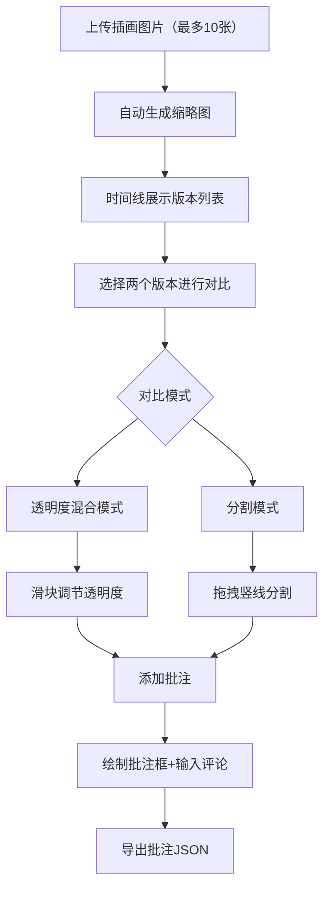

## 1. 产品概述

在线插画版本比对与评审应用，面向独立插画师，解决多版本草稿交付时比对困难、修改意见标注低效的痛点。用户可上传多版本插画，通过双图叠加对比快速定位差异，在画布上直接批注评论，并通过时间线管理版本迭代。

## 2. 核心功能

### 2.1 用户角色

| 角色 | 注册方式 | 核心权限 |
|------|----------|----------|
| 插画师 | 无需注册 | 上传、对比、批注、导出 |

### 2.2 功能模块

1. **主工作区页面**：版本上传与缩略图生成、双图对比视图、批注标注层、版本时间线、批注导出

### 2.3 页面详情

| 页面名称 | 模块名称 | 功能描述 |
|----------|----------|----------|
| 主工作区 | 工具栏 | 添加批注按钮、导出批注按钮、对比模式切换（透明度/分割）、缩放比例显示 |
| 主工作区 | 左侧控制面板 | 当前版本属性（文件名、尺寸、上传时间），可折叠 |
| 主工作区 | 对比视图 | 双图叠加对比：透明度混合模式（滑块控制）与分割模式（可拖拽竖线） |
| 主工作区 | 批注层 | 覆盖在对比视图上，支持拖拽绘制矩形/圆形批注框，文本评论以气泡形式显示 |
| 主工作区 | 版本时间线 | 底部固定120px区域，水平排列版本缩略图，圆形直径64px，灰色虚线连接，点击切换版本 |

## 3. 核心流程

用户上传多张插画图片 → 系统自动生成缩略图并排列在时间线 → 用户从时间线选择两个版本 → 主区域显示双图对比 → 用户切换对比模式（透明度/分割）→ 用户添加批注框并输入评论 → 用户可缩放平移画布 → 用户导出批注数据为JSON

## 4. 用户界面设计

### 4.1 设计风格

- 主色：#6C63FF（靛蓝），辅色：#F5F5F5（浅灰背景），文字色：#333，标题色：#1A1A1A，错误色：#EF4444
- 按钮风格：圆角8px，hover时抬升+阴影加深
- 字体：Inter，标题16px加粗，正文14px，辅助文字11px
- 布局：上方48px工具栏 + 左侧200px控制面板 + 中央对比视图 + 底部120px时间线
- 图标：Lucide风格线性图标

### 4.2 页面设计概览

| 页面名称 | 模块名称 | UI元素 |
|----------|----------|--------|
| 主工作区 | 工具栏 | 纯白背景48px高，底部1px浅灰分割线，圆角8px按钮，主色背景白色文字 |
| 主工作区 | 控制面板 | 浅灰#F5F5F5背景，宽200px，圆角4px，1px分割线 |
| 主工作区 | 对比视图 | 占70%宽高，透明度滑块（6px轨道，20px圆形滑块），分割线2px主色 |
| 主工作区 | 批注框 | 圆角6px，半透明灰背景，编辑/删除图标，文本输入框，评论气泡（圆角8px+三角箭头） |
| 主工作区 | 时间线 | 固定120px高，圆形缩略图64px直径，2px主色边框，灰色虚线连接 |

### 4.3 响应式适配

- 桌面优先设计，768px以下适配移动端
- 768px以下：控制面板折叠为左侧悬浮图标，时间线变为纵向滚动，对比视图上下堆叠
- 时间线支持触屏左右滑动

### 4.4 交互细节

- 版本切换平滑过渡，无白屏闪烁，耗时<0.5秒
- 画布缩放0.5x~3x，以鼠标位置为中心，过渡0.1秒
- 空格键+拖拽平移，光标变为抓取手势
- 批注框支持2000+无卡顿
- 缩略图首屏加载<1秒
