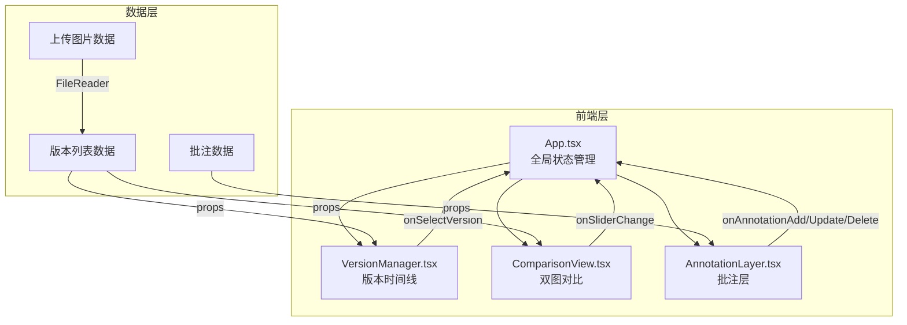

## 1. 架构设计



## 2. 技术说明

- 前端：React@18.2.0 + TypeScript@5.3.3 + Vite@5.0.8
- 初始化工具：vite-init（react-ts模板）
- 后端：无（纯前端应用）
- 数据库：无（本地内存状态，导出为JSON文件）
- 状态管理：React useState/useReducer（组件间通过props传递）

### 依赖列表

| 依赖 | 版本 | 用途 |
|------|------|------|
| react | 18.2.0 | UI框架 |
| react-dom | 18.2.0 | DOM渲染 |
| typescript | 5.3.3 | 类型安全 |
| vite | 5.0.8 | 构建工具 |
| @vitejs/plugin-react | 4.2.0 | Vite React插件 |
| lucide-react | latest | 图标库 |

## 3. 路由定义

| 路由 | 用途 |
|------|------|
| / | 主工作区（单页应用，无路由切换） |

## 4. 数据模型

### 4.1 核心类型定义

```typescript
interface VersionItem {
  id: string;
  versionNumber: string;
  fileName: string;
  originalUrl: string;
  thumbnailUrl: string;
  width: number;
  height: number;
  uploadTime: Date;
}

interface Annotation {
  id: string;
  shape: 'rect' | 'circle';
  x: number;
  y: number;
  width: number;
  height: number;
  text: string;
  versionId: string;
}

type CompareMode = 'opacity' | 'split';
```

### 4.2 数据流向

1. 用户上传图片 → FileReader读取 → 生成缩略图Canvas → 存入versionList
2. 时间线点击 → onSelectVersion回调 → App更新selectedVersions → 传入ComparisonView
3. 对比模式/滑块变化 → ComparisonView内部状态或回调App
4. 批注绘制 → AnnotationLayer记录坐标+文本 → 回调App存储annotations
5. 导出 → App读取annotations → 生成JSON → 触发下载

## 5. 文件结构

```
├── package.json
├── vite.config.js
├── tsconfig.json
├── index.html
└── src/
    ├── App.tsx          # 主应用组件，全局状态管理
    ├── main.tsx         # 入口文件
    ├── styles.css       # 全局样式与CSS变量
    └── components/
        ├── VersionManager.tsx    # 版本时间线组件
        ├── ComparisonView.tsx    # 双图对比组件
        └── AnnotationLayer.tsx   # 批注层组件
```

### 组件调用关系

- `App.tsx` 渲染 `VersionManager`、`ComparisonView`、`AnnotationLayer`
- `App.tsx` → `VersionManager`：传入 `versionList`、`onSelectVersion`、`selectedVersions`
- `App.tsx` → `ComparisonView`：传入 `imageA`、`imageB`、`compareMode`、`opacity`、`onOpacityChange`、`onCompareModeChange`
- `App.tsx` → `AnnotationLayer`：传入 `annotations`、`canvasSize`、`scale`、`onAnnotationAdd`、`onAnnotationUpdate`、`onAnnotationDelete`
- `ComparisonView` 内部使用Canvas绘制，`AnnotationLayer` 叠加在其上方
