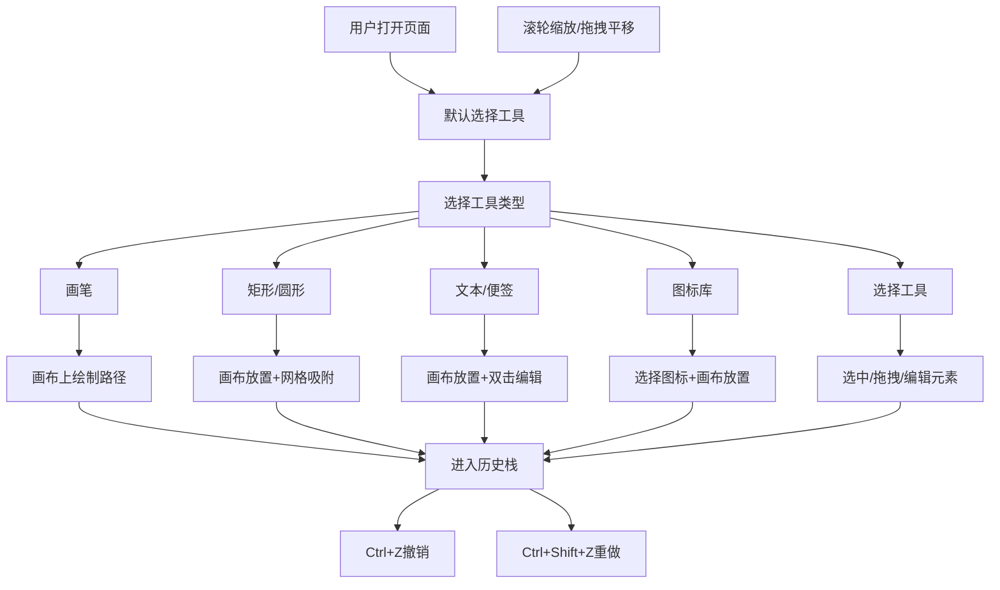

## 1. 产品概述

在线协作白板应用，让团队成员通过浏览器实时绘制流程图、贴便签、插入图标，支持撤销重做和无限画布拖拽，打造极简高效的可视化协作体验。

- 核心目的：为远程/本地团队提供轻量级、零安装的在线白板工具
- 目标用户：产品经理、设计师、开发团队、敏捷教练等需要可视化协作的角色
- 产品价值：低门槛上手、流畅交互体验、手绘风格友好感

## 2. 核心功能

### 2.1 用户角色

| 角色 | 注册方式 | 核心权限 |
|------|----------|----------|
| 普通用户 | 无需注册，直接访问 | 使用所有绘图工具、画布操作、撤销重做 |

### 2.2 功能模块

1. **无限画布区域**：虚拟画布、拖拽平移、滚轮缩放、网格背景
2. **左侧工具条**：7种工具选择（画笔、矩形、圆形、文本、便签、图标库、选择）
3. **元素操作**：放置、拖拽移动、双击编辑、网格吸附
4. **历史管理**：撤销（Ctrl+Z）、重做（Ctrl+Shift+Z）、步数指示器

### 2.3 页面详情

| 页面名称 | 模块名称 | 功能描述 |
|-----------|-------------|---------------------|
| 主界面 | 顶部导航栏 | 浅紫到浅蓝渐变背景，应用名称展示 |
| 主界面 | 左侧工具条 | 固定宽60px，7个工具按钮，圆角右边缘，毛玻璃质感 |
| 主界面 | 中央画布 | 无限虚拟画布，浅灰背景#F0F2F5，网格线50px间距 |
| 主界面 | 历史指示器 | 右下角显示当前步数/总步数，半透明黑色背景圆角6px |

## 3. 核心流程

用户打开页面后，默认处于选择工具状态。用户可从左侧工具条选择工具：
- 点击矩形/圆形/文本/便签/图标工具后，在画布上点击/拖拽放置对应元素
- 使用选择工具可选中、拖拽移动元素，双击进入编辑
- 操作画布区域空白处可拖拽平移，滚轮缩放（光标位置为中心）
- 任何操作均可通过快捷键撤销/重做

## 4. 用户界面设计

### 4.1 设计风格

- **主题色**：顶部导航栏 #667EEA → #764BA2 线性渐变
- **主色调**：蓝色 #2563EB（选中高亮）、浅蓝 #EBF4FF（hover 背景）
- **背景色**：画布 #F0F2F5，网格线 #D0D4D8
- **辅助色**：便签 #FEF3C7（浅黄色）
- **按钮风格**：40px 圆角正方形，hover 放大 1.05 倍，选中下沿 2px 蓝色线
- **毛玻璃效果**：工具条 backdrop-filter: blur(10px) 半透明磨砂质感
- **微动效**：元素放置 0.2s spring 放大动画，缩放过渡 0.15s 平滑

### 4.2 页面设计概述

| 页面名称 | 模块名称 | UI 元素 |
|-----------|-------------|-------------|
| 主界面 | 顶部导航栏 | 渐变背景，白色标题文字，居中，高度 48px |
| 主界面 | 左侧工具条 | 白色半透明背景 blur(10px)，右圆角 8px，轻微阴影，按钮间距 8px，垂直排列 |
| 主界面 | 画布区域 | 占满剩余空间，#F0F2F5 背景，网格线 0.5px 宽，支持光标位置缩放 |
| 主界面 | 历史指示器 | 固定右下角，rgba(0,0,0,0.5) 背景，白色文字，圆角 6px，padding 4px 10px |

### 4.3 响应式

- 桌面端优先设计，适配常规 1080p/2K/4K 显示器
- 工具条固定宽度不随窗口变化
- 画布区域自适应填充剩余空间

### 4.4 性能要求

- 画布拖拽和缩放帧率稳定 ≥ 55fps
- 使用 Canvas/SVG 渲染，避免 DOM 操作瓶颈
- 合理使用 requestAnimationFrame 做动画
