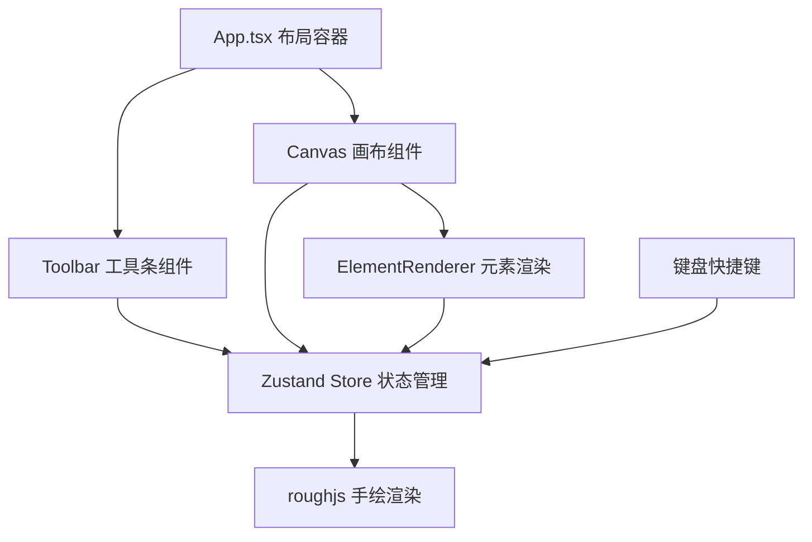

## 1. 架构设计

纯前端应用，无后端依赖。采用分层架构：UI 组件层 → 状态管理层 → 渲染层。



## 2. 技术描述

- **前端框架**：React@18.2.0 + TypeScript@5.3.3
- **构建工具**：Vite@5.0.8 + @vitejs/plugin-react@4.2.0
- **状态管理**：Zustand@4.5.0（集中管理元素、选中态、视图变换、历史栈）
- **渲染引擎**：roughjs@4.6.6（手绘风格 SVG/Canvas 渲染）
- **样式方案**：原生 CSS + CSS 变量（轻量、无额外依赖）
- **后端**：无
- **数据库**：无（纯前端内存状态）

## 3. 目录结构

```
.
├── index.html                 # 入口 HTML
├── package.json               # 依赖管理
├── tsconfig.json              # TS 配置（严格模式、ES2020 target）
├── vite.config.js             # Vite 配置
└── src/
    ├── App.tsx                # 根组件：布局+快捷键
    ├── main.tsx               # React 入口
    ├── index.css              # 全局样式+CSS变量
    ├── store/
    │   └── canvasStore.ts     # Zustand Store
    ├── components/
    │   ├── Toolbar.tsx        # 左侧工具条
    │   ├── Canvas.tsx         # 画布核心
    │   └── ElementRenderer.tsx # 元素渲染器
    └── types/
        └── index.ts           # 类型定义
```

## 4. 核心数据模型

### 4.1 元素类型定义

```typescript
type ToolType = 'select' | 'pen' | 'rectangle' | 'circle' | 'text' | 'sticky' | 'icon';

interface BaseElement {
  id: string;
  type: 'pen' | 'rectangle' | 'circle' | 'text' | 'sticky' | 'icon';
  x: number;
  y: number;
  width: number;
  height: number;
  color: string;
  fill?: string;
  strokeWidth: number;
  createdAt: number;
}

interface PenElement extends BaseElement {
  type: 'pen';
  points: { x: number; y: number }[];
}

interface TextElement extends BaseElement {
  type: 'text';
  content: string;
  fontSize: number;
}

interface StickyElement extends BaseElement {
  type: 'sticky';
  content: string;
  fill: string; // #FEF3C7
}

interface IconElement extends BaseElement {
  type: 'icon';
  iconName: string;
}

type CanvasElement = BaseElement | PenElement | TextElement | StickyElement | IconElement;
```

### 4.2 Store 状态定义

```typescript
interface CanvasState {
  // 元素
  elements: CanvasElement[];
  selectedId: string | null;
  editingId: string | null;
  
  // 工具
  activeTool: ToolType;
  
  // 视图变换
  zoom: number;           // 0.5 ~ 3
  offsetX: number;
  offsetY: number;
  
  // 历史
  past: CanvasElement[][];  // 撤销栈
  future: CanvasElement[][];// 重做栈
  maxHistory: 50;
  
  // Actions
  setTool: (tool: ToolType) => void;
  addElement: (el: CanvasElement) => void;
  updateElement: (id: string, patch: Partial<CanvasElement>) => void;
  deleteElement: (id: string) => void;
  selectElement: (id: string | null) => void;
  setEditing: (id: string | null) => void;
  setView: (zoom: number, offsetX: number, offsetY: number) => void;
  undo: () => void;
  redo: () => void;
  snapshot: () => void;  // 保存当前到历史
}
```

## 5. 撤销重做实现方案

采用 **Memento 模式** + Zustand 中间件思路：

1. 每次**修改元素**前调用 `snapshot()` 将当前 `elements` 推入 `past` 栈
2. `undo()`：弹出 `past` 末尾 → 存入 `future` → 恢复 elements
3. `redo()`：弹出 `future` 末尾 → 存入 `past` → 恢复 elements
4. 栈超过 50 时，丢弃最早的记录（shift）
5. 新增元素、修改元素、删除元素三种操作都会触发 snapshot

## 6. 画布坐标变换

使用 SVG `<g transform="translate(offsetX, offsetY) scale(zoom)">` 包裹所有元素，支持：

- **平移**：鼠标在空白处按下拖拽 → 更新 offsetX / offsetY
- **缩放**：`wheel` 事件，以光标为中心：
  - `newZoom = clamp(zoom * (1 + deltaY * -0.001), 0.5, 3)`
  - `newOffsetX = mouseX - (mouseX - offsetX) * (newZoom / zoom)`
  - 同理 offsetY，CSS `transition: transform 0.15s ease` 平滑过渡

## 7. 性能优化

- SVG 渲染，roughjs 生成手绘路径
- 缩放变换使用 CSS transform（GPU 加速）+ 0.15s transition
- 拖拽平移时禁用 transition 保证即时响应，拖拽结束后恢复
- 元素选择命中检测使用 `getBoundingClientRect` 或点到矩形距离
