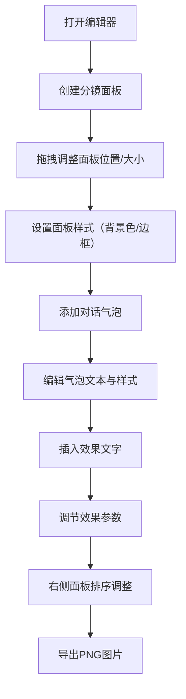

## 1. 产品概述
漫画分镜故事板编辑器是一款面向漫画创作者的在线创作工具，帮助用户通过拖拽分镜面板、添加对话气泡和效果文字，快速编排一页漫画的叙事节奏。

- 目标用户：漫画创作者、故事板艺术家、动画分镜师
- 核心价值：降低漫画分镜创作门槛，提高叙事编排效率

## 2. 核心功能

### 2.1 用户角色
| 角色 | 注册方式 | 核心权限 |
|------|----------|----------|
| 创作者 | 无需注册，直接使用 | 创建/编辑分镜面板、添加对话气泡、插入效果文字、导出作品 |

### 2.2 功能模块
1. **故事板画布区**：分镜面板创建、拖拽布局、网格吸附、尺寸调节
2. **对话气泡系统**：椭圆/矩形/云朵气泡、文本编辑、样式调整、位置锚定
3. **效果文字库**：拟声词、速度线、旋转缩放透明度调节
4. **属性面板**：面板列表、缩略图排序、属性编辑
5. **导出系统**：PNG图片导出（A4比例，150dpi）

### 2.3 页面详情
| 页面名称 | 模块名称 | 功能描述 |
|----------|----------|----------|
| 编辑器主页 | 顶部工具栏 | 新建面板、添加气泡、插入效果、导出PNG等操作按钮 |
| 编辑器主页 | 左侧画布区 | 分镜面板展示、拖拽交互、网格吸附、对话气泡渲染 |
| 编辑器主页 | 右侧属性面板 | 选中面板缩略图、背景色选择器、边框设置、气泡列表、效果文字列表 |

## 3. 核心流程
用户打开编辑器 → 在画布上创建分镜面板 → 拖拽调整面板位置和大小 → 双击面板设置背景色和边框 → 添加对话气泡并输入文本 → 插入效果文字并调节样式 → 通过右侧面板拖拽排序 → 导出为PNG图片

## 4. 用户界面设计

### 4.1 设计风格
- **主色调**：主题蓝 #1976D2，浅灰背景 #F5F5F5 / #F0F0F0
- **辅助色**：12种柔和预设色板（#FFFDE7、#F3E5F5、#E8EAF6等）
- **按钮样式**：36px圆角正方形，hover时背景变为 #E0E0E0，过渡0.2秒
- **字体**：默认无衬线字体，标题字重600，正文字重400
- **布局风格**：Flex水平三栏布局（工具栏+画布+属性面板），卡片式属性编辑区
- **图标风格**：纯CSS绘制，不使用外部图标库

### 4.2 页面设计概览
| 页面名称 | 模块名称 | UI元素 |
|----------|----------|--------|
| 编辑器主页 | 顶部工具栏 | 高度48px，白色背景，底部1px浅灰分割线，图标按钮组 |
| 编辑器主页 | 左侧画布区 | 70%宽度，浅灰背景#F0F0F0，白色画布带2px浅灰虚线边框 |
| 编辑器主页 | 右侧属性面板 | 30%宽度（最小280px），白色背景，圆角12px卡片，分类展开/收起动画0.2秒 |

### 4.3 响应式设计
- **桌面优先**：最小支持宽度1200px，保持70%/30%布局比例
- **窄屏适配**：宽度<1200px时，右侧属性面板变为可折叠侧边栏，全屏蒙层+浮出面板，过渡动画0.3秒

### 4.4 交互细节
- 面板拖拽：网格吸附（30px网格），吸附动画0.1秒
- 气泡拖拽：实时位置更新，重叠检测（红色边框警告）
- 属性面板：分类展开/收起高度过渡0.2秒
- 输入框聚焦：边框变为主题蓝，过渡0.2秒
- 性能要求：20个面板时拖拽帧率≥50fps，气泡操作延迟<30ms
