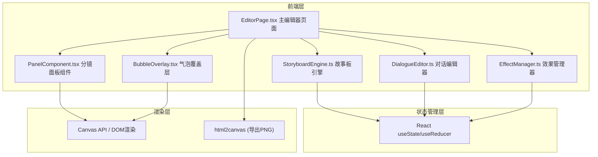

## 1. 架构设计



## 2. 技术说明
- **前端框架**：React@18.2.0 + TypeScript@5.3.3
- **构建工具**：Vite@5.0.8 + @vitejs/plugin-react@4.2.0
- **渲染方案**：DOM + CSS（分镜面板和气泡），Canvas（效果线条辅助）
- **导出方案**：html2canvas 将 DOM 转换为 PNG
- **状态管理**：React 内置 useState/useReducer + 自定义 hooks
- **无后端**：纯前端应用，所有数据保存在内存中

## 3. 路由定义
| 路由 | 用途 |
|------|------|
| / | 编辑器主页面 |

## 4. 数据模型

### 4.1 核心类型定义

```typescript
// 分镜面板
interface Panel {
  id: string;
  x: number;
  y: number;
  width: number;
  height: number;
  backgroundColor: string;
  borderWidth: 1 | 2 | 3;
  borderColor: string;
  order: number;
  bubbles: Bubble[];
  effects: EffectItem[];
}

// 对话气泡
interface Bubble {
  id: string;
  type: 'ellipse' | 'rectangle' | 'cloud';
  text: string;
  x: number; // 相对面板坐标
  y: number;
  width: number;
  height: number;
  fontSize: number; // 12-24px
  textColor: string;
  textAlign: 'left' | 'center' | 'right';
  borderRadius?: number; // 矩形气泡圆角
}

// 效果文字
interface EffectItem {
  id: string;
  type: 'onomatopoeia' | 'speedline';
  subtype: string; // Boom/Whoosh/Zap 等或 horizontal/vertical/radial
  x: number;
  y: number;
  rotation: number; // 0-360度
  scale: number;
  opacity: number; // 0.2-1.0
  text?: string;
}

// 编辑器状态
interface EditorState {
  panels: Panel[];
  selectedPanelId: string | null;
  selectedBubbleId: string | null;
  selectedEffectId: string | null;
}
```

## 5. 模块设计

### 5.1 StoryboardEngine.ts
- 职责：分镜画布渲染、拖拽布局、网格吸附逻辑
- 核心方法：
  - `snapToGrid(value: number): number` - 网格吸附计算
  - `clampPanelPosition(panel: Panel, canvasSize: Size): Panel` - 位置边界限制
  - `checkPanelOverlap(panels: Panel[], movingId: string): boolean` - 面板间距检测
  - `generatePanelId(): string` - 生成唯一ID

### 5.2 DialogueEditor.ts
- 职责：对话气泡文本输入、样式选择、位置锚定服务
- 核心方法：
  - `createBubble(type: BubbleType): Bubble` - 创建气泡对象
  - `validateBubblePosition(bubble: Bubble, panel: Panel): Bubble` - 边界验证
  - `checkBubbleOverlap(bubbles: Bubble[], movingId: string): string[]` - 气泡重叠检测

### 5.3 EffectManager.ts
- 职责：管理效果文字库（拟声词+速度线）
- 常量：
  - `ONOMATOPOEIA_LIST` - 8种拟声词
  - `SPEEDLINE_TYPES` - 3种速度线样式
- 核心方法：
  - `createEffect(type: EffectType, subtype: string): EffectItem` - 创建效果项
  - `getSpeedlinePath(type: string, rotation: number): string` - 获取速度线路径

## 6. 文件结构
```
project/
├── package.json
├── index.html
├── tsconfig.json
├── vite.config.js
└── src/
    ├── main.tsx
    ├── App.tsx
    ├── types/
    │   └── index.ts
    ├── modules/
    │   ├── storyboard/
    │   │   ├── StoryboardEngine.ts
    │   │   └── PanelComponent.tsx
    │   ├── dialogue/
    │   │   ├── DialogueEditor.ts
    │   │   └── BubbleOverlay.tsx
    │   └── effects/
    │       └── EffectManager.ts
    └── pages/
        └── EditorPage.tsx
```

## 7. 性能优化策略
- 使用 `React.memo` 避免不必要的面板重渲染
- 拖拽操作使用 `requestAnimationFrame` 节流
- 位置计算使用 CSS transform 而非 top/left 实现硬件加速
- 气泡重叠检测使用空间划分减少计算量
- 使用 `will-change` CSS 属性提示浏览器优化
