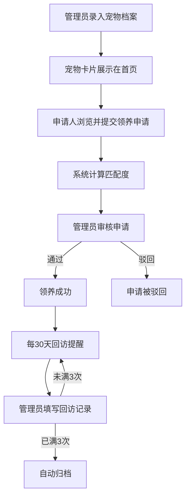

## 1. 产品概述

宠物救助领养匹配与回访管理系统，旨在解决救助站纸质化流程效率低下的问题，通过数字化手段实现宠物档案管理、领养人审核、智能匹配推荐及领养后回访追踪的完整闭环。

- 目标用户：宠物救助站管理员、领养申请人
- 核心价值：提升匹配效率、规范审核流程、确保回访可追踪

## 2. 核心功能

### 2.1 用户角色

| 角色 | 注册方式 | 核心权限 |
|------|----------|----------|
| 管理员 | 系统预设 | 管理宠物档案、审核申请、填写回访记录 |
| 领养申请人 | 自由填写表单 | 浏览宠物、提交领养申请、查看匹配结果 |

### 2.2 功能模块

1. **首页**：宠物卡片瀑布流展示、搜索筛选、导航栏
2. **宠物详情页**：宠物详细信息、性格标签、匹配候选人列表、申请领养入口
3. **申请管理页**：领养申请列表、审核操作、状态标记
4. **回访管理页**：回访记录列表、回访提醒、归档管理

### 2.3 页面详情

| 页面名称 | 模块名称 | 功能描述 |
|----------|----------|----------|
| 首页 | 宠物卡片瀑布流 | 展示所有宠物卡片（260px宽、圆角16px、白色背景），支持虚拟滚动，卡片悬停上浮8px加深阴影 |
| 首页 | 搜索筛选栏 | 按品种、年龄、性格标签筛选宠物 |
| 宠物详情页 | 宠物信息展示 | 主图+最多3张副图轮播、品种/年龄/健康状况、性格标签栏 |
| 宠物详情页 | 匹配候选人区域 | 展示最多5位匹配候选人（圆形头像40px、绿色边框2px），按匹配度排序，可展开问卷详情 |
| 宠物详情页 | 申请领养弹窗 | 填写姓名/联系方式/居住类型/是否有其他宠物/陪伴时间/居住环境图片URL |
| 申请管理页 | 申请列表 | 查看所有申请，状态标签（待审核-黄色/通过-绿色/驳回-红色），状态变更0.2s脉冲动画 |
| 回访管理页 | 回访记录 | 填写文字描述+1-5星评分，30天自动提醒，3次回访后自动归档（浅灰背景） |
| 回访管理页 | 回访提醒 | 页面右下角弹出提示框，停留5秒后自动消失 |

## 3. 核心流程

## 4. 用户界面设计

### 4.1 设计风格

- 主色：#F58F29（暖橙色），辅色：#FFFFFF（白色），背景：#F0F2F5（浅灰）
- 标题：加粗无衬线字体，一级标题24px，正文14px，文字颜色#333333
- 圆角统一12px，标签按钮圆角8px内边距4px 12px
- 卡片圆角16px，悬停上浮8px（box-shadow 0px 8px 24px rgba(0,0,0,0.15)）
- 详情页毛玻璃效果（backdrop-filter: blur(10px)）
- 布局：顶部导航 + 内容区瀑布流网格

### 4.2 页面设计概览

| 页面名称 | 模块名称 | UI元素 |
|----------|----------|--------|
| 首页 | 瀑布流卡片 | 260px固定宽、16px圆角、白底、图片区55%高度、文字区16px内边距、悬停上浮+阴影加深0.25s |
| 首页 | 导航栏 | 橙色主题、白色文字、Logo+导航链接 |
| 宠物详情页 | 右侧滑入面板 | backdrop-filter:blur(10px)、0.3s滑入动画、图片轮播、标签栏、匹配列表 |
| 宠物详情页 | 匹配候选人 | 圆形头像40px+2px绿色边框、昵称、匹配度百分比、点击展开 |
| 申请管理页 | 状态标签 | 待审核黄/通过绿/驳回红、0.2s脉冲动画 |
| 回访管理页 | 提醒弹窗 | 右下角弹出、5秒自动消失、暖橙色边框 |
| 回访管理页 | 归档记录 | 浅灰背景标识已归档 |

### 4.3 响应式设计

- 桌面优先：卡片多列瀑布流布局
- 移动端：卡片单列、宽度自适应、图片高度按比例调整
- 触摸优化：按钮最小44px触摸区域

### 4.4 动效设计

- 卡片悬停：translateY(-8px) + 阴影加深，0.25s过渡
- 详情页进入：从右侧滑入，0.3s
- 状态变更：0.2s脉冲动画（scale脉冲）
- 回访提醒：右下角弹出，停留5秒后淡出
