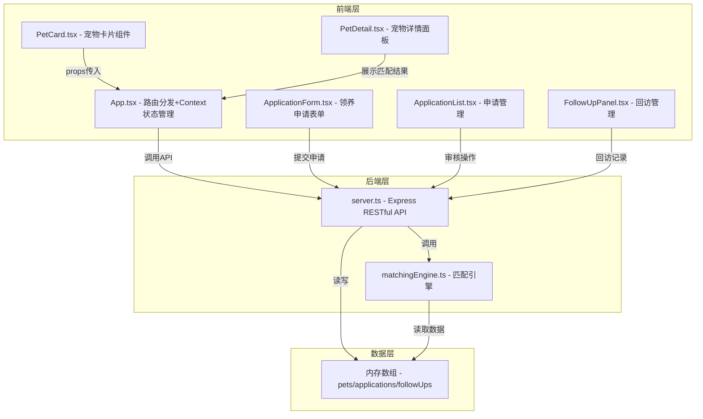
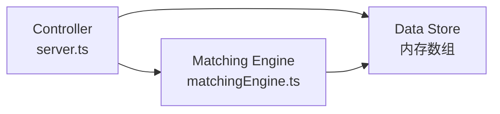
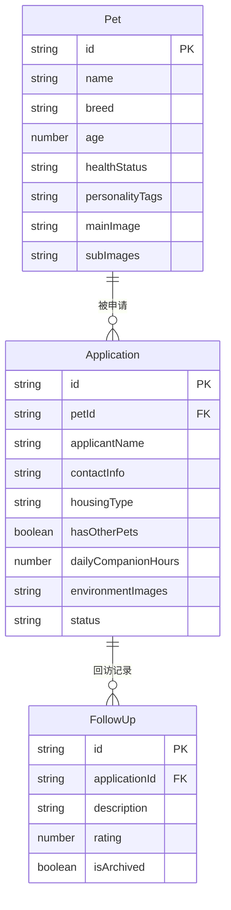

## 1. 架构设计



## 2. 技术说明

- 前端：React@18.2.0 + TypeScript@5.3.3 + Vite@5.0.8
- 初始化工具：vite-init (react-express-ts模板)
- 后端：Express@4.18.2 + TypeScript
- 数据库：内存数组存储（无持久化）
- 状态管理：React Context
- 样式：CSS Modules / 内联样式

## 3. 路由定义

| 路由 | 用途 |
|------|------|
| / | 首页 - 宠物卡片瀑布流展示 |
| /applications | 申请管理页 - 审核领养申请 |
| /followups | 回访管理页 - 回访记录与提醒 |

## 4. API定义

### 4.1 宠物相关

```
GET /api/pets          → Pet[]
POST /api/pets         → Pet（新增宠物）
GET /api/pets/:id      → Pet（宠物详情）
```

### 4.2 申请相关

```
POST /api/applications     → Application（提交申请）
GET /api/applications      → Application[]（所有申请）
PUT /api/applications/:id  → Application（更新状态）
```

### 4.3 匹配相关

```
GET /api/matches/:petId    → MatchResult[]（匹配度排序候选人列表，最多5人）
```

### 4.4 回访相关

```
POST /api/followups        → FollowUp（新增回访记录）
GET /api/followups         → FollowUp[]（所有回访记录）
GET /api/followups/reminders → FollowUpReminder[]（待回访提醒列表）
```

### 4.5 TypeScript类型定义

```typescript
interface Pet {
  id: string;
  name: string;
  breed: string;
  age: number;
  healthStatus: string;
  personalityTags: string[];
  mainImage: string;
  subImages: string[];
  createdAt: string;
}

interface Application {
  id: string;
  petId: string;
  applicantName: string;
  contactInfo: string;
  housingType: 'apartment' | 'house';
  hasOtherPets: boolean;
  dailyCompanionHours: number;
  environmentImages: string[];
  status: 'pending' | 'approved' | 'rejected';
  createdAt: string;
}

interface MatchResult {
  application: Application;
  matchScore: number;
}

interface FollowUp {
  id: string;
  applicationId: string;
  description: string;
  rating: number;
  createdAt: string;
  isArchived: boolean;
}

interface FollowUpReminder {
  applicationId: string;
  petName: string;
  applicantName: string;
  lastFollowUpDate: string | null;
  daysSinceAdoption: number;
}
```

## 5. 服务端架构图



## 6. 数据模型

### 6.1 数据模型定义



### 6.2 匹配算法逻辑

匹配度计算规则：
- 性格标签匹配（权重40%）：宠物标签与申请人条件匹配度
  - "活泼" → 每日陪伴时间≥4小时 得分100%，≥2小时60%，<2小时20%
  - "亲人" → 每日陪伴时间≥3小时 得分100%，≥1小时60%
  - "胆小" → 居住类型为独栋 得分100%，公寓60%
  - "安静" → 居住类型为公寓 得分100%，独栋60%
- 居住环境匹配（权重30%）：独栋适合大型/活泼宠物，公寓适合安静宠物
- 陪伴时间匹配（权重30%）：根据宠物性格标签活跃度匹配陪伴时间

最终匹配度 = (标签匹配×0.4 + 环境匹配×0.3 + 时间匹配×0.3) × 100%
