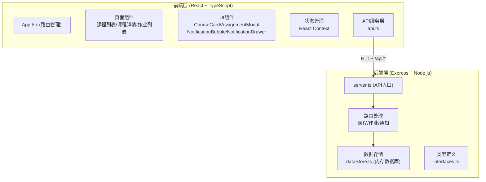
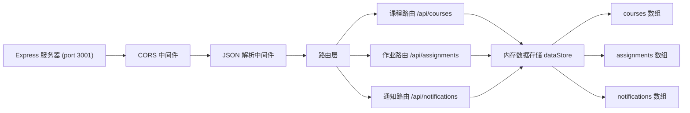
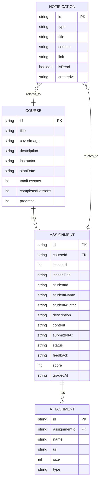

## 1. 架构设计



## 2. 技术栈说明

- **前端框架**：React 18.2.0 + TypeScript 5.3.3
- **构建工具**：Vite 5.0.8
- **路由管理**：react-router-dom
- **样式方案**：CSS Modules / 内联样式（按需求实现，不引入额外 CSS 框架）
- **后端框架**：Express 4.18.2
- **跨域处理**：cors 2.8.5
- **数据存储**：内存数据库（dataStore.ts 模拟）
- **端口分配**：前端 5173，后端 3001
- **代理配置**：Vite 代理 /api 请求到后端 3001 端口

## 3. 路由定义

| 路由路径 | 页面名称 | 说明 |
|----------|----------|------|
| `/` | 课程列表页 | 首页，展示所有课程卡片网格 |
| `/course/:id` | 课程详情页 | 展示课程信息和作业列表 |
| `/assignments` | 讲师作业列表 | 讲师端查看所有学员提交的作业 |
| `/assignments/:id` | 作业批改页 | 讲师批改作业详情 |

## 4. API 接口定义

### 4.1 课程相关接口

| 方法 | 路径 | 说明 | 请求体 | 响应体 |
|------|------|------|--------|--------|
| GET | `/api/courses` | 获取课程列表 | - | Course[] |
| GET | `/api/courses/:id` | 获取课程详情 | - | Course |
| POST | `/api/courses` | 创建课程 | CourseInput | Course |

### 4.2 作业相关接口

| 方法 | 路径 | 说明 | 请求体 | 响应体 |
|------|------|------|--------|--------|
| GET | `/api/assignments` | 获取作业列表（讲师端） | - | Assignment[] |
| GET | `/api/assignments/:id` | 获取作业详情 | - | Assignment |
| POST | `/api/assignments` | 提交作业（学员端） | AssignmentSubmit | Assignment |
| PUT | `/api/assignments/:id/grade` | 批改作业（讲师端） | GradeInput | Assignment |

### 4.3 通知相关接口

| 方法 | 路径 | 说明 | 请求体 | 响应体 |
|------|------|------|--------|--------|
| GET | `/api/notifications` | 获取通知列表 | - | Notification[] |
| PUT | `/api/notifications/:id/read` | 标记通知已读 | - | Notification |
| PUT | `/api/notifications/read-all` | 全部标记已读 | - | { success: true } |

### 4.4 TypeScript 类型定义

```typescript
// Course 课程
interface Course {
  id: string;
  title: string;
  coverImage: string;
  description: string;
  instructor: string;
  startDate: string;
  totalLessons: number;
  completedLessons: number;
  progress: number;
}

// Assignment 作业
interface Assignment {
  id: string;
  courseId: string;
  lessonId: number;
  lessonTitle: string;
  studentId: string;
  studentName: string;
  studentAvatar: string;
  description: string;
  content: string;
  attachments: Attachment[];
  submittedAt: string;
  status: 'pending' | 'graded';
  feedback?: string;
  score?: number;
  gradedAt?: string;
}

// Attachment 附件
interface Attachment {
  id: string;
  name: string;
  url: string;
  size: number;
  type: string;
}

// Notification 通知
interface Notification {
  id: string;
  type: 'new_assignment' | 'graded' | 'course_change';
  title: string;
  content: string;
  link?: string;
  isRead: boolean;
  createdAt: string;
}
```

## 5. 服务器架构



## 6. 数据模型

### 6.1 ER 图



### 6.2 初始数据

系统启动时内置模拟数据：
- 6 门示例课程（含封面图、简介、讲师信息）
- 若干示例作业（含已批改和待批改状态）
- 若干示例通知（含已读和未读状态）

## 7. 项目结构

```
├── package.json
├── index.html
├── tsconfig.json
├── vite.config.js
├── server/
│   ├── server.ts          # Express 服务入口
│   ├── dataStore.ts       # 内存数据库
│   └── interfaces.ts      # TypeScript 接口定义
└── client/
    └── src/
        ├── main.tsx       # 前端入口
        ├── App.tsx        # 路由与全局状态
        ├── components/
        │   ├── CourseCard.tsx          # 课程卡片
        │   ├── AssignmentModal.tsx     # 作业提交模态框
        │   ├── NotificationBubble.tsx  # 通知气泡
        │   └── NotificationDrawer.tsx  # 通知抽屉
        ├── pages/
        │   ├── CourseList.tsx     # 课程列表页
        │   ├── CourseDetail.tsx   # 课程详情页
        │   └── AssignmentList.tsx # 讲师作业列表页
        └── services/
            └── api.ts             # HTTP 请求封装
```
