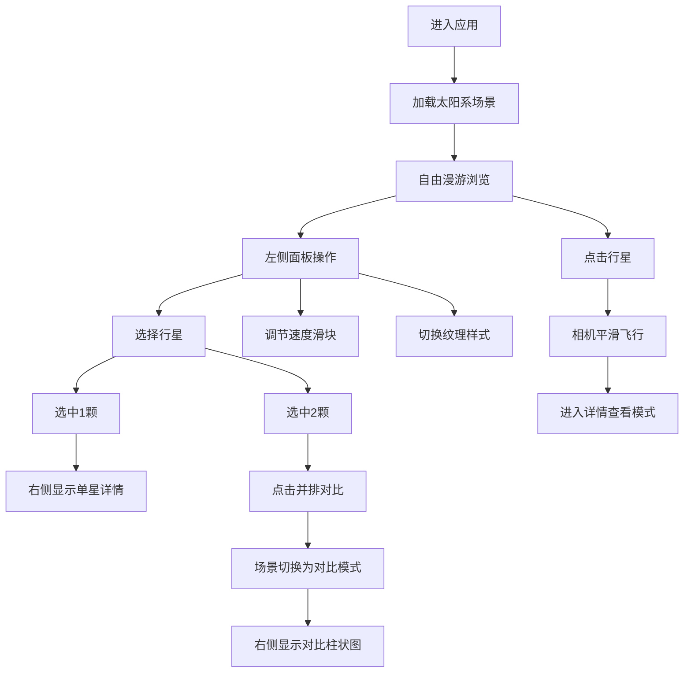

## 1. 产品概述

太阳系行星三维比对与交互漫游应用，为天文爱好者提供直观的三维工具，用于观察和对比不同星球的表面纹理、公转周期和自转倾角，支持在线上科普活动中展示太阳系行星特征。

- 核心价值：将抽象的天文数据转化为可视化的三维交互体验，降低行星知识学习门槛
- 目标用户：天文爱好者、科普工作者、学生群体

## 2. 核心功能

### 2.1 用户角色

| 角色 | 注册方式 | 核心权限 |
|------|----------|----------|
| 普通用户 | 无需注册 | 浏览三维场景、交互控制、行星对比 |

### 2.2 功能模块

1. **行星漫游模式**：三维空间自由漫游，行星轨道展示，程序生成纹理，标签始终面向相机
2. **并排对比功能**：双行星选中并排展示，背景渐变切换，对比数据柱状图可视化
3. **公转自转控制**：速度滑块调节（公转0.5x-5x，自转0x-3x），0.2秒平滑过渡
4. **纹理样式切换**：真实/卡通/线框三种样式，0.4秒透明度过渡动画
5. **交互提示与详情查看**：悬停光环效果，点击相机平滑飞行，法线贴图增强细节

### 2.3 页面详情

| 页面名称 | 模块名称 | 功能描述 |
|----------|----------|----------|
| 主页面 | 3D渲染画布 | 展示太阳系场景，支持鼠标交互漫游 |
| 主页面 | 左侧控制面板 | 行星选择网格、速度滑块、纹理样式切换按钮 |
| 主页面 | 右侧信息面板 | 行星详情展示、双行星对比数据与柱状图 |

## 3. 核心流程

用户进入应用后看到完整太阳系三维场景，可通过鼠标拖拽旋转视角、滚轮缩放浏览。用户可在左侧面板选择行星、调节速度、切换纹理样式。选中两颗行星后点击"并排对比"按钮，场景切换为对比模式，右侧面板展示对比数据与柱状图。点击单颗行星可进入详情查看模式，相机平滑飞向目标行星。

## 4. 用户界面设计

### 4.1 设计风格

- **主题色**：深空背景#0B0C10，面板背景rgba(255,255,255,0.08)，边框rgba(255,255,255,0.12)
- **强调色**：#00FF88（选中高亮）、#FFD700（悬停光环）、#F9A826（对比柱1）、#4ECDC4（对比柱2）
- **UI效果**：半透明毛玻璃（backdrop-filter: blur 8px），圆角12px
- **字体**：现代无衬线字体，行星名称24px加粗白色，详情数据16px

### 4.2 页面设计概览

| 页面名称 | 模块名称 | UI元素 |
|----------|----------|--------|
| 主页面 | 3D画布 | 深空背景，行星按比例分布，轨道线，中文标签 |
| 主页面 | 左侧控制面板(280px) | 行星缩略图网格(50x50px圆形)、公转/自转滑块、三个纹理按钮 |
| 主页面 | 右侧信息面板(320px) | 行星名称标题、参数数据行、对比柱状图区域 |

### 4.3 响应式

- **桌面端(≥900px)**：左侧控制面板固定280px，右侧信息面板固定320px，中间为3D画布
- **移动端(<900px)**：控制面板变为底部固定栏(高180px水平排列)，信息面板收缩为顶部汉堡菜单

### 4.4 3D场景指导

- **环境**：深空蓝色#0B0C10纯色背景，对比模式下渐变#1A1A2E到#16213E
- **光照**：环境光+方向光模拟太阳光照
- **相机**：PerspectiveCamera，OrbitControls自由漫游，点击行星使用三次贝塞尔曲线平滑飞行
- **行星**：程序生成纹理（正弦波+闵可夫斯基分形），最小直径0.2，最大直径2，轨道半径水星5到海王星30
- **标签**：CSS2DRenderer渲染，14px白色#FFFFFF带2px黑色描边，始终面向相机
- **性能**：总三角形数≤50万，1920x1080下保持30FPS+
