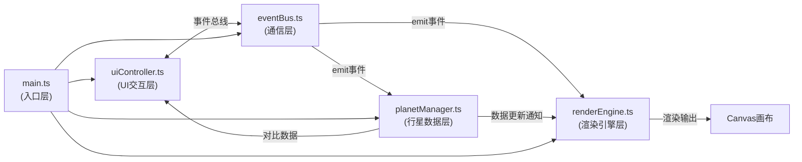

## 1. 架构设计



## 2. 技术选型说明

- **前端框架**：TypeScript 5.3.3 + Vite 5.0.8
- **3D引擎**：Three.js 0.160.0 + @types/three 0.160.0
- **模块间通信**：自定义事件总线（发布-订阅模式）
- **构建工具**：Vite，配置@别名指向src目录

## 3. 模块文件结构

```
src/
├── main.ts                    # 应用入口，初始化所有模块
├── modules/
│   ├── renderEngine.ts        # Three.js渲染引擎
│   ├── planetManager.ts       # 行星数据与外观管理
│   └── uiController.ts        # UI交互控制
└── utils/
    └── eventBus.ts            # 事件总线工具
```

## 4. 核心数据结构

### 4.1 行星数据模型

```typescript
interface PlanetData {
  name: string;              // 中文名
  englishName: string;       // 英文名
  orbitRadius: number;       // 轨道半径(5-30)
  diameter: number;          // 直径(0.2-2)
  color: string;             // 基础颜色
  orbitSpeed: number;        // 公转速度基准
  rotationSpeed: number;     // 自转速度基准
  axialTilt: number;         // 自转倾角(度)
  orbitPeriod: number;       // 公转周期(地球日)
  hasRing?: boolean;         // 是否有环(土星)
}
```

### 4.2 事件总线定义

```typescript
// uiController 发出的事件
'planet:select'       // 选中行星 payload: { name: string }
'planet:deselect'     // 取消选中 payload: { name: string }
'planets:compare'     // 并排对比 payload: { names: string[] }
'speed:orbit'         // 公转速度变化 payload: { speed: number }
'speed:rotation'      // 自转速度变化 payload: { speed: number }
'texture:change'      // 纹理样式切换 payload: { style: 'realistic'|'cartoon'|'wireframe' }
'camera:focus'        // 相机聚焦 payload: { name: string }
'mode:reset'          // 重置漫游模式

// planetManager 发出的事件
'planet:highlighted'  // 行星高亮更新 payload: { name: string, highlighted: boolean }
'planets:compared'    // 对比模式数据 payload: CompareData
```

## 5. 关键技术实现点

### 5.1 程序生成纹理
- 使用Canvas 2D API结合正弦波叠加+闵可夫斯基距离函数生成类木星/土星纹理
- 法线贴图通过灰度图高度场计算，法线强度1.5

### 5.2 平滑动画
- 速度调节：0.2秒线性插值(LERP)过渡当前速度到目标速度
- 纹理切换：0.4秒材质透明度1→0→1的三段式过渡
- 相机飞行：1.2秒三次贝塞尔曲线插值相机位置与lookAt目标

### 5.3 性能优化
- 行星使用SphereGeometry(32段)控制三角形数量
- 轨道线使用LineSegments
- CSS2DRenderer仅渲染8个标签DOM
- 材质共享与几何体实例化复用

### 5.4 并排对比模式
- 选中两颗行星从轨道位置平滑移动到相机前方水平排列(间距3单位)
- 场景背景从#0B0C10过渡为线性渐变#1A1A2E→#16213E
- 右侧面板渲染SVG柱状图，柱色#F9A826和#4ECDC4
