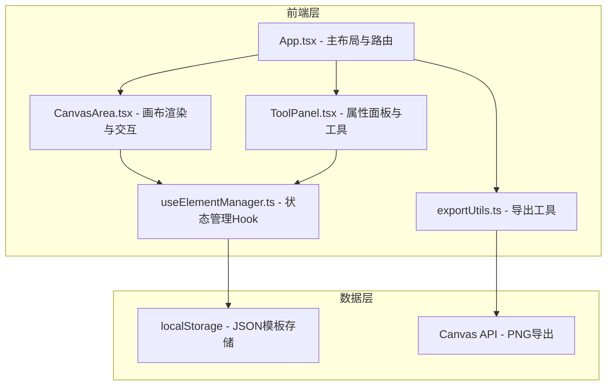

## 1. 架构设计



## 2. 技术说明
- 前端：React@18.2.0 + TypeScript@5.3.3 + Vite@5.0.8
- 初始化工具：vite-init (react-ts模板)
- 样式：CSS Modules + CSS Variables（不使用Tailwind，因用户未指定且自定义样式需求精细）
- 后端：无
- 数据库：无，使用localStorage存储模板

## 3. 路由定义
| 路由 | 用途 |
|------|------|
| / | 编辑器主页面，包含画布和属性面板 |

## 4. 数据模型

### 4.1 核心类型定义

```typescript
type PaperSize = 'A5' | 'A6' | 'B6'
type BorderStyle = 'solid' | 'dashed' | 'dotted'
type ElementType = 'rect' | 'text' | 'line' | 'dateLabel'

interface CanvasElement {
  id: string
  type: ElementType
  x: number
  y: number
  width: number
  height: number
  rotation: number
  backgroundColor: string
  borderStyle: BorderStyle
  borderWidth: number
  borderColor: string
  borderRadius: number
  text?: string
  fontSize?: number
  fontColor?: string
  letterSpacing?: number
}

interface Template {
  id: string
  name: string
  paperSize: PaperSize
  elements: CanvasElement[]
  thumbnail: string
  createdAt: number
  updatedAt: number
}

interface GuideLine {
  id: string
  orientation: 'horizontal' | 'vertical'
  position: number
}
```

### 4.2 纸张尺寸映射（px，按300dpi比例缩放到屏幕）
| 纸张 | 宽px | 高px | 宽高比 |
|------|-------|-------|--------|
| A5 | 420 | 595 | ~0.705 |
| A6 | 298 | 420 | ~0.710 |
| B6 | 372 | 524 | ~0.710 |

## 5. 文件组织
```
├── package.json
├── index.html
├── tsconfig.json
├── vite.config.js
└── src/
    ├── main.tsx
    ├── App.tsx
    ├── types.ts
    ├── components/
    │   ├── CanvasArea.tsx
    │   ├── ToolPanel.tsx
    │   ├── Toolbar.tsx
    │   ├── Ruler.tsx
    │   └── TemplateLibrary.tsx
    ├── hooks/
    │   └── useElementManager.ts
    └── utils/
        └── exportUtils.ts
```
