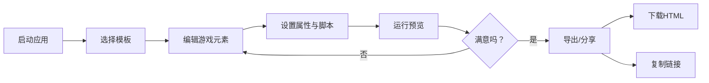

## 1. 产品概述

轻量级2D游戏沙盒应用，帮助独立游戏开发者快速制作和分享小型2D游戏原型（跑酷、平台跳跃、弹幕射击），解决从零编写游戏引擎代码耗时且不易协作分享的问题。

- 目标用户：独立游戏开发者、游戏设计爱好者、教育工作者
- 核心价值：无需编写引擎代码，通过可视化编辑器快速创建游戏原型，支持一键导出和分享

## 2. 核心功能

### 2.1 功能模块

1. **游戏场景编辑器**：拖拽添加元素、属性编辑、图层管理、脚本编辑
2. **游戏运行时预览**：60FPS游戏循环、物理模拟、碰撞检测、暂停/继续
3. **游戏导出与分享**：独立HTML导出、Base64链接分享、引导界面
4. **预设游戏模板**：跑酷、平台跳跃、弹幕射击三套模板

### 2.2 页面详情

| 页面名称 | 模块名称 | 功能描述 |
|-----------|-------------|---------------------|
| 主编辑器 | 顶部工具栏 | 运行、暂停、导出、分享按钮 |
| 主编辑器 | 左侧图层面板 | 元素列表、拖拽排序、选中高亮 |
| 主编辑器 | 中间画布区 | 游戏元素编辑、拖拽移动、缩放 |
| 主编辑器 | 右侧属性面板 | 元素属性编辑、分组控件、脚本编辑 |
| 运行预览 | 游戏画布 | 60FPS渲染、帧率显示、得分显示 |
| 导出界面 | 引导弹窗 | 游戏标题、作者名、下载按钮 |
| 模板选择 | 欢迎提示 | 0.3秒淡入、上下浮动动画 |

## 3. 核心流程

用户启动应用 → 选择游戏模板（或从零开始）→ 在画布上添加/编辑游戏元素 → 设置元素属性和脚本 → 点击运行预览游戏 → 调整元素和参数 → 导出HTML或复制分享链接 → 分享给他人游玩

## 4. 用户界面设计

### 4.1 设计风格
- **主题**：暗色专业主题，适合长时间创作
- **主背景**：#121212，侧边栏#1E1E1E
- **主色调**：#4A90D9（蓝色）作为强调色
- **按钮配色**：运行#10B981（绿）、暂停#F59E0B（琥珀）、导出#3B82F6（蓝）、分享#8B5CF6（紫）
- **字体**：使用专业代码字体 + 现代无衬线字体组合
- **布局**：三列布局，可拖拽分隔条调整宽度
- **动画**：微交互过渡（0.15-0.3秒）、欢迎提示浮动动画

### 4.2 页面设计概述

| 页面名称 | 模块名称 | UI Elements |
|-----------|-------------|-------------|
| 主编辑器 | 顶部工具栏 | 48px高度，四个彩色按钮，圆角6px，hover亮度提升 |
| 主编辑器 | 图层面板 | 300px宽度，垂直列表，#2A2A2A背景，选中#4A90D9高亮，圆角4px |
| 主编辑器 | 画布区 | #E0E0E0背景，10px间距网格线，#C0C0C0线宽0.5px |
| 主编辑器 | 属性面板 | 280px宽度，分组控件，间距16px，自定义滑块样式 |
| 运行预览 | 游戏画布 | 半透明FPS显示（右上角）、得分（左上角）、暂停遮罩 |
| 导出界面 | 引导弹窗 | 60%宽度居中，圆角16px，渐变背景#1E1E2E到#2D2D44，2px#4A90D9边框 |

### 4.3 响应式设计
- **桌面端**：三列布局（≥900px）
- **移动端**：<900px时右侧属性面板变为底部模态面板，0.3秒滑入动画
- **触控优化**：增大可点击区域，支持触摸拖拽

### 4.4 性能指标
- 编辑器交互响应：<50ms
- 游戏运行帧率：稳定60FPS
- 导出HTML大小：≤500KB
