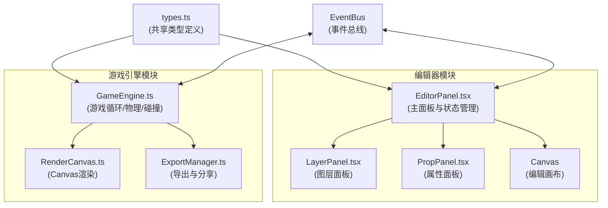
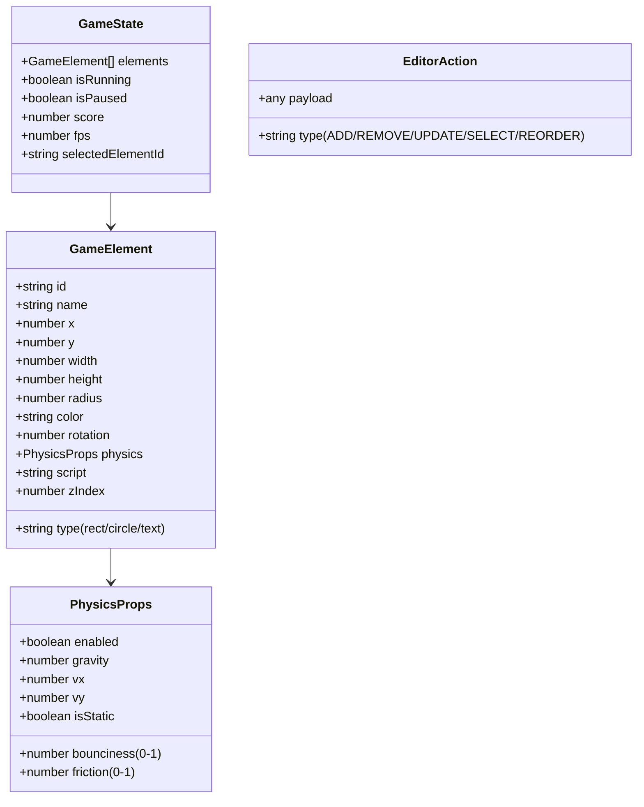

## 1. 架构设计



## 2. 技术描述

- **前端框架**：React@18.2.0 + TypeScript@5.3.3
- **构建工具**：Vite@5.0.8
- **状态管理**：React useState/useReducer + 自定义事件总线
- **渲染方式**：HTML5 Canvas 2D API
- **物理引擎**：自研轻量级物理系统（AABB碰撞检测）
- **样式方案**：原生CSS + CSS变量 + CSS Modules
- **图标库**：lucide-react

## 3. 目录结构

```
src/
├── editor/
│   ├── EditorPanel.tsx      # 编辑器主面板
│   ├── LayerPanel.tsx       # 左侧图层面板
│   ├── PropPanel.tsx        # 右侧属性面板
│   └── components/          # 编辑器UI组件
├── engine/
│   ├── GameEngine.ts        # 游戏引擎核心
│   ├── RenderCanvas.ts      # Canvas渲染器
│   └── ExportManager.ts     # 导出管理器
├── types.ts                 # 共享类型定义
├── utils/
│   ├── eventBus.ts          # 事件总线
│   └── templates.ts         # 预设模板
├── App.tsx                  # 应用入口
├── main.tsx                 # React入口
└── index.css                # 全局样式
```

## 4. 数据模型

### 4.1 核心类型定义



### 4.2 事件总线定义

| 事件名 | 数据类型 | 说明 |
|--------|----------|------|
| element:add | GameElement | 添加元素 |
| element:remove | string | 删除元素（ID） |
| element:update | {id, props} | 更新元素属性 |
| element:select | string | 选中元素（ID） |
| elements:reorder | string[] | 重新排序元素ID列表 |
| game:start | void | 开始游戏 |
| game:pause | void | 暂停游戏 |
| game:stop | void | 停止游戏 |
| game:frame | GameState | 每帧状态更新 |

## 5. 核心模块说明

### 5.1 GameEngine.ts
- **固定时间步长**：60FPS游戏循环（requestAnimationFrame）
- **物理模拟**：重力、速度、摩擦、弹力计算
- **碰撞检测**：AABB（轴对齐包围盒）碰撞检测与响应
- **脚本执行**：每帧调用元素自定义JavaScript脚本
- **状态同步**：通过回调将渲染数据发送给RenderCanvas

### 5.2 RenderCanvas.ts
- **元素渲染**：矩形、圆形、文字绘制
- **网格背景**：10px间距网格线
- **UI叠加**：帧率显示（右上角）、得分显示（左上角）
- **暂停遮罩**：30%透明度黑底 + "已暂停"文字

### 5.3 ExportManager.ts
- **HTML序列化**：将游戏状态序列化为独立HTML文件
- **Base64编码**：压缩游戏数据为URL片段
- **引导界面**：内嵌导出页面的入口HTML结构
- **模板注入**：将游戏引擎代码注入导出文件

### 5.4 EditorPanel.tsx
- **布局管理**：三列布局 + 可拖拽分隔条
- **状态协调**：维护编辑器状态，转发事件给引擎
- **画布交互**：处理拖拽、缩放、选中操作
- **响应式适配**：<900px时属性面板改为底部模态
