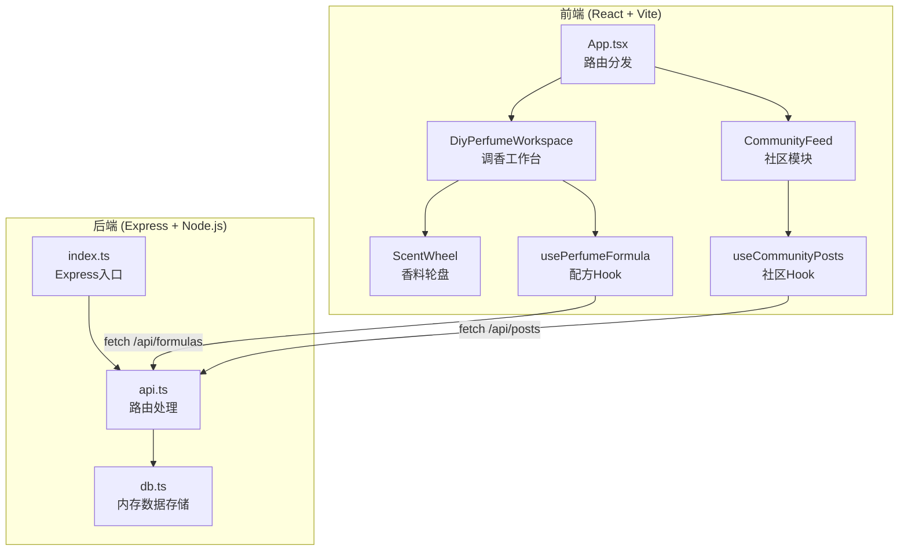
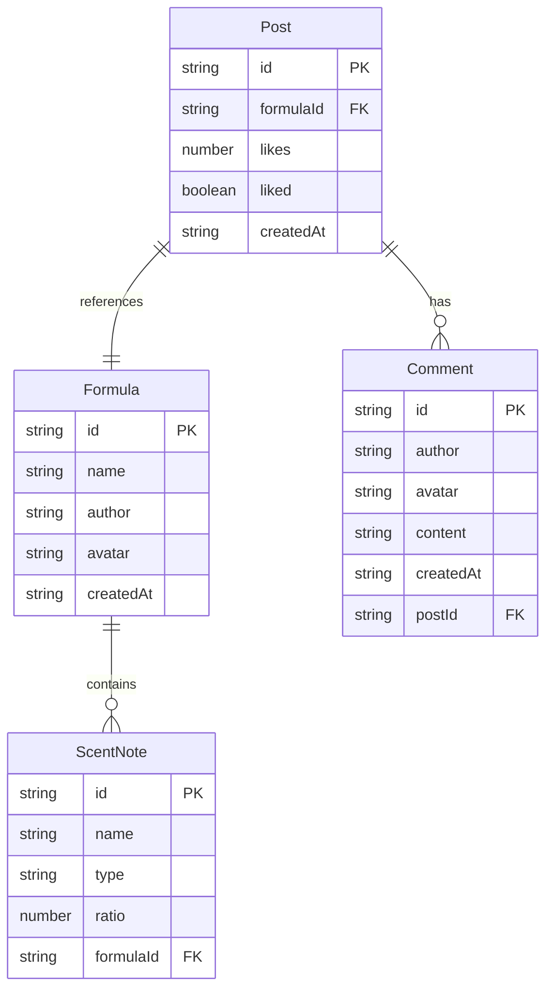

## 1. 架构设计



## 2. 技术说明

- **前端**：React@18.2.0 + TypeScript@5.3.3 + Vite@5.0.8
- **初始化工具**：vite-init（react-express-ts模板）
- **后端**：Express@4.18.2 + ts-node@10.9.2
- **数据库**：内存Map（无需外部数据库）
- **样式方案**：CSS-in-JS（内联样式 + CSS模块），配合Tailwind辅助

## 3. 路由定义

| 路由 | 用途 |
|------|------|
| / | 社区发现页（默认视图） |
| /workspace | 调香工作台视图 |

## 4. API定义

### 4.1 配方API

```typescript
interface ScentNote {
  id: string;
  name: string;
  type: 'top' | 'middle' | 'base';
  ratio: number;
}

interface Formula {
  id: string;
  name: string;
  author: string;
  avatar: string;
  notes: ScentNote[];
  createdAt: string;
}

// GET /api/formulas - 获取所有配方
// Response: Formula[]

// GET /api/formulas/:id - 获取单个配方
// Response: Formula

// POST /api/formulas - 创建配方
// Body: Omit<Formula, 'id' | 'createdAt'>
// Response: Formula

// PUT /api/formulas/:id - 更新配方
// Body: Partial<Formula>
// Response: Formula

// DELETE /api/formulas/:id - 删除配方
// Response: { success: boolean }
```

### 4.2 帖子API

```typescript
interface Comment {
  id: string;
  author: string;
  avatar: string;
  content: string;
  createdAt: string;
}

interface Post {
  id: string;
  formulaId: string;
  formula: Formula;
  likes: number;
  liked: boolean;
  comments: Comment[];
  createdAt: string;
}

// GET /api/posts - 获取所有帖子
// Response: Post[]

// GET /api/posts/:id - 获取帖子详情
// Response: Post

// POST /api/posts - 创建帖子
// Body: { formulaId: string }
// Response: Post

// POST /api/posts/:id/like - 点赞/取消点赞
// Response: { likes: number; liked: boolean }

// POST /api/posts/:id/comments - 添加评论
// Body: { author: string; content: string }
// Response: Comment
```

## 5. 服务端架构图

```mermaid
graph LR
    "Controller<br/>(api.ts)" --> "Service<br/>(db.ts)"
    "Service<br/>(db.ts)" --> "Data<br/>(内存Map)"
```

## 6. 数据模型

### 6.1 数据模型定义



### 6.2 初始数据

配方和帖子使用内存Map存储，服务启动时预填充示例数据（含3-5个示例配方和帖子），确保社区页面首次访问即有内容展示。

## 7. 文件结构

```
├── package.json
├── index.html
├── tsconfig.json
├── vite.config.js
├── src/
│   ├── App.tsx
│   ├── components/
│   │   ├── DiyPerfumeWorkspace.tsx
│   │   ├── ScentWheel.tsx
│   │   └── CommunityFeed.tsx
│   └── hooks/
│       ├── usePerfumeFormula.ts
│       └── useCommunityPosts.ts
└── server/
    ├── index.ts
    ├── db.ts
    └── api.ts
```
