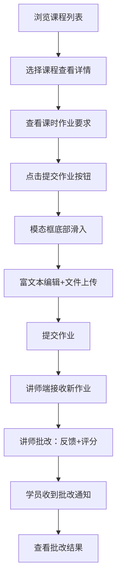

## 1. 产品概述

技能工作坊管理平台 - 一个帮助技能爱好者组织线上工作坊、发布课程并管理学员进度与作业提交的全栈应用。

- 核心目标：解决传统线下技能教学活动中课程安排混乱、学员作业零散难跟踪、老师反馈不及时的问题
- 目标用户：技能教学讲师（课程发布者）和技能学习学员（课程参与者）
- 产品价值：提供一站式课程管理、作业提交批改、实时通知的数字化教学协作平台

## 2. 核心功能

### 2.1 用户角色

| 角色 | 说明 | 核心权限 |
|------|------|----------|
| 讲师 | 课程创建者和管理者 | 创建/管理课程、发布作业、批改作业、查看学员进度 |
| 学员 | 课程参与者 | 浏览课程、查看作业、提交作业、查看批改反馈 |

### 2.2 功能模块

1. **课程列表页**：课程卡片网格展示、课程筛选、进度可视化
2. **课程详情页**：课程信息展示、课时列表、作业查看与提交
3. **作业提交页**：富文本编辑、文件上传、进度显示
4. **讲师作业列表**：学员作业管理、按时间排序、状态筛选
5. **作业批改页**：文字反馈输入、星级评分、状态更新
6. **通知系统**：通知气泡、通知面板、未读标记

### 2.3 页面详情

| 页面名称 | 模块名称 | 功能描述 |
|---------|---------|----------|
| 课程列表页 | 课程卡片网格 | 280px宽度卡片，渐变背景，封面图45%高度，圆形进度环（36px直径，4px描边，三色进度） |
| 课程列表页 | 导航栏 | 56px高，白色背景，应用名+导航链接，用户头像+铃铛图标 |
| 课程详情页 | 作业列表 | 每课时对应作业（文字+附件），提交作业按钮 |
| 课程详情页 | 提交作业模态框 | 底部滑入0.3s，60%遮罩，富文本编辑器（加粗/斜体/列表/图片），文件上传（拖拽+点击，pdf/docx/png/jpg，10MB限制，进度条） |
| 讲师作业列表 | 作业卡片列表 | 学员头像、提交时间、状态标签（已批改绿色/待批改橙色），按时间倒序 |
| 作业批改页 | 批改表单 | 500字文字反馈，1-5星评分（黄色填充，0.2s缩放动画） |
| 全局 | 通知气泡 | 右下角弹出，右侧滑入0.4s，320px宽，白色圆角8px，3秒自动淡出 |
| 全局 | 通知面板 | 右侧抽屉380px宽，铃铛图标（40px圆形，浅灰背景，未读时8px红点），时间倒序列表 |

## 3. 核心流程

### 3.1 讲师发布课程与批改作业流程

讲师登录系统 → 创建课程（填写标题/封面/简介/时间/课时）→ 课程发布成功 → 为课时添加作业要求 → 学员提交作业 → 讲师查看作业列表 → 进入批改页面 → 输入反馈+星级评分 → 提交批改 → 学员收到通知

### 3.2 学员学习与提交作业流程

学员浏览课程列表 → 选择课程查看详情 → 查看各课时作业要求 → 点击提交作业 → 编辑内容+上传附件 → 提交成功 → 等待批改 → 收到批改通知 → 查看反馈与评分

## 4. 用户界面设计

### 4.1 设计风格

- **主色调**：紫色 #7C3AED
- **辅助色**：黄色 #FBBF24
- **背景色**：浅灰 #F9FAFB
- **卡片渐变**：浅紫 #E8DEF8 → 白色 #FFFFFF（从上到下）
- **进度环颜色**：0-33% 红色 #EF4444，34-66% 琥珀色 #F59E0B，67-100% 绿色 #10B981
- **按钮样式**：圆角，主色背景白字，悬停上移3px增强阴影，点击缩放0.95（0.1s）
- **卡片样式**：圆角12px，悬停上移3px增强阴影（0.2s过渡）
- **字体**：现代无衬线字体，清晰层级
- **布局风格**：顶部固定导航栏，主体1200px居中，卡片网格布局
- **图标/emoji风格**：通知图标使用emoji（📝新作业、✅批改、🔔变更）

### 4.2 页面设计概述

| 页面名称 | 模块名称 | UI元素 |
|---------|---------|--------|
| 课程列表页 | 导航栏 | 56px高白底1px深灰底边框，左侧Logo+导航，右侧头像+铃铛（未读红点8px） |
| 课程列表页 | 课程卡片 | 280px宽圆角12px，渐变背景，封面图45%，下方信息区含圆形进度环（36px/4px描边） |
| 课程详情页 | 提交模态框 | 底部滑入0.3s，60%灰黑遮罩，富文本工具栏+拖拽上传区+进度条 |
| 讲师作业列表 | 作业项 | 头像+时间+状态标签（橙/绿），点击跳转批改 |
| 批改页面 | 评分组件 | 黄色#FBBF24五角星，点击缩放0.2s动画 |
| 全局 | 通知气泡 | 320px宽白背景圆角8px阴影，右侧滑入0.4s，3秒淡出 |
| 全局 | 通知抽屉 | 380px宽白底右侧滑入，关闭时右滑出0.3s，按时间倒序排列 |

### 4.3 响应式设计

- **设计原则**：Desktop-first，移动端适配
- **断点**：768px
- **768px以下适配规则**：
  - 导航栏变为汉堡菜单，点击展开侧边抽屉
  - 卡片网格由4列变为2列
  - 通知抽屉变为全屏覆盖
- **触摸优化**：按钮最小44px触摸区域，手势友好

### 4.4 性能要求

- 卡片网格滚动加载帧率 ≥ 55fps
- 通知轮询间隔：10秒
- 动画流畅度：所有过渡动画 ≤ 0.4秒
