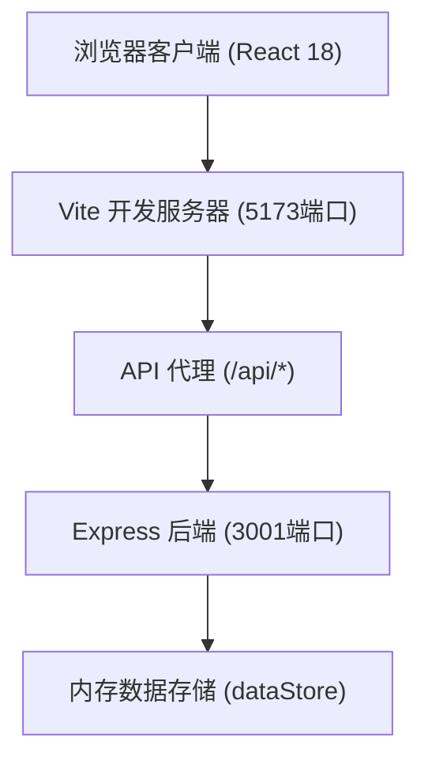
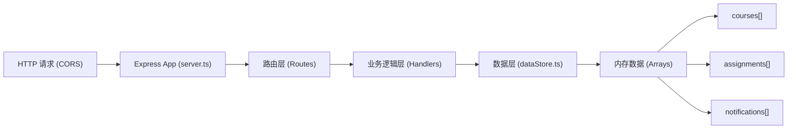
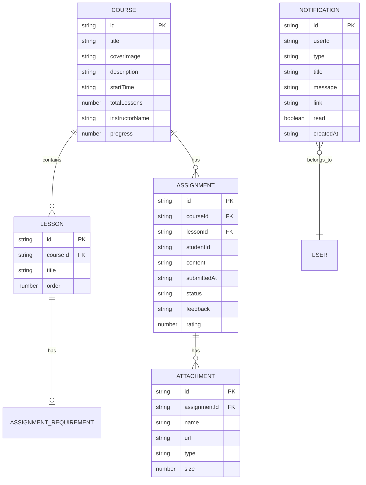

## 1. 架构设计



## 2. 技术说明

- **前端框架**：React@18.2.0 + TypeScript@5.3.3
- **构建工具**：Vite@5.0.8 + @vitejs/plugin-react@4.2.0
- **路由管理**：react-router-dom
- **状态管理**：React Context + useState/useEffect
- **HTTP请求**：Fetch API 封装
- **后端框架**：Express@4.18.2 + cors@2.8.5
- **数据存储**：内存模拟数据库（数组存储）
- **样式方案**：CSS Modules + 全局CSS变量

## 3. 路由定义

### 前端路由 (React Router)

| 路由路径 | 页面用途 |
|---------|---------|
| `/` | 课程列表页（首页） |
| `/course/:id` | 课程详情页（查看作业、提交作业） |
| `/instructor/assignments` | 讲师作业列表页 |
| `/instructor/assignments/:id` | 作业批改详情页 |

### 后端 API 路由 (Express)

| 方法 | 路径 | 用途 |
|------|------|------|
| GET | `/api/courses` | 获取所有课程列表 |
| GET | `/api/courses/:id` | 获取单门课程详情 |
| POST | `/api/courses` | 创建新课程 |
| GET | `/api/courses/:id/assignments` | 获取课程的所有作业 |
| GET | `/api/assignments` | 获取所有作业（讲师端，支持筛选） |
| GET | `/api/assignments/:id` | 获取单个作业详情 |
| POST | `/api/assignments` | 提交新作业 |
| PUT | `/api/assignments/:id/grade` | 批改作业（反馈+评分） |
| GET | `/api/notifications` | 获取通知列表 |
| POST | `/api/notifications/read` | 标记通知为已读 |

## 4. API 定义

### 4.1 类型定义

```typescript
// 课程接口
interface Course {
  id: string;
  title: string;
  coverImage: string;
  description: string; // max 500 chars
  startTime: string; // ISO date
  totalLessons: number;
  instructorName: string;
  instructorAvatar: string;
  progress: number; // 0-100
  lessons: Lesson[];
}

// 课时接口
interface Lesson {
  id: string;
  title: string;
  order: number;
  assignment?: AssignmentRequirement;
}

// 作业要求接口
interface AssignmentRequirement {
  id: string;
  description: string;
  attachments: Attachment[];
  deadline?: string;
}

// 学员提交的作业接口
interface Assignment {
  id: string;
  courseId: string;
  lessonId: string;
  studentId: string;
  studentName: string;
  studentAvatar: string;
  content: string; // 富文本
  attachments: Attachment[];
  submittedAt: string;
  status: 'pending' | 'graded';
  feedback?: string; // max 500 chars
  rating?: number; // 1-5
  gradedAt?: string;
}

// 附件接口
interface Attachment {
  id: string;
  name: string;
  url: string;
  type: string;
  size: number;
}

// 通知接口
interface Notification {
  id: string;
  userId: string;
  type: 'new_assignment' | 'graded' | 'schedule_change';
  icon: string; // emoji
  title: string;
  message: string;
  link: string;
  read: boolean;
  createdAt: string;
}
```

### 4.2 请求/响应示例

**GET /api/courses 响应**：
```json
{
  "success": true,
  "data": [
    {
      "id": "c1",
      "title": "水彩画入门课程",
      "coverImage": "...",
      "description": "从零开始学习水彩画...",
      "startTime": "2026-07-01T09:00:00Z",
      "totalLessons": 8,
      "instructorName": "李老师",
      "progress": 45
    }
  ]
}
```

**POST /api/assignments 提交作业请求**：
```json
{
  "courseId": "c1",
  "lessonId": "l1",
  "studentId": "s1",
  "content": "<p>我的作业内容...</p>",
  "attachments": [{"name": "homework.pdf", "url": "...", "type": "application/pdf", "size": 1024000}]
}
```

**PUT /api/assignments/:id/grade 批改请求**：
```json
{
  "feedback": "作品构图很好，色彩运用得当...",
  "rating": 5
}
```

## 5. 服务器架构图



## 6. 数据模型

### 6.1 实体关系图



### 6.2 初始数据种子

- 预置3-5门示例课程，每门课包含3-5个课时
- 预置部分作业提交和批改记录
- 预置若干通知消息

## 7. 项目文件结构

```
项目根目录/
├── package.json          # 项目依赖和脚本
├── index.html            # Vite入口HTML
├── tsconfig.json         # TypeScript配置
├── vite.config.js        # Vite配置（含代理）
├── server/               # 后端模块
│   ├── server.ts         # Express入口，3001端口
│   ├── dataStore.ts      # 内存数据库
│   └── interfaces.ts     # TypeScript接口定义
└── client/               # 前端模块
    └── src/
        ├── main.tsx      # React入口
        ├── App.tsx       # 路由与全局状态
        ├── services/
        │   └── api.ts    # HTTP请求封装
        └── components/
            ├── CourseCard.tsx
            ├── AssignmentModal.tsx
            ├── NotificationBubble.tsx
            └── NotificationDrawer.tsx
```
