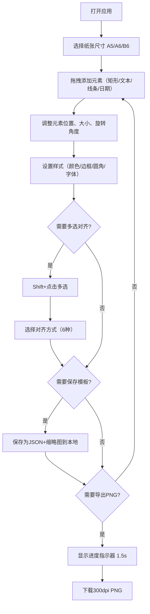

## 1. 产品概述

手账模板设计器是一款面向独立手账爱好者的Web应用，解决纸质手账本内页格式固定、无法灵活自定义布局和打印比例的痛点。用户可通过可视化编辑器自由设计手账内页，并导出为高分辨率PNG图片用于打印。

- 目标用户：手账爱好者、设计师、需要个性化打印内页的用户
- 市场价值：填补在线手账模板设计工具的空白，提供零学习成本的拖拽式编辑体验

## 2. 核心功能

### 2.1 用户角色

| 角色 | 注册方式 | 核心权限 |
|------|----------|----------|
| 普通用户 | 无需注册，本地使用 | 编辑、保存、导出模板 |

### 2.2 功能模块

1. **页面布局编辑器**：元素拖拽、缩放、旋转、多选对齐、标尺网格辅助
2. **模板保存与导出**：本地JSON模板存储、缩略图预览库、300dpi PNG导出
3. **元素属性面板**：样式/布局标签页、实时属性编辑、预设色板
4. **标尺与网格辅助**：可拖拽参考线、吸附功能、网格显示切换

### 2.3 页面详情

| 页面名称 | 模块名称 | 功能描述 |
|----------|----------|----------|
| 主编辑器 | 顶部工具栏 | 纸张尺寸选择、对齐按钮组、撤销/重做、导出按钮、网格显示切换 |
| 主编辑器 | 左侧画布区 | 元素渲染、拖拽缩放旋转、标尺参考线、网格背景 |
| 主编辑器 | 右侧面板 | 属性编辑（样式/布局标签页）、模板库网格展示 |

## 3. 核心流程

用户从打开应用到导出模板的完整流程：选择纸张尺寸 → 拖拽添加元素 → 调整样式属性 → 多选对齐 → 保存模板到本地 → 导出PNG图片。

## 4. 用户界面设计

### 4.1 设计风格

- 主色调：暖白 `#F9FAFB`、蓝灰 `#F3F4F6`
- 强调色：淡蓝 `#60A5FA`、深蓝 `#3B82F6` / `#2563EB`
- 按钮样式：工具栏按钮圆形32px带SVG图标；导出按钮圆角8px蓝色渐变
- 字体：使用系统无衬线字体，标题14px semibold，正文13px regular
- 布局风格：左右分栏，左侧画布70%，右侧面板固定280px
- 过渡动画：所有交互状态0.15-0.3秒缓动过渡

### 4.2 页面设计概述

| 页面名称 | 模块名称 | UI元素 |
|----------|----------|--------|
| 主编辑器 | 顶部工具栏 | 48px高白底，1px底部分割线，圆角按钮，蓝色渐变导出按钮 |
| 主编辑器 | 画布区 | 白色画布带阴影，标尺#F9FAFB背景刻度#D1D5DB，网格#E5E7EB |
| 主编辑器 | 右侧面板 | #F3F4F6背景，左边缘圆角12px，内阴影，标签页0.25s滑入动画 |
| 主编辑器 | 模板库项 | 160px宽圆角8px卡片，hover阴影扩大上移2px过渡0.2s |
| 主编辑器 | 导出进度 | 48px直径圆形描边4px，#60A5FA到#1D4ED8渐变旋转 |

### 4.3 响应式

- 桌面端（≥1024px）：左右布局，画布70%，右侧面板固定280px
- 移动端（<1024px）：右侧面板折叠为底部抽屉，从下方滑入高度280px，动画0.3秒
- 画布自适应保持宽高比

### 4.4 性能指标

- 100个元素同时操作帧率≥45fps
- 属性编辑画布更新延迟≤50ms
