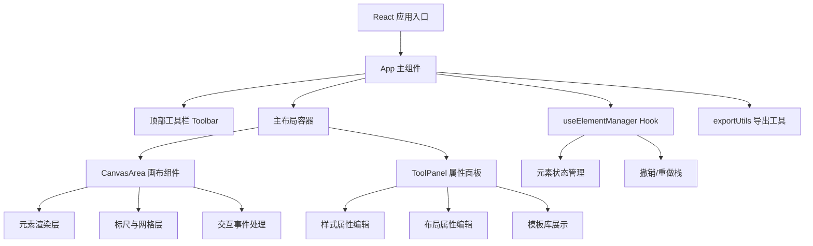

## 1. 架构设计



## 2. 技术描述

- 前端：React@18.2.0 + TypeScript@5.3.3 + Vite@5.0.8
- 构建工具：Vite + @vitejs/plugin-react@4.2.0
- 状态管理：React Hooks (useState, useReducer) + 自定义 Hook useElementManager
- 样式方案：原生 CSS（配合 CSS 变量实现主题）
- 后端：无后端，纯前端应用，数据存储于浏览器 localStorage
- 图标：内联 SVG 图标

## 3. 项目结构

| 路径 | 用途 |
|------|------|
| `/package.json` | 项目依赖与启动脚本 |
| `/index.html` | Vite 入口 HTML |
| `/tsconfig.json` | TypeScript 配置（严格模式、ES2020） |
| `/vite.config.js` | Vite 构建配置 |
| `/src/types/index.ts` | 全局类型定义（元素、样式、纸张尺寸等） |
| `/src/components/CanvasArea.tsx` | 画布组件：元素渲染、拖拽、缩放、旋转 |
| `/src/components/ToolPanel.tsx` | 属性面板：样式/布局编辑、模板库 |
| `/src/components/Toolbar.tsx` | 顶部工具栏 |
| `/src/hooks/useElementManager.ts` | 元素状态管理 Hook |
| `/src/utils/exportUtils.ts` | PNG 导出工具函数 |
| `/src/utils/templateUtils.ts` | 模板保存/加载工具 |
| `/src/App.tsx` | 应用根组件 |
| `/src/main.tsx` | 应用入口 |
| `/src/styles/global.css` | 全局样式 |

## 4. 数据模型

### 4.1 类型定义

```typescript
type PaperSize = 'A5' | 'A6' | 'B6';

interface PaperDimensions {
  width: number;
  height: number;
  name: PaperSize;
}

type ElementType = 'rect' | 'text' | 'line' | 'date';

type BorderStyle = 'solid' | 'dashed' | 'dotted';

interface BaseStyle {
  backgroundColor: string;
  borderColor: string;
  borderWidth: number;
  borderStyle: BorderStyle;
  borderRadius: number;
}

interface TextStyle extends BaseStyle {
  content: string;
  fontSize: number;
  fontColor: string;
  letterSpacing: number;
}

interface CanvasElement {
  id: string;
  type: ElementType;
  x: number;
  y: number;
  width: number;
  height: number;
  rotation: number;
  style: BaseStyle | TextStyle;
}

interface Template {
  id: string;
  name: string;
  paperSize: PaperSize;
  elements: CanvasElement[];
  thumbnail: string;
  createdAt: number;
}
```

### 4.2 对齐类型

```typescript
type AlignmentType = 
  | 'top' 
  | 'bottom' 
  | 'left' 
  | 'right' 
  | 'center-h' 
  | 'center-v';
```

## 5. 核心算法

### 5.1 元素旋转
- Ctrl + 滚轮触发，每步 15 度
- 使用 CSS transform: rotate() 实现
- 旋转角度显示在元素中心，0.5 秒后淡出

### 5.2 多选对齐
- 计算所有选中元素的边界包围盒
- 根据对齐类型计算每个元素新位置
- 支持：上/下/左/右对齐、水平/垂直居中

### 5.3 参考线吸附
- 元素边缘与参考线距离 ≤ 5px 时触发吸附
- 吸附时视觉提示（参考线高亮）

### 5.4 PNG 导出（300dpi）
- 按纸张物理尺寸计算像素：mm × 300 / 25.4
- 使用 HTMLCanvasElement 绘制所有元素
- 背景白色 #FFFFFF，通过 toBlob 生成 PNG
