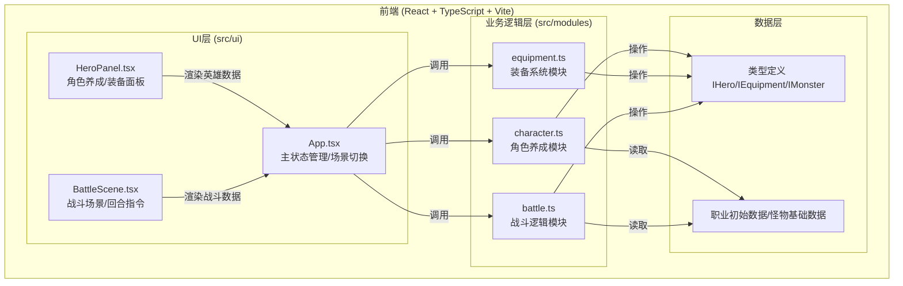
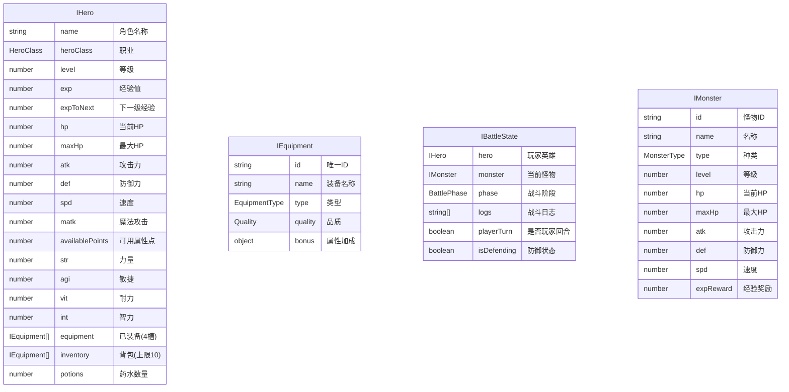

## 1. 架构设计



## 2. 技术描述
- **前端框架**：React@18.2.0 + React-DOM@18.2.0
- **语言**：TypeScript@5.3.3（严格模式，target ES2020，jsx react-jsx）
- **构建工具**：Vite@5.0.8 + @vitejs/plugin-react@4.2.0
- **路径别名**：@ → src目录
- **状态管理**：React useState（轻量级场景，无需额外状态库）
- **样式方案**：原生CSS + CSS变量 + CSS动画
- **后端**：纯前端，无后端服务

## 3. 路由定义
| 场景 | 说明 |
|------|------|
| create | 英雄创建场景 |
| panel | 角色养成面板 |
| map | 随机地图场景 |
| battle | 战斗场景 |
| result | 战斗结算场景 |
| gameover | 游戏结束场景 |

## 4. 数据模型

### 4.1 类型定义



### 4.2 数据流向
```
UI指令 → App.tsx(state) → modules/* 纯函数处理 → 返回新状态 → UI重新渲染
  ↑                                                        ↓
  └──────────────── 用户交互事件 ←─────────────────────────┘
```

- **character.ts数据流**：UI(createHero/分配属性) → 调用函数 → 更新IHero → 返回新对象
- **equipment.ts数据流**：战斗结果掉落ID → generateEquipment随机生成 → equipItem/unequipItem操作英雄装备栏 → 背包溢出警告
- **battle.ts数据流**：UI选择攻击/防御/药水 → executeTurn执行回合 → calculateDamage计算伤害 → checkVictory检测结果 → 返回战斗状态+日志

## 5. 文件结构

```
auto44/
├── package.json            # 依赖与脚本
├── vite.config.js          # Vite配置(@别名)
├── tsconfig.json           # TS配置(严格/ES2020)
├── index.html              # 入口(Press Start 2P/黑色背景)
└── src/
    ├── main.tsx            # React入口
    ├── index.css           # 全局像素风样式
    ├── modules/
    │   ├── character.ts    # 角色养成(IHero, createHero, gainExp, levelUp)
    │   ├── equipment.ts    # 装备系统(IEquipment, 生成/穿戴/卸下)
    │   └── battle.ts       # 战斗逻辑(回合制,伤害计算,胜负判定)
    └── ui/
        ├── App.tsx         # 主组件(状态管理,场景切换)
        ├── HeroPanel.tsx   # 养成面板(属性+装备)
        ├── BattleScene.tsx # 战斗场景(精灵/HP条/日志/按钮)
        └── MapScene.tsx    # 地图场景(怪物节点)
```
