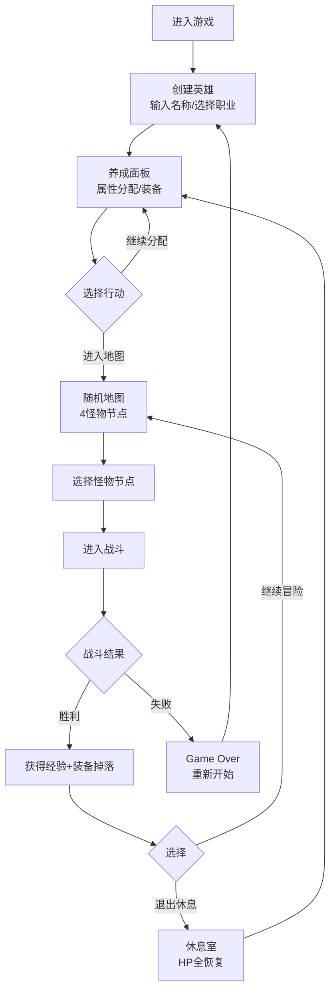

## 1. 产品概述
像素风JRPG战斗与角色养成系统 - 一款浏览器端迷你像素风格角色扮演游戏原型，为独立游戏制作人提供一键搭建的基础框架。包含英雄创建、属性分配、装备系统、随机地图与回合制战斗核心玩法。

## 2. 核心功能

### 2.1 用户角色
| 角色 | 核心权限 |
|------|----------|
| 玩家 | 创建英雄、养成角色、装备物品、进行战斗 |

### 2.2 功能模块
1. **英雄创建界面**：名称输入、职业选择（战士/法师/盗贼/弓箭手）
2. **角色养成面板**：属性分配、装备槽位、背包系统
3. **战斗场景**：敌我像素精灵、HP血条、行动日志、战斗指令
4. **地图系统**：随机怪物节点、休息室恢复

### 2.3 页面详情
| 页面名称 | 模块名称 | 功能描述 |
|----------|----------|----------|
| 创建界面 | 英雄创建 | 输入名称（≤16字符），选择四职业，自动生成基础属性 |
| 养成面板 | 属性系统 | 升级获得5点属性点，分配到力量/敏捷/耐力/智力，确认锁定 |
| 养成面板 | 装备系统 | 4个装备槽位（武器/头盔/铠甲/靴子），拖拽装备卡片更换，背包10件上限 |
| 地图场景 | 节点系统 | 4个随机怪物节点，难度随等级动态调整，休息室全恢复 |
| 战斗场景 | 回合制战斗 | 攻击/防御/药水三种指令，HP条渐变动画，日志滚动，胜利获得经验和掉落 |
| 结算画面 | 胜利/失败 | Game Over重开按钮，胜利经验装备掉落动画 |

## 3. 核心流程

主用户流程：创建英雄 → 分配属性 → 进入地图 → 遇怪战斗 → 获得奖励 → 继续或休息 → 循环升级

## 4. 用户界面设计

### 4.1 设计风格
- **主色调**：深色系，背景#0D0D0D，面板#1A1A1A，文字#FFFFFF，强调色#FFD700
- **像素风格**：Press Start 2P字体，1px白色实线边框，1px像素阴影
- **按钮样式**：宽100px高36px，圆角4px，深灰#1E1E1E背景，悬停#333333，按下缩放0.95，过渡0.15秒
- **HP条**：绿色#4ADE80渐变至红色#EF4444，宽度变化过渡0.3秒
- **状态切换动画**：淡入淡出0.5秒 ease-in-out
- **装备掉落动画**：从上方掉落旋转0.4秒 cubic-bezier(0.25,0.46,0.45,0.94)

### 4.2 页面设计概览
| 页面名称 | 模块名称 | UI元素 |
|----------|----------|----------|
| 创建界面 | 英雄创建 | 名称输入框、四职业卡片（带属性预览）、确认按钮（绿色#4ADE80，0.3秒弹动） |
| 养成面板 | 属性系统 | 顶部黄色可用点数、4个属性格子（120×48px，+号按钮分配）、确认锁定按钮 |
| 养成面板 | 装备系统 | 4个装备槽位、装备卡片（品质渐变色：普通#9E9E9E/稀有#2196F3/史诗#9C27B0/传说#FF9800）、背包列表、容量警告闪烁#EF4444 1秒 |
| 地图场景 | 节点系统 | 4个像素怪物图标（CSS方块模拟）、休息室图标、连接线 |
| 战斗场景 | 对战UI | 左右像素精灵（4px格子CSS块）、上下HP条、中间行动日志（滚动自动到底部，最新黄色高亮，0.2秒淡入）、底部三按钮组 |
| 结算画面 | 结果界面 | 居中标题、经验/装备奖励展示、操作按钮 |

### 4.3 响应式
桌面优先设计，最低适配1024×768分辨率，使用CSS Flexbox和Grid布局确保各面板排列有序。

### 4.4 性能要求
- UI帧率 ≥ 60FPS
- 战斗动画单次执行 ≤ 0.5秒
- 初始加载时间 ≤ 3秒（代码拆分+懒加载）
