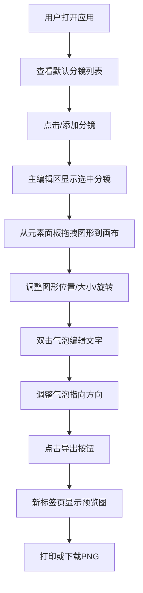

## 1. 产品概述

漫画分镜编辑器（Comic Storyboard Editor）是一款面向短篇漫画作者的高效创作工具，帮助作者快速将文字脚本转换成带有简单分镜和文字气泡的电子漫画预览页。

- **核心价值**：解决从文字脚本到直观视觉分镜需要大量手绘草图、沟通成本高和反复修改的问题
- **目标用户**：短篇漫画作者、漫画编辑、故事板设计师
- **产品定位**：轻量级、高效率的分镜可视化工具

## 2. 核心功能

### 2.1 功能模块

1. **分镜列表管理**：分镜卡片展示、拖拽排序、编辑描述、删除分镜
2. **画布编辑区**：场景元素的拖拽、缩放、旋转、网格吸附
3. **元素库面板**：预设图形库（矩形、圆形、三角形、对话气泡、对话框）
4. **文字气泡编辑**：气泡内文字编辑、尾端指向调整
5. **导出预览**：三列布局漫画预览图、打印、下载PNG

### 2.2 功能详情

| 模块名称 | 功能描述 |
|-----------|----------|
| 分镜列表 | 每项180x80px，圆角6px，深色背景#2D2D2D，选中边框橙黄#F59E0B；显示序号、描述摘要、60x40px微缩预览（场景绿#10B981/人物蓝#3B82F6/物品紫#8B5CF6）；支持拖拽排序、双击编辑、删除确认（红色#EF4444） |
| 主编辑区 | 占70%宽度，浅灰背景#F5F5F5，深色边框#1F2937；8px网格吸附；选中元素显示坐标（12px灰色#6B7280）、蓝色缩放手柄、绿色旋转手柄（15度步进） |
| 元素面板 | 固定200px宽；5种图形各5种配色；拖拽时半透明跟随；矩形#6B7280填充#4B5563边框；气泡白色#FFFFFF填充#D1D5DB边框内边距8px |
| 文字气泡 | 双击进入编辑模式；输入框自适应最大90%宽度，14px灰色#374151；尾端8px蓝色圆点，8方向45度吸附 |
| 导出预览 | 橙黄按钮#F59E0B hover#D97706；三列布局每格180px间隔16px黑色背景#111827；新标签页打开打印/下载按钮 |

## 3. 核心流程

## 4. 用户界面设计

### 4.1 设计风格

- **主色调**：深紫蓝背景#1A1A2E，面板背景#2D2D44，强调色橙黄#F59E0B
- **按钮样式**：圆角8px，hover时0.2s过渡变深，点击时0.1s scale(0.95)缩放
- **字体**：系统无衬线字体 (-apple-system, BlinkMacSystemFont, 'Segoe UI')
- **布局风格**：三栏布局（左分镜列表 + 中编辑区 + 右元素面板），顶部48px工具栏
- **动画**：所有过渡0.3s ease-in-out；拖拽使用CSS transform保证45fps+

### 4.2 响应式设计

- **桌面端（≥1024px）**：三栏完整布局
- **移动端（<1024px）**：右侧元素面板收起为右下角44px圆形抽屉按钮（#F59E0B），点击弹出半透明blur覆盖层

### 4.3 界面结构

| 区域 | 背景色 | 尺寸/占比 |
|-----|--------|----------|
| 顶部工具栏 | #2D2D44 | 高度48px |
| 左侧分镜列表 | #2D2D44 | 自适应 |
| 中间主编辑区 | #F5F5F5 | 70%宽度 |
| 右侧元素面板 | #2D2D44 | 200px宽 |
| 全局背景 | #1A1A2E | - |
