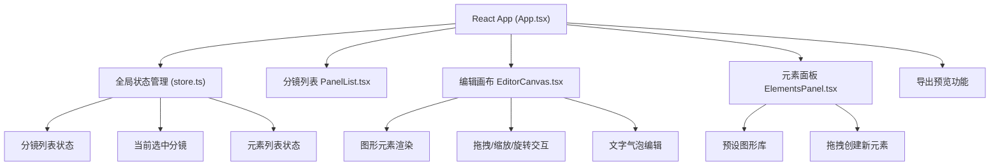

## 1. 架构设计



## 2. 技术说明

- **前端框架**：React@18.2.0 + TypeScript@5.3.3
- **构建工具**：Vite@5.0.8 + @vitejs/plugin-react@4.2.0
- **状态管理**：useReducer + Context（store.ts）
- **工具库**：uuid@9.0.0（生成唯一ID）
- **样式方案**：原生 CSS + CSS 变量（无需 Tailwind，按用户指定颜色体系）

## 3. 文件结构

```
e:\solo\SoloAutoDemo\tasks\auto46\
├── index.html                 # 入口HTML
├── package.json               # 依赖配置
├── tsconfig.json              # TS配置（严格模式，ES2020）
├── vite.config.js             # Vite配置（@别名）
└── src/
    ├── App.tsx                # 主布局组件
    ├── store.ts               # 全局状态管理（useReducer）
    ├── PanelList.tsx          # 左侧分镜列表
    ├── EditorCanvas.tsx       # 中间编辑画布
    ├── ElementsPanel.tsx      # 右侧元素面板
    └── index.css              # 全局样式
```

## 4. 数据模型

### 4.1 核心类型定义

```typescript
// 图形元素类型
type ElementType = 'rectangle' | 'circle' | 'triangle' | 'speechBubble' | 'dialogBox';

// 场景主体类型（用于微缩预览颜色）
type SubjectType = 'scene' | 'character' | 'object';

// 画布元素
interface CanvasElement {
  id: string;
  type: ElementType;
  x: number;
  y: number;
  width: number;
  height: number;
  rotation: number;           // 角度
  fill: string;
  stroke: string;
  text?: string;              // 气泡文字
  tailDirection?: number;     // 气泡指向角度（0-315，45度步进）
}

// 分镜
interface Panel {
  id: string;
  order: number;
  description: string;
  subjectType: SubjectType;    // 场景/人物/物品
  elements: CanvasElement[];
}

// 全局状态
interface AppState {
  panels: Panel[];
  selectedPanelId: string | null;
  selectedElementId: string | null;
}
```

### 4.2 Action 类型

```typescript
type Action =
  | { type: 'ADD_PANEL' }
  | { type: 'DELETE_PANEL'; payload: string }
  | { type: 'SELECT_PANEL'; payload: string }
  | { type: 'EDIT_PANEL_DESCRIPTION'; payload: { id: string; description: string } }
  | { type: 'REORDER_PANELS'; payload: string[] }
  | { type: 'SET_PANEL_SUBJECT'; payload: { id: string; subjectType: SubjectType } }
  | { type: 'ADD_ELEMENT'; payload: { panelId: string; element: CanvasElement } }
  | { type: 'UPDATE_ELEMENT'; payload: { panelId: string; elementId: string; updates: Partial<CanvasElement> } }
  | { type: 'DELETE_ELEMENT'; payload: { panelId: string; elementId: string } }
  | { type: 'SELECT_ELEMENT'; payload: string | null };
```

## 5. 性能优化策略

- **拖拽性能**：使用 CSS transform/translate 而非 top/left，避免重排
- **帧率保证**：requestAnimationFrame 驱动动画，目标45fps+
- **网格吸附**：8px步进的数学计算，无DOM查询
- **组件拆分**：纯组件 + memo 避免不必要重渲染
- **事件委托**：画布级别统一管理鼠标事件
