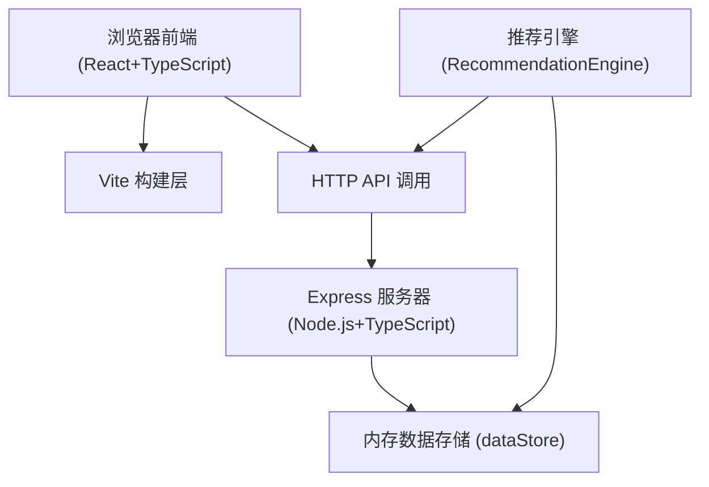
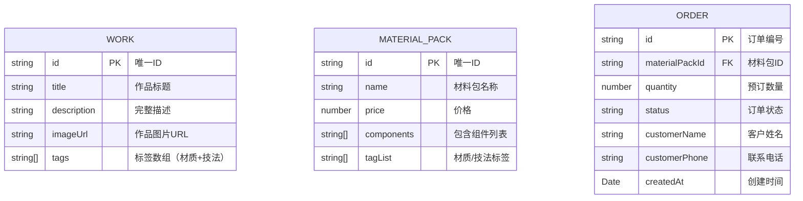

## 1. 架构设计



## 2. 技术描述

- **前端**：React@18.2.0 + TypeScript@5.3.3 + Vite@5.0.8
- **构建工具**：Vite@5.0.8 + @vitejs/plugin-react@4.2.0
- **后端**：Express@4.18.2 + TypeScript@5.3.3
- **数据存储**：内存数组（dataStore.ts）
- **跨域**：cors@2.8.5
- **工具库**：uuid@9.0.0
- **启动方式**：`npm run dev`（Vite 同时提供前端热更新和后端服务）

## 3. 目录与文件职责

```
project-root/
├── package.json                 # 项目依赖与脚本
├── vite.config.js               # Vite 构建配置（含 @ → src alias）
├── tsconfig.json                # TypeScript 配置（strict, ES2020, ESNext）
├── index.html                   # 前端入口 HTML
└── src/
    ├── frontend/
    │   ├── App.tsx              # 主应用：路由、全局状态、后端数据分发
    │   ├── WorksGallery.tsx     # 作品展示：卡片网格、详情页、侧边栏筛选
    │   └── RecommendationEngine.ts  # 推荐引擎：标签相似度计算、Top5 推荐
    └── backend/
        ├── server.ts            # Express 服务器：API 路由与响应
        └── dataStore.ts         # 内存数据：作品、材料包、订单的模拟数据
```

**数据流与调用关系**：

```
WorksGallery.tsx ──作品ID──▶ RecommendationEngine.ts ──请求──▶ server.ts (/api/materials/:id)
        │                                                               │
        └──────── GET /api/works ──────────────────────────────────────┘
        │
        └──────── POST /api/orders ────────────────────────────────────▶ server.ts
                                                                             │
                                                                             ▼
                                                                      dataStore.ts (内存读写)
```

## 4. 路由定义

| 前端路由 | 用途 |
|---------|------|
| / | 首页：作品网格展示 + 侧边栏 |
| /work/:id | 作品详情页 + 推荐材料包 |
| /orders | 订单列表页 |

| 后端 API 路由 | 方法 | 用途 |
|-------------|------|------|
| /api/works | GET | 获取所有作品列表 |
| /api/works/:id | GET | 获取单个作品详情 |
| /api/materials | GET | 获取所有材料包 |
| /api/materials/:id | GET | 获取单个材料包详情 |
| /api/orders | GET | 获取订单列表 |
| /api/orders | POST | 创建新订单 |

## 5. 数据模型

### 5.1 数据模型定义



### 5.2 类型定义（TypeScript）

```typescript
interface Work {
  id: string;
  title: string;
  description: string;
  imageUrl: string;
  tags: string[];
}

interface MaterialPack {
  id: string;
  name: string;
  price: number;
  components: string[];
  tagList: string[];
}

type OrderStatus = '已提交' | '已发货' | '已完成';

interface Order {
  id: string;
  materialPackId: string;
  materialPackName: string;
  quantity: number;
  totalPrice: number;
  status: OrderStatus;
  customerName: string;
  customerPhone: string;
  createdAt: string;
}
```

### 5.3 标签配色映射

| 标签类型 | 颜色值 |
|---------|--------|
| 植鞣革 | #D97706 |
| 铬鞣革 | #7C3AED |
| 编织 | #059669 |
| 十字纹 | #D97706（同植鞣革色系） |
| 原色 | #D97706 |
| 手工缝线 | #059669 |
| 封边 | #8B5CF6 |
| 默认 | #6B7280 |

## 6. 推荐算法说明

推荐引擎基于标签相似度计算：

1. 提取目标作品的所有标签（材质 + 技法）
2. 遍历所有材料包，计算与作品标签的交集数量
3. 匹配度 = (交集标签数 / 作品标签总数) × 100%
4. 按匹配度降序排列，取前 5 个结果
5. 性能约束：单次计算 ≤ 200ms
