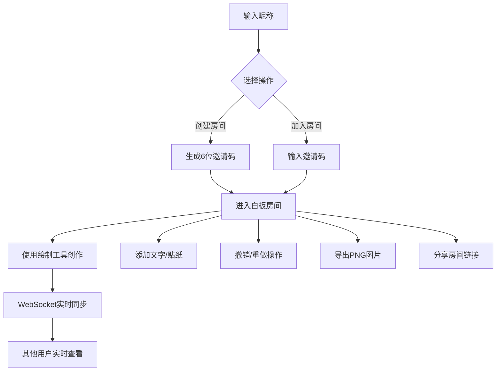

## 1. 产品概述

在线涂鸦白板与实时协作演示应用，支持多人实时在画布上自由绘制、添加文字和贴纸，适用于远程协作、在线教学、头脑风暴等场景。

- **核心价值**：低延迟实时协作白板，提供流畅的绘制体验和丰富的创作工具
- **目标用户**：团队协作者、在线教育工作者、创意工作者

## 2. 核心功能

### 2.1 用户角色

| 角色 | 加入方式 | 核心权限 |
|------|----------|----------|
| 房间创建者 | 创建房间生成邀请码 | 管理房间、清空画布、所有绘制操作 |
| 普通用户 | 输入邀请码加入 | 绘制、添加文字/贴纸、聊天、撤销重做 |

### 2.2 功能模块

1. **白板绘制**：铅笔、橡皮、矩形、圆形、直线等工具，支持颜色和粗细调节
2. **房间管理**：创建/加入房间、用户列表、昵称系统
3. **文字与贴纸**：可编辑文字、6种预设贴纸、拖拽移动
4. **历史版本**：撤销/重做、步骤指示器、最多100步历史
5. **导出分享**：PNG导出、房间链接分享

### 2.3 页面详情

| 页面名称 | 模块名称 | 功能描述 |
|----------|----------|----------|
| 房间入口页 | 昵称输入 | 2-10字符昵称验证，非法字符过滤 |
| 房间入口页 | 房间操作 | 创建房间（生成6位邀请码）、加入房间（输入邀请码） |
| 白板主页面 | 画布区域 | 80%宽度，浅灰网格背景，支持绘制/擦除/形状/文字/贴纸 |
| 白板主页面 | 工具面板 | 240px宽右侧面板，包含绘图工具、颜色色板、粗细滑块、操作按钮 |
| 白板主页面 | 用户列表 | 右侧面板显示在线用户，创建者显示皇冠图标 |
| 白板主页面 | 聊天面板 | 房间内消息通讯，进入退出通知 |

## 3. 核心流程

用户输入昵称后可创建或加入房间。进入房间后，可使用各种工具在白板上创作，所有操作通过WebSocket实时同步给房间内其他用户。支持撤销重做、导出图片和分享房间链接。

## 4. 用户界面设计

### 4.1 设计风格

- **主色调**：蓝色 #3B82F6
- **背景色**：白色 #FFFFFF，画布浅灰 #F9FAFB
- **辅助色**：浅灰 #E5E7EB，文字灰 #6B7280
- **按钮风格**：圆角设计，悬停亮度变化，点击缩放动画
- **字体**：系统默认字体
- **布局风格**：左右分栏，左侧画布右侧工具面板
- **图标风格**：SVG线性图标，简洁现代

### 4.2 页面设计概述

| 页面名称 | 模块名称 | UI元素 |
|----------|----------|--------|
| 房间入口页 | 昵称输入 | 输入框、验证提示、创建/加入按钮 |
| 白板主页面 | 画布区域 | 网格背景、绘制图层、工具提示跟随鼠标 |
| 白板主页面 | 工具面板 | 6个绘图工具按钮、12色色板、粗细滑块、5个操作按钮 |
| 白板主页面 | 用户列表 | 圆形头像、用户名、皇冠图标、滑入动画 |
| 白板主页面 | 聊天面板 | 消息气泡、头像、时间戳、输入框 |

### 4.3 响应式

- 桌面端优先，左右分栏布局
- 手机端（360px宽）自动折行排列，工具按钮自适应
- 触摸操作优化，支持移动端绘制

### 4.4 动画与交互

- 工具按钮点击缩放0.9倍动画0.15s
- 用户列表滑入动画0.3s ease-out
- 贴纸拖拽放大1.1倍动画0.2s
- 撤销画布渐变回滚0.5s动画
- 分享成功绿色提示2s后消失
- 色块选中外圈边框过渡0.2s
