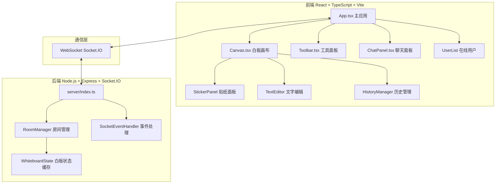
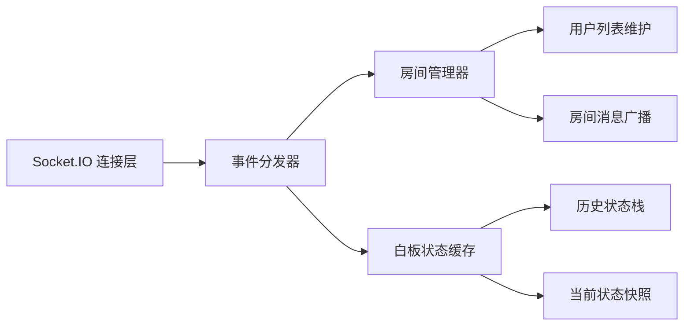
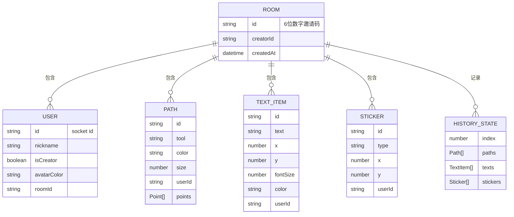

## 1. 架构设计



## 2. 技术描述

- **前端框架**：React@18.2.0 + TypeScript@5.3.3
- **构建工具**：Vite@5.0.8 + @vitejs/plugin-react@4.2.0
- **样式方案**：CSS Modules / 内联样式
- **后端框架**：Express@4.18.2
- **实时通信**：Socket.IO@4.7.2 / socket.io-client@4.7.2
- **跨域处理**：cors@2.8.5
- **唯一标识**：uuid@9.0.0
- **画布技术**：HTML5 Canvas 2D API
- **初始化方式**：手动配置项目结构

## 3. 路由定义

| 路由 | 用途 |
|------|------|
| / | 入口页面，昵称输入 + 创建/加入房间 |
| /room/:roomId | 白板主页面，包含画布和工具面板 |

## 4. API 定义（Socket.IO 事件）

### 4.1 客户端 → 服务端

| 事件名 | 参数 | 描述 |
|--------|------|------|
| `createRoom` | `{ nickname: string }` | 创建新房间 |
| `joinRoom` | `{ roomId: string, nickname: string }` | 加入房间 |
| `leaveRoom` | `{ roomId: string }` | 离开房间 |
| `drawStart` | `{ roomId: string, tool: string, x: number, y: number, color: string, size: number }` | 开始绘制 |
| `drawMove` | `{ roomId: string, x: number, y: number }` | 绘制中 |
| `drawEnd` | `{ roomId: string, pathId: string }` | 结束绘制 |
| `addText` | `{ roomId: string, text: string, x: number, y: number, fontSize: number, color: string }` | 添加文字 |
| `addSticker` | `{ roomId: string, type: string, x: number, y: number }` | 添加贴纸 |
| `moveSticker` | `{ roomId: string, stickerId: string, x: number, y: number }` | 移动贴纸 |
| `undo` | `{ roomId: string, userId: string }` | 撤销操作 |
| `redo` | `{ roomId: string, userId: string }` | 重做操作 |
| `clearCanvas` | `{ roomId: string }` | 清空画布 |
| `sendMessage` | `{ roomId: string, text: string }` | 发送聊天消息 |

### 4.2 服务端 → 客户端

| 事件名 | 参数 | 描述 |
|--------|------|------|
| `roomCreated` | `{ roomId: string, userId: string }` | 房间创建成功 |
| `roomJoined` | `{ roomId: string, userId: string, users: User[] }` | 加入房间成功 |
| `userJoined` | `{ user: User }` | 新用户加入 |
| `userLeft` | `{ userId: string }` | 用户离开 |
| `fullState` | `{ paths: Path[], texts: TextItem[], stickers: Sticker[] }` | 完整白板状态（新用户加入时） |
| `drawStart` | `{ userId: string, tool: string, ... }` | 广播绘制开始 |
| `drawMove` | `{ userId: string, x: number, y: number }` | 广播绘制中 |
| `drawEnd` | `{ userId: string, pathId: string }` | 广播绘制结束 |
| `textAdded` | `{ text: TextItem }` | 广播文字添加 |
| `stickerAdded` | `{ sticker: Sticker }` | 广播贴纸添加 |
| `stickerMoved` | `{ stickerId: string, x: number, y: number }` | 广播贴纸移动 |
| `canvasUndo` | `{ historyIndex: number }` | 广播撤销 |
| `canvasRedo` | `{ historyIndex: number }` | 广播重做 |
| `canvasCleared` | `{}` | 广播清空画布 |
| `messageReceived` | `{ userId: string, text: string, timestamp: number }` | 广播聊天消息 |

### 4.3 类型定义

```typescript
interface User {
  id: string;
  nickname: string;
  isCreator: boolean;
  avatarColor: string;
}

interface Point {
  x: number;
  y: number;
}

interface Path {
  id: string;
  tool: 'pencil' | 'eraser' | 'rectangle' | 'circle' | 'line';
  points: Point[];
  color: string;
  size: number;
  userId: string;
}

interface TextItem {
  id: string;
  text: string;
  x: number;
  y: number;
  fontSize: number;
  color: string;
  userId: string;
}

interface Sticker {
  id: string;
  type: 'smile' | 'star' | 'arrow' | 'flower' | 'lightning' | 'heart';
  x: number;
  y: number;
  userId: string;
}

interface HistoryState {
  paths: Path[];
  texts: TextItem[];
  stickers: Sticker[];
}
```

## 5. 服务端架构图



## 6. 数据模型

### 6.1 数据模型定义



### 6.2 内存存储结构

服务端使用内存缓存存储白板状态，数据结构如下：

```typescript
interface RoomState {
  id: string;
  creatorId: string;
  users: Map<string, User>;
  history: HistoryState[];
  historyIndex: number;
}

const rooms: Map<string, RoomState> = new Map();
```
