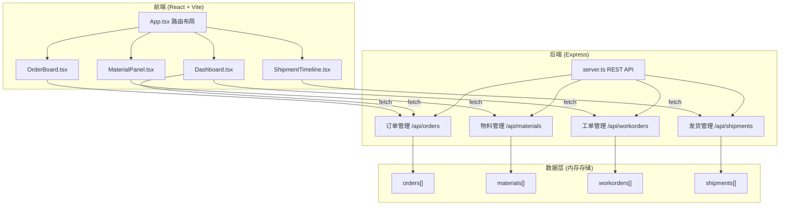
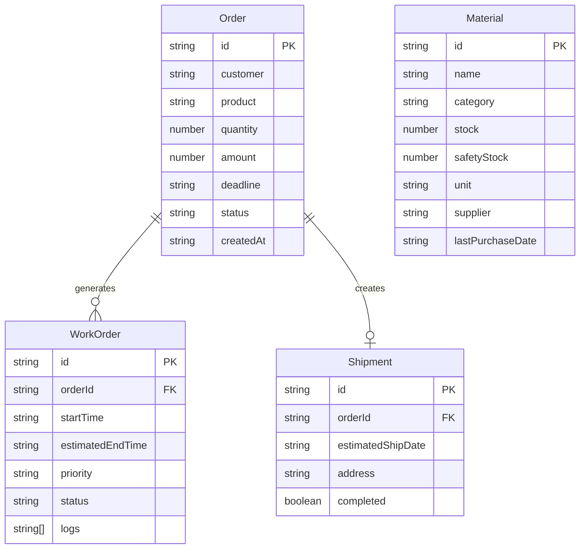

## 1. 架构设计



## 2. 技术说明
- 前端：React@18.2.0 + TypeScript@5.3.3 + Vite@5.0.8
- 初始化工具：vite-init（react-express-ts模板）
- 后端：Express@4.18.2 + TypeScript
- 数据库：内存数据存储（无持久化）
- 状态管理：React useState + useEffect（从后端fetch数据）
- 依赖：cors@2.8.5、uuid@9.0.0、@vitejs/plugin-react@4.2.0

## 3. 路由定义
| 路由 | 用途 |
|------|------|
| / | 仪表盘页面 - 生产概览、工单列表、趋势图 |
| /orders | 订单看板页面 - Kanban风格订单管理 |
| /materials | 物料库存页面 - 库存表格与补货 |
| /shipments | 发货计划页面 - 时间线与确认发货 |

## 4. API定义

### 4.1 订单 API
- `GET /api/orders` - 获取所有订单
- `POST /api/orders` - 创建新订单（body: {customer, product, quantity, amount, deadline}）
- `PATCH /api/orders/:id/status` - 更新订单状态（body: {status}）

### 4.2 物料 API
- `GET /api/materials` - 获取所有物料
- `POST /api/materials/:id/purchase` - 补货（body: {quantity}）

### 4.3 工单 API
- `GET /api/workorders` - 获取所有工单
- `GET /api/workorders/:id` - 获取工单详情

### 4.4 发货 API
- `GET /api/shipments` - 获取所有发货记录
- `POST /api/shipments/:id/complete` - 确认发货完成

### 4.5 TypeScript类型定义

```typescript
interface Order {
  id: string;
  customer: string;
  product: string;
  quantity: number;
  amount: number;
  deadline: string;
  status: 'pending' | 'in_production' | 'ready_to_ship' | 'completed';
  createdAt: string;
}

interface Material {
  id: string;
  name: string;
  category: string;
  stock: number;
  safetyStock: number;
  unit: string;
  supplier: string;
  lastPurchaseDate?: string;
}

interface WorkOrder {
  id: string;
  orderId: string;
  startTime: string;
  estimatedEndTime: string;
  priority: 'high' | 'normal';
  status: 'waiting_material' | 'in_progress' | 'completed';
  logs: string[];
}

interface Shipment {
  id: string;
  orderId: string;
  estimatedShipDate: string;
  address: string;
  completed: boolean;
}
```

## 5. 服务器架构图

```mermaid
flowchart LR
    "Controller 路由处理" --> "Service 业务逻辑" --> "Repository 内存数据" --> "Data 数据存储"
```

## 6. 数据模型

### 6.1 数据模型定义



### 6.2 初始化数据定义
- 10条示例订单（状态分布：3待处理、3生产中、2待发货、2已完成）
- 10条物料记录（部分库存低于安全阈值以演示预警）
- 5个工单（含等待物料和进行中状态）
- 3个待发货记录
