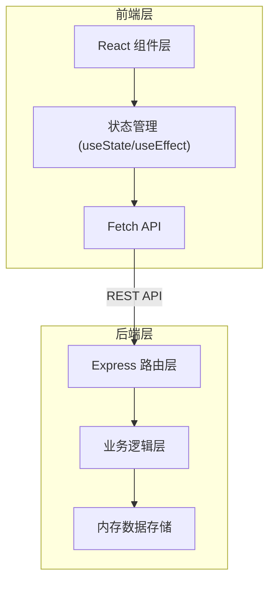
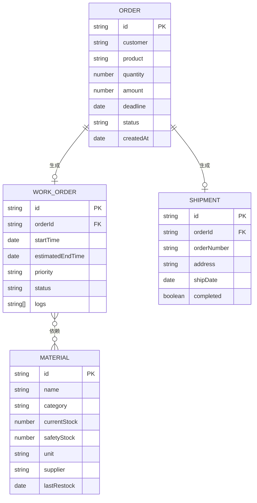

## 1. 架构设计



## 2. 技术描述

- **前端**：React 18.2.0 + TypeScript 5.3.3 + Vite 5.0.8
- **后端**：Express 4.18.2 + Node.js + 内存数据存储
- **构建工具**：Vite 5.0.8 + @vitejs/plugin-react 4.2.0
- **路由**：React Router
- **通信**：Fetch API + CORS
- **数据生成**：uuid 9.0.0
- **开发端口**：前端5173，后端3001

## 3. 路由定义

| 前端路由 | 页面/组件 | 功能描述 |
|---------|----------|---------|
| / | Dashboard | 仪表盘概览 |
| /orders | OrderBoard | 订单看板 |
| /materials | MaterialPanel | 物料库存 |
| /shipments | ShipmentTimeline | 发货计划 |

## 4. API 定义

### 4.1 订单 API

| 方法 | 路径 | 功能 | 请求体 | 响应 |
|-----|------|------|-------|------|
| GET | /api/orders | 获取所有订单 | - | Order[] |
| POST | /api/orders | 创建订单 | { customer, product, quantity, amount, deadline } | Order |
| PUT | /api/orders/:id | 更新订单状态 | { status } | Order |

### 4.2 物料 API

| 方法 | 路径 | 功能 | 请求体 | 响应 |
|-----|------|------|-------|------|
| GET | /api/materials | 获取所有物料 | - | Material[] |
| PUT | /api/materials/:id/purchase | 物料补货 | { quantity } | Material |

### 4.3 工单 API

| 方法 | 路径 | 功能 | 请求体 | 响应 |
|-----|------|------|-------|------|
| GET | /api/workorders | 获取所有工单 | - | WorkOrder[] |

### 4.4 发货 API

| 方法 | 路径 | 功能 | 请求体 | 响应 |
|-----|------|------|-------|------|
| GET | /api/shipments | 获取所有发货记录 | - | Shipment[] |
| PUT | /api/shipments/:id/complete | 确认发货 | - | Shipment |

## 5. 数据模型

### 5.1 数据模型定义



### 5.2 数据类型定义（TypeScript）

```typescript
type OrderStatus = 'pending' | 'processing' | 'shipping' | 'completed';

interface Order {
  id: string;
  customer: string;
  product: string;
  quantity: number;
  amount: number;
  deadline: string;
  status: OrderStatus;
  createdAt: string;
}

interface Material {
  id: string;
  name: string;
  category: string;
  currentStock: number;
  safetyStock: number;
  unit: string;
  supplier: string;
  lastRestock?: string;
}

type WorkOrderStatus = 'waiting' | 'inProgress' | 'completed';
type WorkOrderPriority = 'high' | 'normal';

interface WorkOrder {
  id: string;
  orderId: string;
  startTime: string;
  estimatedEndTime: string;
  priority: WorkOrderPriority;
  status: WorkOrderStatus;
  logs: string[];
}

interface Shipment {
  id: string;
  orderId: string;
  orderNumber: string;
  address: string;
  shipDate: string;
  completed: boolean;
}
```

## 6. 文件结构与调用关系

```
src/
├── common/
│   └── types.ts          # 共享类型定义（被所有模块引用）
├── backend/
│   └── server.ts         # Express后端，REST API，内存数据
└── frontend/
    ├── App.tsx           # 根组件，路由配置，数据获取分发
    └── components/
        ├── Dashboard.tsx       # 仪表盘（从App传入汇总数据）
        ├── OrderBoard.tsx      # 订单看板（onStatusChange回调）
        ├── MaterialPanel.tsx   # 物料面板（onPurchase回调）
        └── ShipmentTimeline.tsx # 发货时间线（onComplete回调）
```

### 数据流向

1. **App.tsx** 通过 useEffect 从后端 API 获取所有数据
2. 数据通过 props 分发给各子组件
3. 子组件通过回调函数（onStatusChange、onPurchase、onComplete）向上传递操作
4. App.tsx 调用后端 API 更新数据后重新获取最新状态
5. 后端 server.ts 接收请求，操作内存数据，返回 JSON 响应

## 7. 排程逻辑说明

- 订单状态变为 `processing` 时，自动生成 WorkOrder
- 优先级规则：订单金额 > 1000 为高优先级，否则普通
- 预计完成时间：每单位产品需要 1 小时
- 物料可用性检查：物料不足时工单状态为 `waiting`，补货后自动改为 `inProgress`
- 发货计划：订单状态变为 `shipping` 时自动生成 Shipment 记录
