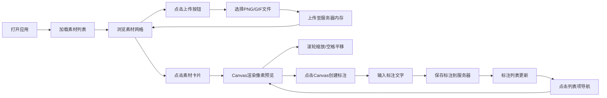

## 1. 产品概述

像素风格游戏素材管理与在线标注平台，为小型独立游戏开发团队提供轻量级的素材协作管理方案。解决现有工具过于笨重或无法支持像素画精确预览的痛点。

- **目标用户**：游戏策划、美术设计师、独立游戏开发者
- **核心价值**：像素级精确预览、便捷的素材标注、团队协作管理

## 2. 核心功能

### 2.1 用户角色
| 角色 | 登录方式 | 核心权限 |
|------|---------|---------|
| 团队成员 | 免登录（本地协作） | 素材上传、浏览、预览、标注 |

### 2.2 功能模块
1. **素材管理模块**：素材上传、分类浏览、文件类型标签
2. **像素预览模块**：canvas整数倍缩放、滚轮缩放、空格拖拽平移
3. **标注模块**：点击创建标注点、浮动输入框、标注列表导航
4. **布局模块**：可拖拽分割线、左右分栏布局

### 2.3 页面详情
| 页面名称 | 模块名称 | 功能描述 |
|---------|---------|---------|
| 主界面 | 素材上传区 | 顶部渐变按钮，选择PNG/GIF文件上传 |
| 主界面 | 素材网格区 | 4列弹性网格，卡片展示缩略图/名称/时间/类型标签 |
| 主界面 | 可拖拽分割线 | 4px宽，hover/drag状态变色变宽 |
| 主界面 | 像素预览区 | Canvas渲染，1x-16x缩放，底部显示缩放倍数 |
| 主界面 | 标注创建交互 | 点击Canvas弹出浮动输入框，创建粉色十字标注 |
| 主界面 | 标注列表区 | 显示所有标注，点击居中闪烁定位 |

## 3. 核心流程

用户打开应用 → 浏览已有素材网格 → 上传新素材（可选）→ 点击素材卡片选中 → 右侧预览区加载Canvas渲染 → 滚轮缩放/空格平移调整视角 → 点击Canvas创建标注点 → 输入标注文字保存 → 在标注列表中点击导航到标注位置

## 4. 用户界面设计

### 4.1 设计风格
- **主色调**：深紫色系渐变 #A78BFA → #7C3AED
- **背景色**：#181825（主背景）、#1E1E2E → #2D2D3F（卡片渐变）
- **文字色**：#CDD6F4（主文字）、白色（标题）、自定义灰色（辅助文字）
- **强调色**：#FF00FF（标注点）、#4ADE80（PNG标签）、#FACC15（GIF标签）
- **按钮风格**：胶囊型圆角22px，渐变背景，悬停放大1.05倍，点击凹陷0.95倍
- **字体**：系统默认无衬线字体，14px正文，10px辅助文字
- **布局风格**：左右分栏（55% / 45%），卡片式网格

### 4.2 页面设计概览
| 页面名称 | 模块名称 | UI元素 |
|---------|---------|-------|
| 主界面 | 上传按钮 | 160×44px，圆角22px，紫-紫渐变，悬停scale(1.05)，点击scale(0.95) |
| 主界面 | 素材卡片 | 240px宽，圆角8px，渐变背景，悬停上移4px+阴影 |
| 主界面 | 类型标签 | 圆角4px，10px字号，PNG绿色/GIF黄色 |
| 主界面 | 选中卡片 | 边框#A78BFA |
| 主界面 | 分割线 | 4px宽，默认#45475A，hover#A78BFA，drag#CBA6F7且6px |
| 主界面 | 标注列表项 | 高40px，圆角6px，背景#313244，悬停#45475A，选中左边框#A78BFA |

### 4.3 响应式
- 桌面优先设计，最小宽度1280px
- 固定左右分栏比例，分割线可拖拽调整
- 标注列表区可滚动

## 5. 性能指标
- Canvas 16x缩放渲染帧率 ≥ 30fps
- 10张素材卡片首屏渲染 ≤ 1秒
- 标注保存响应时间 < 200ms
