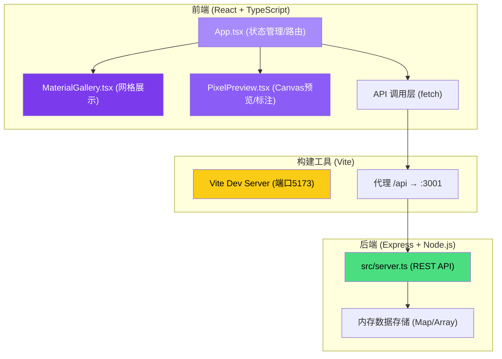
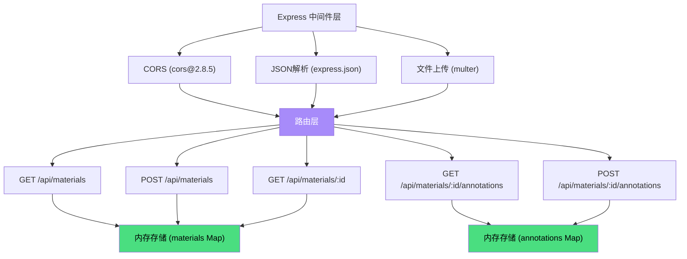
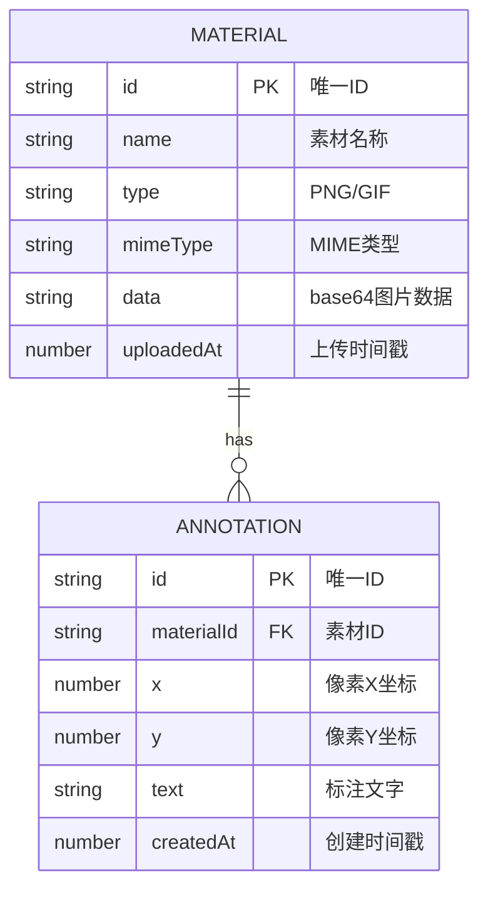

## 1. 架构设计



## 2. 技术说明

- **前端**：React@18.2.0 + TypeScript@5.3.3，无额外UI库
- **构建工具**：Vite@5.0.8 + @vitejs/plugin-react@4.2.0
- **后端**：Express@4.18.2，multer@1.4.5-lts.1处理文件上传，cors@2.8.5跨域
- **数据存储**：Node.js内存（Map + Array），无需数据库
- **初始化方式**：手动创建所有配置文件和源码，满足用户指定的精确文件结构

## 3. 路由定义
前端为单页应用，无路由组件，状态通过App.tsx管理：
| 逻辑视图 | 用途 |
|---------|------|
| 素材网格 + 预览 | 默认视图，左右分栏展示所有功能 |

## 4. API 定义

### 4.1 类型定义
```typescript
interface Material {
  id: string;
  name: string;
  type: 'PNG' | 'GIF';
  mimeType: string;
  data: string; // base64 encoded image
  uploadedAt: number; // timestamp
}

interface Annotation {
  id: string;
  materialId: string;
  x: number; // pixel coordinate
  y: number; // pixel coordinate
  text: string;
  createdAt: number;
}
```

### 4.2 接口定义

| 方法 | 路径 | 请求体 | 响应 | 说明 |
|------|------|--------|------|------|
| GET | /api/materials | - | Material[] | 获取所有素材列表 |
| POST | /api/materials | multipart/form-data (file, name) | Material | 上传新素材 |
| GET | /api/materials/:id | - | Material | 获取单个素材 |
| GET | /api/materials/:id/annotations | - | Annotation[] | 获取素材的所有标注 |
| POST | /api/materials/:id/annotations | { x, y, text } | Annotation | 创建新标注 |

## 5. 服务器架构



## 6. 数据模型

### 6.1 实体关系



### 6.2 内存存储结构
- `materials: Map<string, Material>` - 素材表，key为id
- `annotations: Map<string, Annotation[]>` - 标注表，key为materialId

## 7. 文件结构与调用关系

```
├── package.json          # 依赖配置，启动脚本
├── vite.config.js        # Vite配置，@别名，API代理
├── tsconfig.json         # TS配置，严格模式，ES2020
├── index.html            # 入口HTML
└── src/
    ├── server.ts         # Express后端（端口3001）
    │   └── 暴露API供 App.tsx fetch调用
    ├── App.tsx           # 主组件，状态管理
    │   ├── 调用 server.ts 的 REST API
    │   ├── 向 MaterialGallery 注入 materials数据 + onSelect回调
    │   ├── 向 PixelPreview 注入 selected材料 + onSaveAnnotation回调
    │   └── 接收子组件事件并调度数据更新
    └── components/
        ├── MaterialGallery.tsx  # 网格展示组件
        │   └── 接收App数据，触发选中回调
        └── PixelPreview.tsx     # 像素预览+标注组件
            └── 接收App数据，Canvas渲染，触发保存标注回调
```

## 8. 数据流方向

1. **上传流程**：用户点击上传 → App.tsx发送POST /api/materials → server.ts内存存储 → 返回新素材 → App更新状态 → MaterialGallery重新渲染
2. **选中预览**：点击卡片 → MaterialGallery回调 → App设置selectedId → PixelPreview接收素材URL → Canvas加载渲染
3. **标注创建**：Canvas点击 → PixelPreview弹出输入框 → 用户输入 → 回调App → App发送POST /api/materials/:id/annotations → server保存 → 返回标注 → App更新 → PixelPreview渲染标注点和列表
