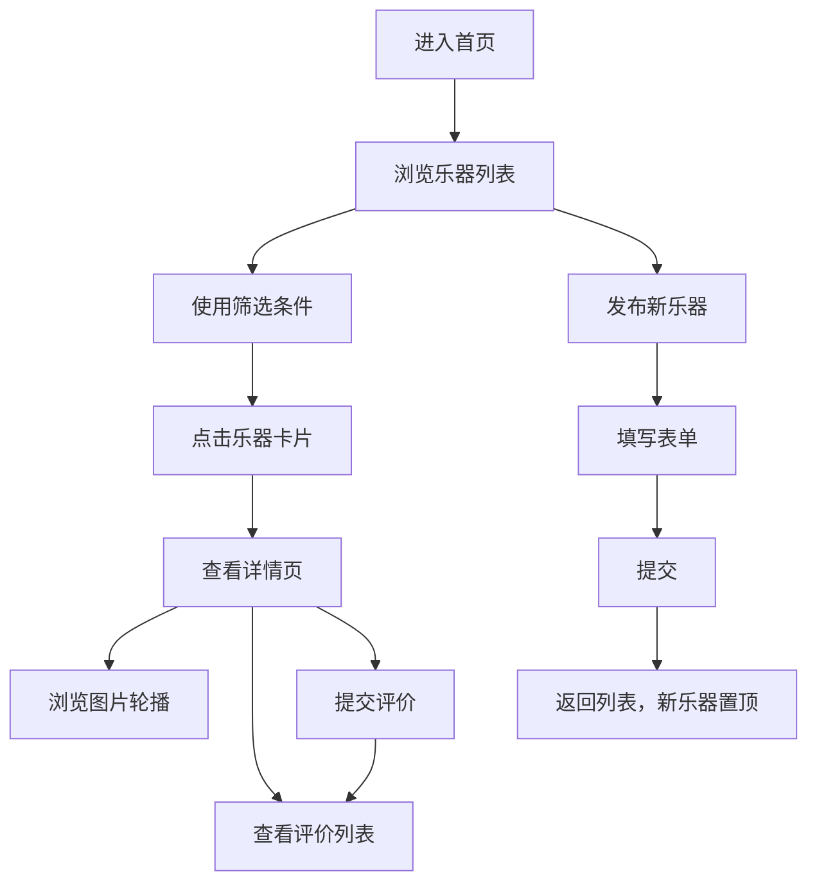

## 1. 产品概述

在线二手乐器交易市场与评价系统，为音乐爱好者提供闲置乐器发布、浏览、详情查看及真实使用评价的平台。
- 目标用户：音乐爱好者、乐器初学者、乐器收藏者
- 产品价值：降低乐器交易门槛，通过真实评价帮助买家做出明智决策

## 2. 核心功能

### 2.1 用户角色
| 角色 | 注册方式 | 核心权限 |
|------|---------|---------|
| 普通用户 | 无需注册（访客模式） | 浏览乐器、查看详情、提交评价、发布乐器 |

### 2.2 功能模块
1. **乐器列表页**：乐器卡片展示、多维度筛选（品牌、价格、类别）、图片懒加载
2. **乐器详情页**：图片轮播、完整信息展示、评价列表
3. **评价系统**：星级评分、文字评价、评分统计展示
4. **乐器发布**：发布表单、新乐器即时展示

### 2.3 页面详情
| 页面名称 | 模块名称 | 功能描述 |
|---------|---------|----------|
| 乐器列表页 | 筛选区域 | 品牌下拉、类别下拉、价格区间滑动条 |
| 乐器列表页 | 乐器卡片网格 | 两列布局、悬停动画、图片淡入 |
| 乐器详情页 | 图片轮播 | 左右切换箭头、淡入动画 |
| 乐器详情页 | 信息展示区 | 类别、成色、描述、上架时间、综合评分 |
| 乐器详情页 | 评价列表 | 时间降序排列、评分星级、评价内容 |
| 乐器详情页 | 评价表单 | 星级选择、文字输入、提交按钮 |
| 发布页面 | 发布表单 | 名称、品牌、类别、成色、价格、图片URL、描述 |

## 3. 核心流程

用户浏览流程：
用户进入首页 → 查看乐器列表 → 通过筛选条件过滤 → 点击乐器卡片进入详情页 → 查看图片轮播和详细信息 → 浏览评价 → 提交评价 → 返回列表

发布流程：
用户点击发布按钮 → 填写乐器信息表单 → 提交 → 返回列表页，新乐器显示在顶部 → 显示成功提示

## 4. 用户界面设计

### 4.1 设计风格
- **主色调**：柔和暖色调，米白 #FFF8F0 背景，深灰 #374151 文字，琥珀色 #F59E0B 强调色
- **卡片风格**：统一圆角 12px，白底微阴影，悬停时上移并加深阴影
- **按钮风格**：悬停 0.2s 过渡动画，放大 1.05 倍或改变背景色
- **字体**：清晰易读的无衬线字体，保持层次分明
- **布局**：卡片式布局，两列网格（PC端），单列（平板/移动端）

### 4.2 页面设计概览
| 页面名称 | 模块名称 | UI 元素 |
|---------|---------|---------|
| 乐器列表页 | 筛选栏 | 下拉菜单（品牌、类别）、价格滑动条、发布按钮 |
| 乐器列表页 | 卡片网格 | 240px 宽卡片、128x128px 缩略图、¥格式价格、悬停上移动画 |
| 乐器详情页 | 轮播区域 | 大图展示、圆形 40px 半透明箭头按钮、0.4s 淡入切换 |
| 乐器详情页 | 评分展示 | 渐变评分条（#FCD34D → #F59E0B）、平均分、评价数 |
| 乐器详情页 | 评价列表 | 星形评分、用户评价、0.3s 插入动画 |
| 评价表单 | 星级选择 | 28px 星形 SVG、选中 #F59E0B、未选 #D1D5FA |
| 提示条 | 成功/信息提示 | 绿色成功提示（#D1FAE5 / #065F46）、淡蓝色信息提示（#E0E7FF / #3730A3） |

### 4.3 响应式设计
- **桌面端**（> 768px）：两列网格布局，筛选栏水平排列
- **平板/移动端**（≤ 768px）：单列布局，筛选栏垂直堆叠
- **触摸优化**：按钮和可点击元素确保足够大的点击区域

### 4.4 动效设计
- 卡片悬停：上移 8px + 阴影加深，0.2s 过渡
- 图片加载：IntersectionObserver 触发淡入，透明度 0→1
- 筛选结果：0.3s 淡入动画
- 评价插入：0.3s 过渡动画
- 图片轮播：0.4s 淡入切换
- 按钮交互：0.2s 缩放或背景色变化
