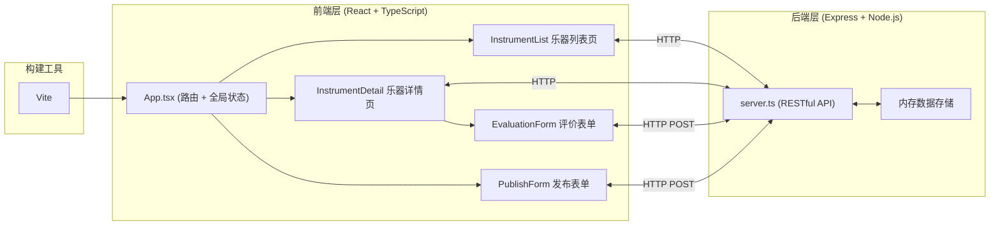
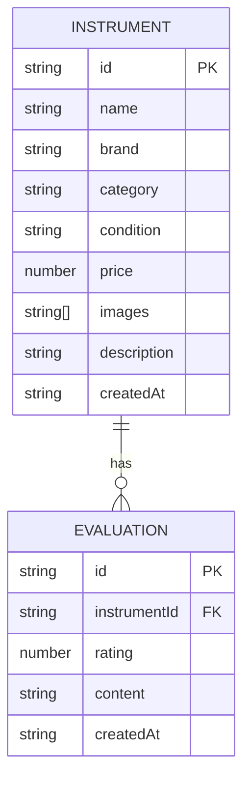

## 1. 架构设计



## 2. 技术描述

- **前端**：React@18.2.0 + TypeScript@5.3.3 + Vite@5.0.8
- **后端**：Express@4.18.2 + Node.js
- **构建工具**：Vite@5.0.8 + @vitejs/plugin-react@4.2.0
- **状态管理**：React Context + useState
- **路由**：React Router
- **数据存储**：内存存储（使用 uuid 生成唯一 ID）
- **跨域**：cors 中间件
- **样式方案**：CSS Modules / 内联样式 + CSS 动画

## 3. 路由定义

| 路由 | 页面 | 说明 |
|------|------|------|
| `/` | 乐器列表页 | 展示所有乐器，支持筛选 |
| `/instrument/:id` | 乐器详情页 | 展示乐器详情、图片轮播、评价列表 |
| `/publish` | 发布页面 | 发布新乐器表单 |

## 4. API 定义

### 4.1 获取乐器列表
- **GET** `/api/instruments`
- **请求参数**：无（筛选通过 query 参数可选）
- **响应**：
```typescript
interface Instrument {
  id: string;
  name: string;
  brand: string;
  category: string;
  condition: '全新' | '9成新' | '8成新';
  price: number;
  images: string[];
  description: string;
  createdAt: string;
  evaluations: Evaluation[];
}

interface Evaluation {
  id: string;
  rating: number; // 1-5
  content: string;
  createdAt: string;
}
```

### 4.2 获取乐器详情
- **GET** `/api/instruments/:id`
- **响应**：Instrument 对象

### 4.3 提交评价
- **POST** `/api/instruments/:id/evaluations`
- **请求体**：
```typescript
interface EvaluationRequest {
  rating: number;
  content: string;
}
```
- **响应**：新建的 Evaluation 对象

### 4.4 发布新乐器
- **POST** `/api/instruments`
- **请求体**：
```typescript
interface PublishRequest {
  name: string;
  brand: string;
  category: string;
  condition: '全新' | '9成新' | '8成新';
  price: number;
  images: string[];
  description: string;
}
```
- **响应**：新建的 Instrument 对象

## 5. 数据模型

### 5.1 数据模型定义



### 5.2 初始数据
- 预置 40 件乐器数据，涵盖吉他、架子鼓、钢琴等类别
- 每类乐器包含多个品牌
- 部分乐器预置评价数据

## 6. 项目文件结构

```
.
├── package.json
├── index.html
├── vite.config.js
├── tsconfig.json
├── src/
│   ├── App.tsx              # 主应用组件（路由、全局状态）
│   ├── main.tsx             # 入口文件
│   ├── components/
│   │   ├── InstrumentList.tsx    # 乐器列表页
│   │   ├── InstrumentDetail.tsx  # 乐器详情页
│   │   ├── EvaluationForm.tsx    # 评价表单
│   │   ├── PublishForm.tsx       # 发布表单
│   │   └── StarRating.tsx        # 星级评分组件
│   ├── server.ts            # Express 后端
│   ├── types.ts             # TypeScript 类型定义
│   └── utils/
│       └── mockData.ts      # 模拟数据
```

## 7. 性能优化

- **图片懒加载**：使用 IntersectionObserver 实现
- **列表虚拟化**：暂不使用，40 条数据直接渲染
- **筛选优化**：前端筛选，响应时间 < 100ms
- **构建优化**：Vite 原生 ESM，快速热更新
