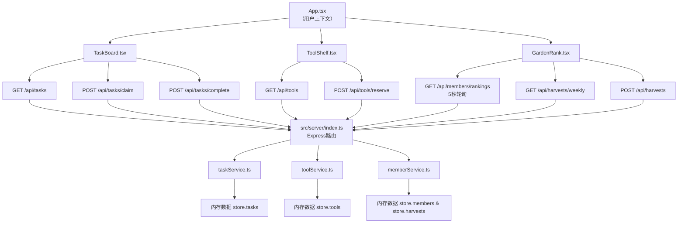

# 社区花园应用 - 技术架构文档

## 1. 项目结构

```
auto87/
├── package.json
├── vite.config.js
├── tsconfig.json
├── index.html
└── src/
    ├── client/
    │   ├── App.tsx              # 主应用组件，路由分发
    │   ├── components/
    │   │   ├── TaskBoard.tsx    # 任务看板
    │   │   ├── ToolShelf.tsx    # 工具架
    │   │   ├── GardenRank.tsx   # 积分排名+产出记录
    │   │   └── common/          # 通用组件
    │   ├── services/            # API调用封装
    │   ├── types/               # TypeScript类型定义
    │   └── styles/              # 全局样式
    └── server/
        ├── index.ts             # Express入口（端口3001）
        └── services/            # 业务逻辑与内存数据存储
            ├── taskService.ts
            ├── toolService.ts
            └── memberService.ts
```

## 2. 数据模型

### Task（任务）
```typescript
interface Task {
  id: string;
  title: string;
  type: '浇水' | '施肥' | '除草' | '采摘';
  deadline: string;
  urgency: '普通' | '紧急' | '非常紧急';
  status: '待认领' | '进行中' | '已完成';
  assigneeId?: string;
  assigneeName?: string;
  createdAt: string;
  completedAt?: string;
}
```

### Tool（工具）
```typescript
interface Tool {
  id: string;
  name: string;
  icon: string;
  total: number;
  available: number;
  currentBorrower?: string;
  returnTime?: string;
  reservations: ToolReservation[];
}

interface ToolReservation {
  id: string;
  date: string;
  period: '上午' | '下午' | '全天';
  memberId: string;
  memberName: string;
}
```

### Member（成员）
```typescript
interface Member {
  id: string;
  name: string;
  points: number;
  tasksCompleted: number;
  toolsReturnedOnTime: number;
}
```

### Harvest（产出记录）
```typescript
interface Harvest {
  id: string;
  memberId: string;
  memberName: string;
  productName: string;
  weightG: number;
  quantity: number;
  recordedAt: string;
}
```

## 3. API接口设计

### 任务接口
- `GET /api/tasks` - 获取所有任务
- `POST /api/tasks` - 创建新任务
- `POST /api/tasks/claim` - 认领任务 { taskId, memberId }
- `POST /api/tasks/complete` - 完成任务 { taskId }

### 工具接口
- `GET /api/tools` - 获取工具列表
- `POST /api/tools/reserve` - 预约工具 { toolId, date, period, memberId, memberName }

### 成员接口
- `GET /api/members/rankings` - 获取积分排名
- `GET /api/members/:id` - 获取成员信息

### 产出接口
- `GET /api/harvests` - 获取产出记录
- `POST /api/harvests` - 记录产出
- `GET /api/harvests/weekly` - 获取近4周汇总

## 4. 数据流向图



## 5. 调用关系说明

| 调用方 | 被调用方 | 用途 |
|---|---|---|
| App.tsx | TaskBoard, ToolShelf, GardenRank | 传递用户上下文，组合主视图 |
| TaskBoard.tsx | /api/tasks (GET/POST) | 拉取、创建、认领、完成任务 |
| ToolShelf.tsx | /api/tools (GET/POST) | 拉取工具列表、提交预约 |
| GardenRank.tsx | /api/members/rankings, /api/harvests | 轮询排名、记录产出 |
| server/index.ts | taskService, toolService, memberService | 路由转发到业务服务层 |
| *Service.ts | 内存store | 读写业务数据 |

## 6. 前端模块职责

- **App.tsx**：顶层组件，维护当前登录用户状态，集成三大功能模块，提供全局布局、导航栏、页脚。
- **TaskBoard.tsx**：任务管理CRUD UI，处理任务卡片渲染、紧急闪烁动画、状态流转交互。
- **ToolShelf.tsx**：工具列表渲染、预约日期时段选择、已预约时段的视觉屏蔽。
- **GardenRank.tsx**：积分榜轮询刷新（5s）、产出记录表单、近4周柱状图。

## 7. 后端模块职责

- **server/index.ts**：Express启动（端口3001），挂载cors中间件，注册/api/*路由。
- **taskService.ts**：任务增删改查、认领、完成，积分计算联动。
- **toolService.ts**：工具库存、预约校验、归还积分计算。
- **memberService.ts**：成员积分累加、排名排序、产出按周汇总。

## 8. 性能保障

- 初始数据量：10任务 + 8工具 + 20成员
- 接口返回数据做浅拷贝，避免共享引用
- 前端轮询使用setInterval，组件卸载时清理
- 长列表使用稳定的key（uuid）避免React重渲染开销
