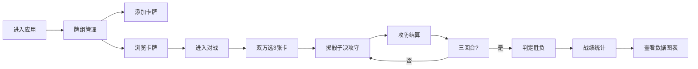

## 1. 产品概述

基于桌游的虚拟骰子对战与牌组收藏应用，用户可创建牌组收藏，通过掷骰子进行回合制对战，并记录战绩与卡牌使用统计。

- **核心价值**：将实体桌游体验数字化，提供便捷的牌组管理和对战模拟
- **目标用户**：桌游爱好者、卡牌游戏玩家
- **主要功能**：牌组收藏管理、骰子回合制对战、战绩数据统计

## 2. 核心功能

### 2.1 功能模块
1. **牌组管理模块**：卡牌添加、网格展示、分页浏览、稀有度分类
2. **对战模块**：卡牌选择、骰子掷点、回合制战斗、动画效果、胜负判定
3. **战绩统计模块**：胜负场次柱状图、胜负饼图、卡牌使用频率排名

### 2.2 页面详情
| 页面名称 | 模块名称 | 功能描述 |
|---------|---------|----------|
| 主应用 | 导航栏 | 切换牌组/对战/统计三个模块，品牌标识 |
| 牌组管理页 | 卡牌添加表单 | 输入卡牌名称、稀有度、攻防数值、插画URL |
| 牌组管理页 | 卡牌网格 | 4列网格展示，每页24张，悬停上浮效果 |
| 牌组管理页 | 分页控件 | 上下页切换，翻页响应<200ms |
| 对战页 | 卡牌选择区 | 双方各选3张卡牌参战 |
| 对战页 | 骰子区 | 中央骰子旋转动画，1.2秒减速停止 |
| 对战页 | 战斗区 | 攻击推进动画、受击闪烁、战果文字滑入 |
| 对战页 | 生命值显示 | 双方血条，三回合制 |
| 统计页 | 柱状图 | 胜/负/平场次对比，渐变填充 |
| 统计页 | 饼图 | 胜负比例分布 |
| 统计页 | 卡牌使用率 | 横向条状图，使用频率排名 |

## 3. 核心流程

用户进入应用 → 浏览/添加卡牌 → 进入对战模式 → 双方选择3张卡牌 → 三回合骰子对战 → 判定胜负 → 查看战绩统计

## 4. 用户界面设计

### 4.1 设计风格
- **主色调**：深蓝灰 #1E293B，暖金 #F59E0B
- **背景渐变**：#1E293B 到 #334155
- **按钮风格**：宽度自适应、最小120px、高44px、圆角22px
- **标题**：40px 粗体，2px 文字阴影
- **稀有度配色**：普通 #9CA3AF、稀有 #3B82F6、史诗 #8B5CF6、传说 #F59E0B

### 4.2 页面设计概览
| 页面名称 | 模块名称 | UI元素 |
|---------|---------|--------|
| 牌组管理 | 卡牌网格 | 200×280px卡片、圆角12px、底部2px边框、六边形稀有度图标、悬停上浮8px |
| 对战场景 | 骰子动画 | 中央旋转1.2秒减速停止、攻击推进30px、受击红闪0.2秒 |
| 对战场景 | 战果展示 | 24px #1F2937 文字、底部上滑0.4秒入场 |
| 对战场景 | 胜利特效 | 40枚金色粒子、6-12px大小、0.8秒飞散淡出 |
| 统计面板 | 柱状图 | 渐变 #6366F1→#A855F7、从底部生长0.5秒 |
| 统计面板 | 饼图 | 胜/负/平三色分区 |
| 统计面板 | 使用率条 | 横向渐变 #10B981、条内显示卡牌名和次数 |

### 4.3 响应式
- 桌面端优先设计
- 卡牌网格4列布局，小屏幕自动调整为2列
- 对战区域保持居中对称布局

### 4.4 动效规范
- 卡牌悬停：上浮8px + 阴影加深，0.3秒 ease-out
- 骰子动画：旋转减速停止，1.2秒
- 攻击动画：卡牌推进30px后复位
- 受击效果：红色 #EF4444 闪烁0.2秒
- 战果文字：底部上滑入场0.4秒
- 胜利粒子：40枚金色粒子飞散，0.8秒淡出
- 图表生长：从底部向上生长0.5秒
