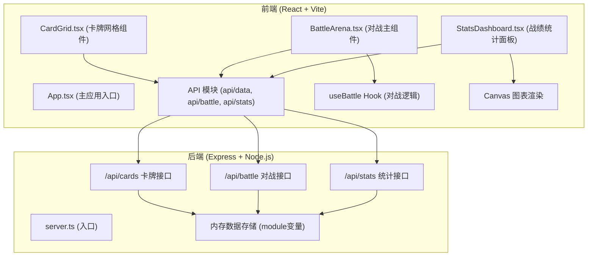

## 1. 架构设计



## 2. 技术描述

- **前端**：React@18.2.0 + TypeScript@5.3.3 + Vite@5.0.8 + @vitejs/plugin-react@4.2.0
- **后端**：Express@4.18.2 + Node.js
- **数据存储**：内存存储（module级变量）
- **构建工具**：Vite，配置 @ 路径别名
- **状态管理**：React useState/useReducer + 自定义Hook
- **图表渲染**：原生 Canvas 2D API
- **跨域**：cors 中间件
- **唯一ID**：uuid

## 3. 项目文件结构

```
.
├── package.json
├── index.html
├── vite.config.ts
├── tsconfig.json
└── src/
    ├── client/
    │   ├── App.tsx
    │   ├── CardGrid.tsx
    │   ├── BattleArena.tsx
    │   ├── StatsDashboard.tsx
    │   └── api/
    │       └── index.ts (API调用封装)
    └── server/
        └── server.ts
```

## 4. API 定义

### 4.1 类型定义

```typescript
interface Card {
  id: string;
  name: string;
  rarity: 'common' | 'rare' | 'epic' | 'legendary';
  attack: number;
  defense: number;
  imageUrl: string;
}

interface BattleRecord {
  id: string;
  player1Cards: string[];
  player2Cards: string[];
  winner: 'player1' | 'player2' | 'draw';
  timestamp: number;
}

interface Stats {
  player1Wins: number;
  player2Wins: number;
  draws: number;
  cardUsage: Record<string, number>;
}
```

### 4.2 接口定义

| 方法 | 路径 | 请求体 | 响应 | 说明 |
|------|------|--------|------|------|
| GET | `/api/cards` | - | `{ cards: Card[], total: number }` | 获取卡牌列表，支持分页 |
| POST | `/api/cards` | `{ name, rarity, attack, defense, imageUrl }` | `Card` | 添加新卡牌 |
| POST | `/api/battle` | `{ player1Cards: string[], player2Cards: string[], winner }` | `{ success: boolean }` | 记录对战结果 |
| GET | `/api/stats` | - | `Stats` | 获取战绩统计数据 |

## 5. 核心数据模型

### 5.1 卡牌数据
```
Card {
  id: string (uuid)
  name: string
  rarity: common | rare | epic | legendary
  attack: number (1-10)
  defense: number (1-10)
  imageUrl: string
}
```

### 5.2 统计数据
```
Stats {
  totalBattles: number
  player1Wins: number
  player2Wins: number
  draws: number
  cardUsage: { [cardId: string]: number }
}
```

## 6. 性能优化

- 卡牌列表分页：每页24张，翻页响应 < 200ms
- Canvas 图表高效渲染
- 内存数据快速访问，无需数据库IO
- 前端状态合理缓存，减少API请求

## 7. 启动方式

```bash
npm install
npm run dev
```

访问 `http://localhost:5173` 打开应用。
