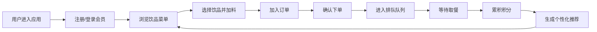

## 1. 产品概述

咖啡馆点单与会员管理应用，解决高峰期排队点单问题，系统记录顾客饮品偏好，提升推荐精准度和会员复购率。目标用户为咖啡馆顾客和运营者，核心价值是提升点单效率和用户粘性。

## 2. 核心功能

### 2.1 用户角色
| 角色 | 注册方式 | 核心权限 |
|------|----------|----------|
| 会员用户 | 昵称+邮箱注册 | 浏览菜单、自定义加料、在线下单、查看排队、累积积分、接收个性化推荐 |

### 2.2 功能模块
1. **会员系统**：注册登录、会员等级、积分累计、消费进度
2. **饮品菜单**：6款基础饮品展示、自定义加料面板
3. **订单系统**：购物车、下单确认、排队队列、等待时间预估
4. **推荐系统**：基于历史订单的个性化饮品推荐

### 2.3 页面详情
| 页面名称 | 模块名称 | 功能描述 |
|-----------|-------------|---------------------|
| 主页面 | 会员信息栏 | 显示会员头像、等级、累积消费金额、进度条动画 |
| 主页面 | 饮品菜单区 | 左侧70%宽度，展示饮品卡片，支持加料选择 |
| 主页面 | 订单摘要栏 | 右侧30%宽度固定定位，显示已选饮品和总价 |
| 主页面 | 排队状态栏 | 顶部显示排队人数和预计等待时间 |
| 主页面 | 推荐卡片 | 右下角展示2款个性化推荐饮品 |
| 主页面 | 下单确认弹窗 | 从底部滑入，展示订单详情和确认按钮 |

## 3. 核心流程

用户进入应用 → 注册/登录会员 → 浏览饮品菜单 → 选择饮品并自定义加料 → 加入订单 → 确认下单 → 查看排队状态 → 取餐完成 → 累积积分 → 系统生成个性化推荐

## 4. 用户界面设计

### 4.1 设计风格
- **主色调**：咖啡色 #6F4E37，hover 深褐色 #4E342E
- **背景色**：米白色 #FAF0E6
- **卡片背景**：暖白色 #FDF5E6
- **文字颜色**：深褐色 #3E2723
- **按钮圆角**：6px
- **卡片圆角**：8px
- **会员等级颜色**：青铜 #CD7F32 → 钻石 #B9F2FF 渐变
- **推荐卡片背景**：浅渐变 #E8D5B7 到 #F5E6CC

### 4.2 页面设计概述
| 页面名称 | 模块名称 | UI 元素 |
|-----------|-------------|-------------|
| 主页面 | 会员信息栏 | 圆形头像(2px边框，等级颜色)、昵称、消费金额、圆角进度条(6px厚度，底部填充动画0.5s) |
| 主页面 | 饮品卡片 | 固定宽度200px，圆角8px，悬停上浮4px加深阴影，过渡0.2s |
| 主页面 | 加料面板 | 圆角6px，从上到下展开动画0.2s，加料标签圆角4px，选中背景变咖啡色并右移10px |
| 主页面 | 确认弹窗 | 圆角8px，从底部滑入0.3s，展示订单明细和总价 |
| 主页面 | 排队人数 | 数字放大效果(1.0→1.2→回弹，0.3s) |
| 主页面 | 推荐卡片 | 圆角12px，宽度280px，浅渐变背景，2款推荐饮品带小图标和推荐理由 |

### 4.3 响应式
- 桌面端：左侧菜单70%，右侧订单面板30%固定定位
- 移动端(<768px)：订单面板折叠为底部固定条(高度50px)，点击展开为全屏覆盖层

### 4.4 动画规范
- 卡片悬停：上浮4px + 阴影加深，0.2s ease-out
- 加料面板展开：从上到下展开，0.2s ease-out
- 确认弹窗：从底部滑入，0.3s ease-out
- 进度条填充：从底部填充，0.5s ease-out
- 排队数字：放大回弹，0.3s ease-out
- 加料标签选中：背景色变化 + 右移10px，0.2s ease-out
