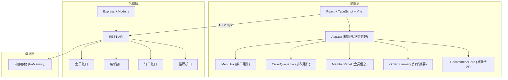
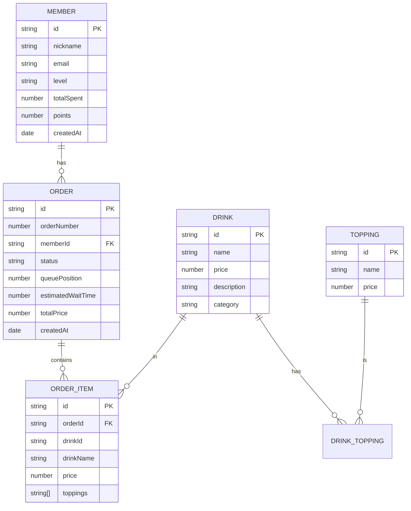

## 1. 架构设计



## 2. 技术描述

- **前端**：React@18.2.0 + TypeScript@5.3.3 + Vite@5.0.8
- **构建工具**：Vite@5.0.8 + @vitejs/plugin-react@4.2.0
- **后端**：Express@4.18.2 + Node.js
- **跨域**：cors@2.8.5
- **数据存储**：内存存储（开发演示用）
- **状态管理**：React useState/useEffect (组件内状态)

## 3. 文件结构

```
├── package.json              # 项目依赖和脚本
├── vite.config.js            # Vite配置，代理/api到后端3001端口
├── tsconfig.json             # TypeScript严格模式配置
├── index.html                # 入口HTML页面
├── server.ts                 # 后端Express服务
└── src/
    ├── App.tsx               # 根组件，状态管理，路由切换
    ├── Menu.tsx              # 菜单组件，饮品卡片+加料面板
    └── OrderQueue.tsx        # 排队队列组件
```

## 4. API 定义

### 4.1 会员接口

**POST /api/members/register** - 会员注册
```typescript
// Request
{
  nickname: string;
  email: string;
}

// Response
{
  id: string;
  nickname: string;
  email: string;
  level: 'bronze' | 'silver' | 'gold' | 'platinum' | 'diamond';
  totalSpent: number;
  points: number;
}
```

**POST /api/members/login** - 会员登录
```typescript
// Request
{
  email: string;
}

// Response
{
  id: string;
  nickname: string;
  email: string;
  level: string;
  totalSpent: number;
  points: number;
}
```

**GET /api/members/:id** - 获取会员信息

### 4.2 菜单接口

**GET /api/menu** - 获取饮品列表
```typescript
// Response
[
  {
    id: string;
    name: string;
    price: number;
    description: string;
    image: string;
    category: string;
  }
]
```

**GET /api/toppings** - 获取加料选项
```typescript
// Response
[
  {
    id: string;
    name: string;
    price: number;
  }
]
```

### 4.3 订单接口

**POST /api/orders** - 创建订单
```typescript
// Request
{
  memberId: string;
  items: [
    {
      drinkId: string;
      drinkName: string;
      price: number;
      toppings: string[];
    }
  ];
}

// Response
{
  id: string;
  orderNumber: number;
  status: 'queued' | 'preparing' | 'ready' | 'completed';
  queuePosition: number;
  estimatedWaitTime: number;
  totalPrice: number;
  createdAt: string;
}
```

**GET /api/orders/queue** - 获取排队队列
```typescript
// Response
{
  totalInQueue: number;
  orders: [
    {
      id: string;
      orderNumber: number;
      status: string;
      queuePosition: number;
    }
  ];
}
```

**GET /api/orders/:id** - 获取订单详情

### 4.4 推荐接口

**GET /api/recommendations/:memberId** - 获取个性化推荐
```typescript
// Response
[
  {
    drinkId: string;
    drinkName: string;
    reason: string;
    image: string;
    price: number;
  }
]
```

## 5. 数据模型

### 5.1 数据模型定义



### 5.2 初始数据

**6款基础饮品：**
1. 美式咖啡 (Americano) - ¥22
2. 拿铁 (Latte) - ¥28
3. 卡布奇诺 (Cappuccino) - ¥26
4. 摩卡 (Mocha) - ¥30
5. 焦糖玛奇朵 (Caramel Macchiato) - ¥32
6. 抹茶拿铁 (Matcha Latte) - ¥30

**3种加料选项：**
1. 额外浓缩 - ¥5
2. 燕麦奶 - ¥6
3. 焦糖酱 - ¥4

**会员等级（按累计消费）：**
- 青铜 (Bronze): ¥0 - ¥99 - #CD7F32
- 白银 (Silver): ¥100 - ¥299 - #C0C0C0
- 黄金 (Gold): ¥300 - ¥699 - #FFD700
- 铂金 (Platinum): ¥700 - ¥1499 - #E5E4E2
- 钻石 (Diamond): ¥1500+ - #B9F2FF

## 6. 数据流

### 前端数据流
1. App.tsx 管理全局状态（会员、订单、排队信息）
2. 子组件通过 props 接收数据，通过回调函数向上传递操作
3. 定时轮询后端接口更新排队状态

### 后端数据流
1. 接收前端 HTTP 请求
2. 路由分发到对应处理函数
3. 操作内存数据
4. 返回 JSON 响应

## 7. 性能约束
- 饮品列表加载到渲染完成时间 < 500ms
- 加料面板展开动画帧率 ≥ 50fps
- 订单提交后排队编号更新响应时间 < 200ms
