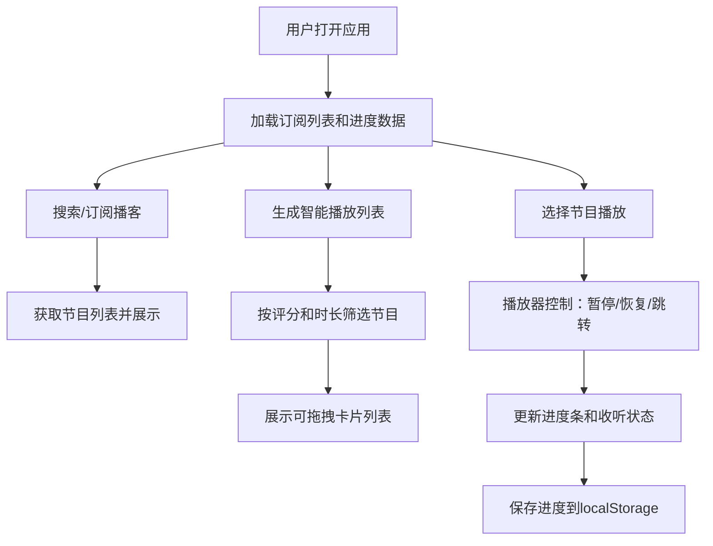

## 1. 产品概述
个人播客收藏管理应用，帮助用户管理大量播客订阅、自动发现新内容并跨设备同步收听进度。
- 主要用途：播客订阅管理、智能播放列表生成、收听进度同步
- 目标用户：订阅大量播客节目、难以高效管理和发现内容的播客听众
- 产品价值：解决信息过载导致的内容发现困难，以及跨设备收听进度不一致的问题

## 2. 核心功能

### 2.1 用户角色
| 角色 | 注册方式 | 核心权限 |
|------|----------|----------|
| 普通用户 | 无需注册（本地存储） | 订阅/取消订阅播客、生成播放列表、记录收听进度 |

### 2.2 功能模块
1. **播客订阅管理模块**：搜索播客、添加订阅、订阅列表展示、展开查看节目、取消订阅
2. **智能播放列表生成模块**：时长限制输入、自动生成播放列表、卡片堆叠展示、拖拽排序
3. **收听进度同步模块**：播放控制（暂停/恢复/跳转）、进度条显示、状态标记、本地持久化

### 2.3 页面详情
| 页面名称 | 模块名称 | 功能描述 |
|-----------|-------------|---------------------|
| 主页面 | 播客订阅列表 | 搜索框、订阅卡片列表（120px行高）、展开/收起节目、取消订阅动画 |
| 主页面 | 节目详情区域 | 展示选中播客的所有节目、进度条显示、状态标记 |
| 主页面 | 播放列表生成器 | 时长输入、生成按钮、卡片堆叠展示（240x320px）、长按播放、拖拽排序 |
| 主页面 | 播放器 | 封面图、节目标题、进度条、播放/暂停/跳转按钮 |

## 3. 核心流程

### 3.1 播客订阅流程
用户搜索播客 → 选择并点击订阅 → 系统从模拟数据源获取节目列表 → 播客卡片添加到订阅列表 → 点击卡片展开查看所有节目

### 3.2 播放列表生成流程
用户输入时长限制（如30分钟）→ 点击生成按钮 → 系统筛选已订阅播客中未收听节目 → 优先选择评分>4星节目 → 计算总时长不超过限制 → 返回卡片堆叠列表 → 用户可拖拽调整顺序 → 长按卡片播放

### 3.3 收听进度同步流程
用户点击节目播放 → 播放器加载节目信息 → 用户暂停/恢复/跳转 → 实时更新进度条（已听/未听/已完成） → 数据自动保存到localStorage → 页面刷新后恢复进度

### 3.4 核心流程图

## 4. 用户界面设计

### 4.1 设计风格
- **主题风格**：深色主题（Dark Mode），现代科技感
- **主背景色**：#1E1E2E
- **卡片背景色**：#2A2A3C
- **文字主色**：#E4E4E7
- **强调色/主题色**：#6366F1（靛蓝色）
- **成功色**：#10B981（绿色）
- **进度条底色**：#D1D5DB（虚线）、进度条实色：#6366F1
- **按钮样式**：圆角按钮，悬停时背景微亮+上浮2px，聚焦外发光
- **字体**：现代无衬线字体，标题18px加粗，正文16px常规
- **布局风格**：两栏布局（左侧320px播客列表，右侧自适应节目详情），卡片式设计
- **图标风格**：线性简洁图标，SVG格式

### 4.2 页面设计概述
| 页面名称 | 模块名称 | UI元素 |
|-----------|-------------|-------------|
| 主页面 | 播客列表 | 搜索框（聚焦#6366F1外发光0.2s）、卡片行高120px、封面图100x100px圆角12px、标题18px加粗#1F2937、2px#6366F1边框悬停+高斯模糊阴影、取消订阅左滑淡出0.4s |
| 主页面 | 节目列表 | 节目卡片、底部4px圆角2px进度条（#6366F1实色/#D1D5DB虚线/已完成#10B981+勾号图标） |
| 主页面 | 播放列表生成器 | 时长输入框、生成按钮、垂直堆叠卡片240x320px圆角16px、#F9FAFB→#E5E7EB渐变背景、封面120x120px居中、长按放大1.05倍+深色半透明蒙版+播放按钮、拖拽弹性动画 |
| 主页面 | 播放器 | 封面图、节目标题、进度条、播放/暂停/跳转按钮、悬停上浮效果 |
| 全局 | 空状态 | 80x80px灰色SVG图标、提示文字#71717A |
| 全局 | 动画 | 内容区域淡入0.3s、卡片悬停边框+阴影、按钮悬停微亮+上浮2px |

### 4.3 响应式设计
- 桌面优先设计（Desktop-first）
- 两栏布局在小屏幕下转为上下堆叠
- 移动端优化触控目标（最小44px）
- 拖拽操作支持触控和鼠标

### 4.4 性能要求
- 所有UI交互帧率 ≥ 50FPS
- 100个节目数据量下，播放列表生成响应时间 ≤ 800ms
- CSS动画优先使用transform和opacity属性，避免重排重绘
