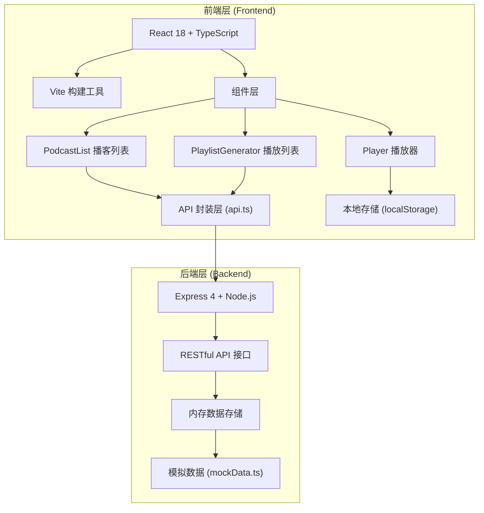
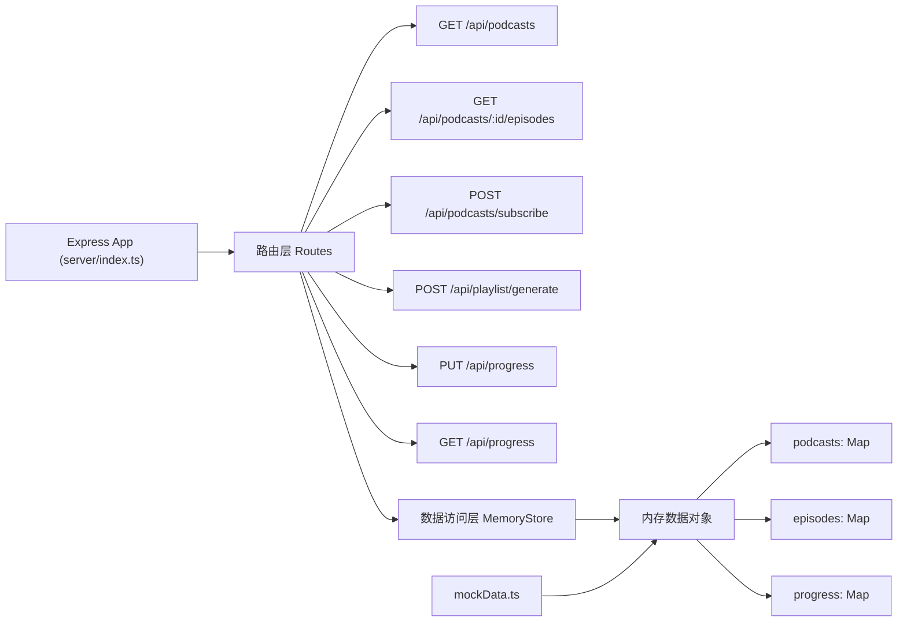
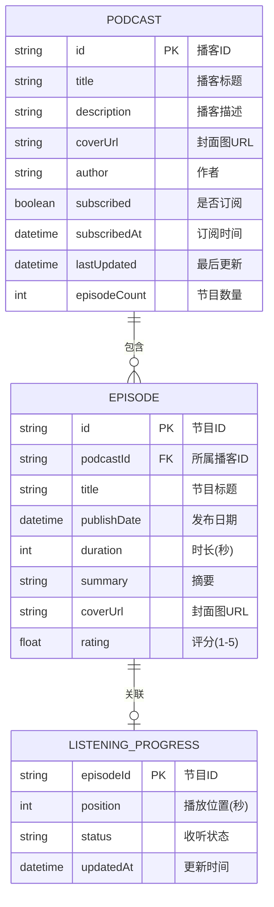

## 1. 架构设计



## 2. 技术选型说明

### 前端技术栈
- **UI框架**：React@18.2.0 - 组件化开发，Hooks管理状态和副作用
- **DOM渲染**：react-dom@18.2.0 - React18并发特性
- **开发语言**：TypeScript@5.3.3 - 严格模式，静态类型检查，target ES2020
- **构建工具**：Vite@5.0.8 - 快速冷启动，HMR热更新
- **React插件**：@vitejs/plugin-react@4.2.0 - Vite React支持
- **路径别名**：@ 指向 src 目录

### 后端技术栈
- **Web框架**：Express@4.18.2 - 轻量级Node.js框架
- **跨域支持**：cors@2.8.5 - 允许前后端不同端口通信
- **ID生成**：uuid@9.0.0 - 生成唯一播客和节目ID
- **数据存储**：内存对象（模拟数据库）
- **API风格**：RESTful

## 3. 路由定义

由于是单页面应用(SPA)，使用前端路由或组件切换实现：

| 区域 | 目的 |
|------|------|
| 左侧栏 | PodcastList - 播客订阅列表和搜索 |
| 右侧主区域 | 节目详情 + PlaylistGenerator + Player 组合展示 |

## 4. API 接口定义

### 4.1 类型定义

```typescript
// 播客类型
interface Podcast {
  id: string;
  title: string;
  description: string;
  coverUrl: string;
  author: string;
  subscribed: boolean;
  subscribedAt?: Date;
  lastUpdated: Date;
  episodeCount: number;
}

// 节目类型
interface Episode {
  id: string;
  podcastId: string;
  title: string;
  publishDate: Date;
  duration: number;  // 秒
  summary: string;
  coverUrl: string;
  rating: number;    // 1-5星
}

// 收听进度类型
interface ListeningProgress {
  episodeId: string;
  position: number;  // 当前播放位置（秒）
  status: 'not_started' | 'in_progress' | 'completed';
  updatedAt: Date;
}

// 生成播放列表请求
interface GeneratePlaylistRequest {
  maxDuration: number;  // 最大时长（分钟）
  subscribedPodcastIds: string[];
}

// 生成播放列表响应
interface GeneratePlaylistResponse {
  episodes: Episode[];
  totalDuration: number;  // 实际总时长（秒）
}
```

### 4.2 接口列表

| 方法 | 路径 | 描述 | 请求体 | 响应体 |
|------|------|------|--------|--------|
| GET | `/api/podcasts` | 获取所有播客列表（含搜索） | query: `search?: string` | `Podcast[]` |
| GET | `/api/podcasts/:id/episodes` | 获取指定播客的所有节目 | - | `Episode[]` |
| POST | `/api/podcasts/subscribe` | 订阅/取消订阅播客 | `{ podcastId: string, subscribe: boolean }` | `Podcast` |
| POST | `/api/playlist/generate` | 智能生成播放列表 | `GeneratePlaylistRequest` | `GeneratePlaylistResponse` |
| PUT | `/api/progress` | 更新收听进度 | `{ episodeId: string, position: number, status: string }` | `ListeningProgress` |
| GET | `/api/progress` | 获取所有收听进度 | - | `ListeningProgress[]` |

## 5. 服务端架构图



## 6. 数据模型

### 6.1 实体关系图



### 6.2 数据初始化说明
- `mockData.ts` 中预置 10-15 个播客，每个播客包含 5-15 个节目
- 节目评分随机分布在 3.0-5.0 之间，保证有足够的4星+节目用于智能筛选
- 封面图使用 picsum.photos 或 placeholder 图片服务的 URL
- 收听进度初始为空，通过用户操作逐步填充

## 7. 项目文件结构

```
auto1/
├── package.json              # 项目依赖和脚本配置
├── index.html                # Vite入口HTML
├── vite.config.js            # Vite构建配置(@别名)
├── tsconfig.json             # TypeScript严格模式配置
├── server/
│   └── index.ts              # Express后端入口+所有API
├── src/
│   ├── main.tsx              # React入口组件
│   ├── App.tsx               # 根组件，布局和状态管理
│   ├── api/
│   │   └── api.ts            # API请求封装
│   ├── data/
│   │   └── mockData.ts       # 模拟播客和节目数据
│   ├── components/
│   │   ├── PodcastList.tsx   # 播客订阅列表组件
│   │   ├── PlaylistGenerator.tsx  # 智能播放列表组件
│   │   └── Player.tsx        # 播放器组件
│   ├── types/
│   │   └── index.ts          # 共享类型定义
│   └── styles/
│       └── globals.css       # 全局样式和动画
```

## 8. 开发规范

### 8.1 命名规范
- 组件：PascalCase（如 `PodcastList`）
- 函数/变量：camelCase（如 `generatePlaylist`）
- 常量：UPPER_SNAKE_CASE（如 `MAX_DURATION`）
- 类型接口：PascalCase（如 `Episode`）

### 8.2 性能优化策略
- 列表渲染使用 React.memo 避免不必要重渲染
- 拖拽动画使用 CSS transform + will-change 提升性能
- localStorage 操作防抖处理，避免频繁读写
- 大列表考虑虚拟滚动（根据实际数据量）
- API 请求使用 AbortController 管理取消

### 8.3 动画实现规范
- 优先使用 CSS 动画而非 JS 动画
- 时长单位统一使用秒（s）
- 过渡属性限定为 transform 和 opacity（GPU加速）
- 动画曲线：`cubic-bezier(0.4, 0, 0.2, 1)`
