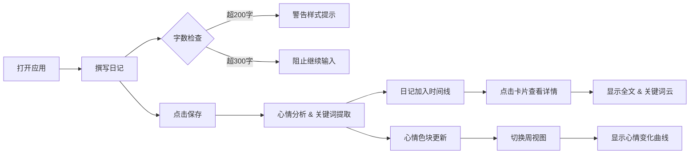

## 1. 产品概述

基于时间线的数字日记与心情色彩分析应用，用户每天记录简短日记，系统自动提取关键词并分配心情颜色，通过时间线和色块可视化一周心情变化。

- 核心价值：将日常情绪转化为可视化的色彩记录，帮助用户觉察和反思心情变化
- 目标用户：喜欢记录生活、关注情绪健康的年轻用户群体
- 产品定位：轻量级、高颜值的个人心情日记工具

## 2. 核心功能

### 2.1 用户角色
| 角色 | 注册方式 | 核心权限 |
|------|----------|----------|
| 普通用户 | 无需注册，本地存储 | 记录日记、查看时间线、浏览心情分析 |

### 2.2 功能模块
1. **日记输入模块**：文本输入区、字数统计、保存按钮
2. **时间线模块**：日记卡片列表、卡片展开、关键词云
3. **心情色块条**：7天心情色块展示、悬停标签
4. **周视图曲线**：心情变化连接曲线、日期标注
5. **月历模块**：月历视图、心情标记、日期跳转

### 2.3 页面详情
| 页面名称 | 模块名称 | 功能描述 |
|-----------|-------------|---------------------|
| 主页面 | 日记输入模块 | 300字限制文本框，实时字数统计，超200字警告样式，超限阻止输入，渐变保存按钮 |
| 主页面 | 时间线模块 | 日记卡片列表，顶部色带，摘要展示，点击展开全文和关键词云，悬停浮起效果 |
| 主页面 | 心情色块条 | 最近7天色块，悬停显示标签，底色#F9FAFB，居中布局 |
| 主页面 | 周视图曲线 | 平滑连接曲线，渐变色，1.5秒绘制动画，日期标注 |
| 主页面 | 月历模块 | 6行7列日历，当天高亮，心情圆点标记，翻页动画 |

## 3. 核心流程

用户打开应用 → 在左侧输入区撰写日记 → 输入过程中实时字数统计和样式反馈 → 点击保存按钮 → 系统分析心情并提取关键词 → 日记卡片加入时间线 → 当天心情色块更新 → 用户可点击卡片查看详情和关键词云 → 用户可切换周视图查看心情曲线 → 用户可通过月历跳转查看历史日记

## 4. 用户界面设计

### 4.1 设计风格
- **主色调**：#6366F1（靛蓝）
- **强调色**：#8B5CF6（紫色）
- **警告色**：#EAB308（琥珀色）
- **错误色**：#EF4444（红色）
- **背景色**：#F3F4F6（浅灰）
- **卡片背景**：#FFFFFF（白色）
- **按钮风格**：渐变背景（#8B5CF6 → #6366F1），圆角20px，悬停右移+发光
- **字体**：现代无衬线字体，清晰易读
- **布局风格**：卡片式布局，三栏设计（桌面端）
- **动画风格**：ease-out 0.3秒过渡，流畅自然

### 4.2 页面设计概览
| 页面名称 | 模块名称 | UI元素 |
|-----------|-------------|-------------|
| 主页面 | 日记输入模块 | 文本域（2px边框、圆角）、字数统计（底部）、保存按钮（渐变、悬停效果） |
| 主页面 | 时间线模块 | 卡片（白色、圆角16px、2px边框）、顶部色带（8px高）、日期、摘要、色块圆点 |
| 主页面 | 心情色块条 | 7个色块（40x80px、圆角8px）、间距4px、悬停标签 |
| 主页面 | 周视图曲线 | 3px线宽、渐变颜色、从左到右绘制动画 |
| 主页面 | 月历模块 | 6x7网格、当天圆圈高亮、心情小圆点、翻页缩放动画 |

### 4.3 响应式设计
- **桌面端（768px以上）**：三栏布局（月历 + 输入区 + 时间线），心情色块条底部横跨
- **平板端（480-768px）**：两栏布局，月历折叠或顶部展示
- **移动端（480px以下）**：单栏垂直布局，各模块依次排列
- **时间线自适应宽度**，保持良好的阅读体验

### 4.4 交互动效
- 卡片悬停：上浮6px + 阴影加深，0.3秒ease-out
- 保存按钮悬停：右移3px + 发光效果
- 输入超限：边框变红 + 抖动0.4秒
- 色块悬停：顶部伸出标签，淡入0.2秒
- 周视图曲线：从左到右绘制，1.5秒动画
- 月历翻页：scaleX从1→0→1，0.5秒动画
