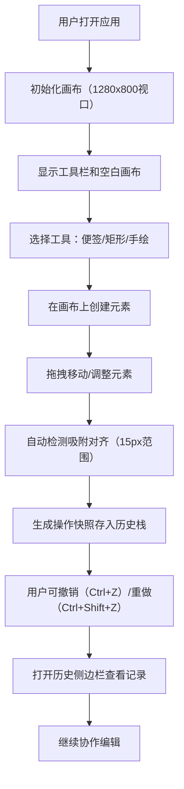

## 1. 产品概述

在线协作白板是一款面向团队协作的实时画布工具，支持多人在同一画布上添加便签、绘制形状和自由手绘，所有操作实时同步并支持撤销重做。

- 核心目标：提供流畅、直观的团队协作白板体验，提升远程团队的沟通效率
- 目标用户：产品团队、设计团队、敏捷开发团队、远程办公团队
- 市场价值：填补轻量级、高性能实时协作白板的需求空白

## 2. 核心功能

### 2.1 用户角色

| 角色 | 注册方式 | 核心权限 |
|------|----------|----------|
| 普通用户 | 无需注册，直接使用 | 画布操作、元素编辑、历史浏览、撤销重做 |

### 2.2 功能模块

1. **无限画布模块**：支持无限滚动、缩放平移、网格背景、元素渲染
2. **元素编辑模块**：便签添加与编辑、矩形绘制、自由手绘路径
3. **交互体验模块**：元素拖拽、吸附对齐、阴影效果、平滑动画
4. **历史管理模块**：操作快照、撤销重做、版本侧边栏、快捷键支持
5. **工具栏模块**：顶部工具栏、元素添加按钮、撤销重做按钮

### 2.3 页面详情

| 页面名称 | 模块名称 | 功能描述 |
|-----------|-------------|---------------------|
| 主页面 | 无限画布 | 1280x800px初始视口，#F8FAFC背景，40px间距#E2E8F0网格线，支持拖拽平移和滚轮缩放（0.3-3.0，0.2秒平滑插值） |
| 主页面 | 便签元素 | 黄色#FEF08A背景，圆角8px，240x160px尺寸，0.5px#EAB308边框，可编辑文字，右上角18x18px#EF4444圆形删除按钮 |
| 主页面 | 矩形元素 | 可调填充色和边框色，默认填充#DBEAFE，边框#3B82F6 |
| 主页面 | 手绘路径 | 贝塞尔曲线平滑，笔触宽3px，颜色#6366F1，透明度0.85 |
| 主页面 | 拖拽交互 | 元素拖拽时x2px y2px 4px模糊#00000033半透明阴影，15px范围内吸附对齐时显示1px虚线#10B981吸附线 |
| 主页面 | 顶部工具栏 | 固定高度56px，#FFFFFF背景，底部1px#E2E8F0边框，撤销（Ctrl+Z）重做（Ctrl+Shift+Z）按钮 |
| 主页面 | 历史管理 | 内存存储最多50步操作快照，撤销时0.2秒渐隐动画，重做时0.2秒渐显动画 |
| 主页面 | 版本侧边栏 | 右侧滑入，280px宽，#FFFFFF背景，左侧1px#E2E8F0边框，0.3秒ease滑入动画，显示近10个操作记录 |
| 主页面 | 历史记录项 | 操作类型图标（添加+、删除垃圾桶、移动四向箭头），时间戳HH:mm:ss格式 |

## 3. 核心流程

用户打开应用 → 看到初始画布和工具栏 → 点击工具栏按钮添加便签/矩形/手绘 → 拖拽移动元素（自动吸附对齐） → 编辑便签文字 → 操作失误时按Ctrl+Z撤销 → 查看历史侧边栏了解操作记录 → 按需调整画布缩放和平移

## 4. 用户界面设计

### 4.1 设计风格

- **主色调**：#6366F1（靛蓝）、#3B82F6（蓝色）点缀
- **背景色**：#F8FAFC（画布）、#FFFFFF（工具栏/侧边栏）
- **强调色**：#EF4444（删除按钮）、#10B981（吸附线）、#FEF08A（便签）
- **边框色**：#E2E8F0（浅灰）
- **设计语言**：极简扁平设计，无多余装饰
- **交互效果**：所有可交互元素悬停时加亮2px淡淡光晕，移除时0.2秒恢复
- **按钮样式**：扁平圆角按钮，无阴影，悬停时光晕效果
- **字体**：现代无衬线字体，清晰易读
- **动效**：所有状态变化0.2-0.3秒平滑过渡，ease缓动函数

### 4.2 页面设计概述

| 页面名称 | 模块名称 | UI元素 |
|-----------|-------------|-------------|
| 主页面 | 画布区域 | 浅灰网格背景，无限滚动，缩放指示器 |
| 主页面 | 顶部工具栏 | 左对齐工具按钮（便签、矩形、手绘），右对齐操作按钮（撤销、重做、历史），56px高度 |
| 主页面 | 便签元素 | 黄色卡片，圆角8px，可编辑文本区域，右上角删除按钮 |
| 主页面 | 矩形元素 | 可定制颜色的矩形，选中时显示调整手柄 |
| 主页面 | 手绘路径 | 平滑贝塞尔曲线，笔触流畅自然 |
| 主页面 | 拖拽效果 | 半透明阴影跟随，吸附对齐时绿色虚线提示 |
| 主页面 | 历史侧边栏 | 右侧滑入面板，时间倒序操作列表，图标+时间戳+操作描述 |
| 主页面 | 撤销重做动画 | 元素渐隐渐显0.2秒过渡，视觉反馈清晰 |

### 4.3 响应式设计

- **桌面优先**：最小宽度1024px，针对大屏优化
- **高度适配**：视口高度<700px时底部工具栏自动折行
- **触控优化**：支持触摸设备的手势操作（预留接口）
- **性能保证**：200个元素同时渲染时帧率≥30fps，拖拽响应延迟≤16ms

### 4.4 视觉细节

- **元素阴影**：拖拽时偏移x2px y2px，模糊4px，颜色#00000033
- **吸附线**：1px虚线，颜色#10B981，元素接近15px时显示
- **悬停光晕**：2px半透明光晕，主色调#6366F140，0.2秒过渡
- **边框细节**：0.5px细边框用于便签，1px用于工具栏分隔
- **删除按钮**：18x18px，圆形，#EF4444背景，悬停时放大1.1倍
