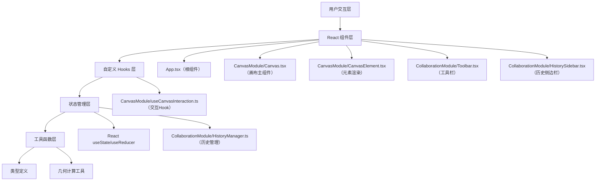

## 1. 架构设计



## 2. 技术描述

- **前端框架**：React@18.2.0 + ReactDOM@18.2.0
- **开发语言**：TypeScript@5.3.3（严格模式）
- **构建工具**：Vite@5.0.8 + @vitejs/plugin-react@4.2.0
- **工具库**：uuid@9.0.0（生成唯一ID）
- **初始化方式**：手动配置项目结构
- **后端服务**：无（纯前端应用，内存存储）
- **数据库**：无（操作历史存储在内存中，最多50步）

## 3. 文件结构定义

```
项目根目录/
├── package.json                    # 项目依赖和脚本
├── index.html                      # 入口HTML
├── vite.config.js                  # Vite构建配置
├── tsconfig.json                   # TypeScript配置（严格模式）
└── src/
    ├── index.tsx                   # 应用入口
    ├── App.tsx                     # 根组件，集成所有模块
    ├── types.ts                    # 全局类型定义
    ├── CanvasModule/
    │   ├── Canvas.tsx              # 画布主组件
    │   ├── CanvasElement.tsx       # 单个元素渲染组件
    │   └── useCanvasInteraction.ts # 画布交互自定义Hook
    └── CollaborationModule/
        ├── HistoryManager.ts       # 操作历史管理（纯函数）
        ├── HistorySidebar.tsx      # 历史侧边栏组件
        └── Toolbar.tsx             # 顶部工具栏组件
```

## 4. 核心数据模型

### 4.1 类型定义

```typescript
// 元素类型
type ElementType = 'sticky' | 'rectangle' | 'path';

// 操作类型
type ActionType = 'add' | 'delete' | 'move' | 'modify';

// 画布元素基础接口
interface BaseElement {
  id: string;
  type: ElementType;
  x: number;
  y: number;
  zIndex: number;
}

// 便签元素
interface StickyElement extends BaseElement {
  type: 'sticky';
  width: number;
  height: number;
  text: string;
  backgroundColor: string;
  borderColor: string;
}

// 矩形元素
interface RectangleElement extends BaseElement {
  type: 'rectangle';
  width: number;
  height: number;
  fillColor: string;
  borderColor: string;
  borderWidth: number;
}

// 手绘路径点
interface PathPoint {
  x: number;
  y: number;
}

// 手绘路径元素
interface PathElement extends BaseElement {
  type: 'path';
  points: PathPoint[];
  strokeColor: string;
  strokeWidth: number;
  opacity: number;
}

// 联合类型
type CanvasElement = StickyElement | RectangleElement | PathElement;

// 操作历史记录
interface HistoryEntry {
  id: string;
  action: ActionType;
  timestamp: number;
  elements: CanvasElement[];
  description: string;
}

// 画布状态
interface CanvasState {
  elements: CanvasElement[];
  selectedId: string | null;
  viewportX: number;
  viewportY: number;
  scale: number;
  isDragging: boolean;
  isDrawing: boolean;
  snapLines: SnapLine[];
}

// 吸附线
interface SnapLine {
  type: 'horizontal' | 'vertical';
  position: number;
}
```

## 5. 核心模块设计

### 5.1 画布渲染模块 (CanvasModule)

**Canvas.tsx** 职责：
- 渲染网格背景（使用CSS linear-gradient）
- 管理视口变换（平移和缩放）
- 渲染所有画布元素
- 处理画布级别的鼠标事件
- 实现元素拖拽时的阴影效果
- 检测并显示吸附线

**CanvasElement.tsx** 职责：
- 根据元素类型渲染不同的组件
- 便签：可编辑文本、删除按钮
- 矩形：可调整大小、颜色选择
- 路径：使用SVG path和贝塞尔曲线平滑
- 处理元素选中状态和拖拽事件

**useCanvasInteraction.ts** 职责：
- 管理鼠标事件监听（mousedown, mousemove, mouseup, wheel）
- 实现画布平移（拖拽空白区域）
- 实现画布缩放（滚轮，0.3-3.0范围，0.2秒平滑）
- 实现元素拖拽（带15px吸附检测）
- 实现自由手绘路径（贝塞尔曲线平滑）
- 管理拖拽状态和临时数据

### 5.2 协作管理模块 (CollaborationModule)

**HistoryManager.ts** 职责（纯函数模块）：
- 管理历史栈（undo栈和redo栈）
- push(): 添加新的操作快照
- undo(): 撤销到上一个状态
- redo(): 重做下一个状态
- 限制最大历史记录数（50步）
- 提供获取最近操作记录的方法

**Toolbar.tsx** 职责：
- 渲染顶部工具栏（56px高度）
- 提供元素添加按钮（便签、矩形、手绘）
- 提供撤销/重做按钮，支持快捷键
- 显示当前工具状态
- 历史侧边栏开关按钮

**HistorySidebar.tsx** 职责：
- 从右侧滑入动画（0.3秒ease）
- 按时间倒序显示近10条操作记录
- 每条记录显示操作类型图标和时间戳
- 点击记录可跳转（可选）

## 6. 性能优化策略

### 6.1 渲染优化
- 使用React.memo包裹CanvasElement，避免不必要重渲染
- 元素更新时只更新变化的元素，不整体重渲染
- 使用useCallback缓存事件处理函数
- 使用useMemo缓存计算结果（如吸附线检测）

### 6.2 交互优化
- 使用requestAnimationFrame处理缩放平滑动画
- 拖拽时使用transform而非top/left，触发GPU加速
- 鼠标事件处理中避免频繁的状态更新，使用节流或防抖
- 手绘路径使用离屏Canvas预渲染

### 6.3 数据结构优化
- 元素使用Map存储，O(1)时间复杂度查找
- 历史记录使用数组栈，限制最大长度避免内存溢出
- 吸附检测使用空间分割，减少O(n²)比较

### 6.4 性能指标
- 200个元素时帧率 ≥ 30fps
- 拖拽响应延迟 ≤ 16ms
- 缩放动画平滑度 ≥ 60fps

## 7. 动画实现

### 7.1 缩放平滑动画
```typescript
// 使用requestAnimationFrame实现0.2秒平滑插值
function animateScale(targetScale: number) {
  const startScale = currentScale;
  const startTime = performance.now();
  const duration = 200;
  
  function animate(currentTime: number) {
    const elapsed = currentTime - startTime;
    const progress = Math.min(elapsed / duration, 1);
    const easeProgress = easeOutQuad(progress);
    const interpolatedScale = startScale + (targetScale - startScale) * easeProgress;
    setScale(interpolatedScale);
    
    if (progress < 1) {
      requestAnimationFrame(animate);
    }
  }
  
  requestAnimationFrame(animate);
}
```

### 7.2 元素渐隐渐显动画
- 使用CSS opacity + transition实现0.2秒过渡
- 撤销时先将元素opacity设为0，0.2秒后更新状态
- 重做时更新状态后将opacity从0过渡到1

### 7.3 侧边栏滑入动画
- 使用CSS transform: translateX() + transition实现
- 关闭时translateX(100%)，打开时translateX(0)
- transition: transform 0.3s ease

## 8. 快捷键支持

| 快捷键 | 功能 |
|--------|------|
| Ctrl + Z | 撤销操作 |
| Ctrl + Shift + Z | 重做操作 |
| Delete | 删除选中元素 |
| Escape | 取消选中/取消绘制 |
| 空格 + 拖拽 | 平移画布 |
| Ctrl + 滚轮 | 缩放画布 |

## 9. 构建与部署

- **开发命令**：npm run dev
- **构建命令**：npm run build
- **输出目录**：dist/
- **部署方式**：静态文件部署，可部署到任何静态托管服务
